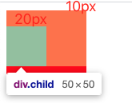
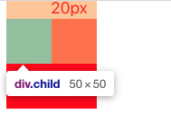
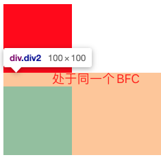
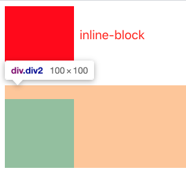

# CSS 基础

## 1. CSS 性能优化总结

- 在格式书写上，
  按照**定位、盒模型、文字、其他的样式属性**顺序排列
  之所以这样的顺序是因为重排一定会引起重绘，所以影响元素定位的属性（比如定位属性、盒模型、宽高等）放在前面，而影响元素绘制（比如元素内的字体大小、颜色）的属性放在后面

- 文件压缩
  文件压缩的效果显著，文件的大小会直接影响到浏览器的加载速度，通常使用如 webpack、gulp/grunt 等支持 CSS 压缩的构建工具。CSS 文件大小压缩后，会使得 DOM 树构建更快。

- 去除无用 CSS
  有一些属性是可以从父类继承得来，这个可以再 devtools 里的 Elements 中的 style 看到划线的元素。**因为压缩工具只会去除 CSS 文件中的无用空格**，如果想进一步减小 CSS 文件的大小，就要手动去寻找并删除代码中的无用 CSS。

- 有选择地使用选择器
  **CSS 选择器匹配是从右到左进行的**，比如对于#markdown-content-h3，使用#markdown .content h3 时，浏览器生成渲染树所要花费的时间更多。因为后者需要先找到 DOM 中的所有 h3 元素，再过滤掉祖先元素不是.content 的，最后过滤掉.content 祖先不是#markdown 的。如果嵌套等级很多，那么匹配所要花费的时间代价会非常高。**现代浏览器对这一方面做了优化，不同选择器的性能差别不明显**，遵循以下几点就好：
  1. 保持简单，不要嵌套过多复杂的选择器
  2. 通配符和属性选择器效率最低，需要匹配的元素最多，尽量避免

**Tip：**CSS 选择器从右向左匹配的原因
CSS 选择器在匹配过程中，更多的是不匹配的情况，所以从右向左匹配可以使得当不匹配时效率更高，这样想来，在匹配时多耗费性能就说的通了

- 尽量不使用昂贵的属性
  在浏览器绘制屏幕时，所有**需要浏览器进行操作或计算的属性**相对而言都需要花费更大的代价。当页面发生重绘的时候，它们会降低浏览器性能。所以，在可选择的情况下，应该尽可能少用昂贵属性，如 box-shadow、border-radius、filter、透明度、:nth-child 等。

- 优化重排与重绘（**重要**）
  当 FPS 为 60 以上时，用户使用网站时才会感到流畅。也就是说我们需要再 16.67ms 以内完成每次渲染相关的所有操作，所以要尽量减少耗费更多的操作
  **减少重排**
  重排一定会引起重绘，所以减少重排很重要。要避免频繁触发下面的操作：
  - 改变元素尺寸相关的属性，如宽高、位置、字体大小
  - CSS 伪类激活（如 hover 等，这个貌似没法避免）
  - 通过 js 获取 DOM 元素的位置相关属性（比如 width/height）
  - Flex 有更好的重排性能，所以在布局的时候优先考虑 Flex
    **减少重绘**
  - 重绘是无法避免的，浏览器对此做了优化，将多次的重排和重绘操作合并一次执行。我们仍然需要避免不必要的重绘，如页面滚动的 hover 事件等（可以禁止掉）。
  - 对于动画相关的代码，比如 transform3D 就相较于 transform 有 GPU 加速，所以优先考虑。

## 2. BFC

简称**块级格式化上下文**。html 元素的 display 控制着元素的布局类型，常用的包括不显示(none)、块元素(block)、内联元素(inline)、内联块元素(inline-block)、flex(弹性盒)。

BFC（格式化上下文）的条件：

- 浮动元素。
- 绝对定位元素，position(absolute,fixed)
- display 为以下其中之一的值 inline-block，table-cells，table-captions
- overflow 除了 visible 以外的值（hidden，auto，scroll）

### 2.1 margin 重叠

处于同一个块格式化上下文的两个<font color='red'>流内块级盒</font>会发生 margin 重叠。

**流外元素**：浮动、绝对定位、根元素
**流内元素**：除此之外

例 1:根元素与 body 不会发生 margin 重叠

```css
html {
  margin-top: 10px;
}
body {
  margin-top: 10px;
}
```

<font color='red'>结果：body 距离视口顶部 20px</font>

例 2:两个绝对定位的盒子不会发生 margin 重叠

```html
.div1 { width: 100px; height: 100px; position: absolute; background: red;
margin-bottom: 10px; top: 0; } .div2 { width: 100px; height: 100px; position:
absolute; background: yellow; margin-top: 10px; top: 100px; }
<body>
  <div class="div1"></div>
  <div class="div2"></div>
</body>
```

<font color='red'>在浏览器一看，咦，两个 div 间距刚好是 10px,这不是发生 margin 重叠了吗？no,no,no。如果此时，改变其中一个 div 的 margin 值，都不会影响任何一个 div 的布局。通俗的讲就是，把绝对定位的盒子比作飞起来的盒子，那么这两个飞起来的盒子，一定处于不同高度，因此，不管这个盒子如何移动，都不会影响任何一个飞起来的盒子。</font>

例 3:overflow 不为‘visible’的元素，不会与它的流内子级合并

```html
.father { width: 100px; height: 100px; background: red; margin-top: 10px;
overflow: auto; } .child { width: 50px; height: 50px; background: yellow;
margin-top: 20px; }
<div class="father">
  <div class="child"></div>
</div>
```

在一个块级格式化上下文中，盒在竖直方向从上到下排列，两个兄弟盒之间的竖直距离由 margin 属性决定。同一个块格式化上下文中的相邻块级盒之间的竖直 margin 会合并。**这里 father 的 overflow 不为 visible**，所以 father 建立了新的格式化上下文，内部的子元素
child 的上下文（margin 依托的根）是 father，所以会距离 father 顶部 20px。



如果不设置 overflow，即默认值为 visible，则会发生 margin 重叠，即整体盒子距离上的 margin 由内部元素最大值决定：



### 2.2 解决 margin 重叠的方法

相邻块级元素 margin 重叠



通过设置 inline-block 来简历一个新的 BFC，从而打破重叠


## 3. CSS 常考属性

### 3.1 box-sizing

### 3.2 flex

## 4. 居中方法
