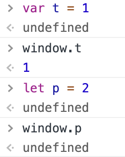

# 随笔

[toc]

## 1. var和let在全局声明上的区别

与var关键字不同，let在全局作用域中声明的变量不会成为window对象的属性



## 2. Symbol

- 基本用法
```js
// 函数可以不传东西
let s1 = Symbol();
// 也可以传一个字符串
let s2 = Symbol('s2');

// Symbol-符号是全局唯一标识符，即便创建时函数中内容不同
// 最终的符号也一定不同
let s3 = Symbol();
s1 == s3;   // false
```

- 使用全局符号注册表
如果运行时的不同部分需要**共享**和**重用**符号实例，那么久可以用一个字符串作为key，在<font color='red'>全局符号注册表</font>中创建（使用Symbol.for()）并重用符号。

```js
// 创建一个新符号实例并添加到注册表中
let s4 = Symbol.for('s');
// 重用已有的符号
let s5 = Symbol.for('s');

s4 === s5;  // true

// 利用Symbol.keyFor(symbol)来查找全局符号注册表
Symbol.keyFor(s5);    // s
```

- 使用符号作为属性

```js
let s1 = Symbol('foo');
let s2 = Symbol('bar');

let o = {
    [s1]: 'foo val',
    [s2]: 'bar val',
    s: 's val'
}

console.log(o);   
// [Symbol('foo'): 'foo val', Symbol('bar'): 'bar val', s: 's val']
```

## 3. 全局上下文

```js
function add(a, b){
    sum = a + b;
    return sum;
}

add(1, 2);
sum // 3
```

上面代码在函数外边居然可以访问到“函数内部的变量”。这里其实在调用add之后，sum变量被添加到了全局上下文，而在函数退出之后却**依然存在**，从而在后面就可以访问到了。
<font color='red'>这种未经声明而初始化变量是js的一个非常常见的错误，会导致很多问题！！！</font>

## 4. 内存泄漏

- 意外声明全局变量

```js
function setName(){
    name = 'Jack';
}
```

上面setName函数在执行时，解释器会把变量name当作window的属性来创建（相当于window.name = 'Jack'）。所以只要window不被清理，那么这个全局属性就会一直存在。

- 闭包

```js
let outer = function(){
    let name = 'Jack';
    return function(){
        return name;
    }
}
```

上面代码创建了一个内部闭包，只要outer函数存在就不能清理name，因为闭包一直在引用着它。

## 5. 内存管理的优化

- 通过let和const提升性能
let和const有助于改进垃圾回收的过程。因为let和const都以块（而非函数）为作用域。相比var，可以让垃圾回收程序更早的介入，尽早回收应该回收的内存。<font color='red'>在块作用域比函数作用域更早终止的情况下，就会起到这个作用。</font>

- 对象池
为提升js性能，一个策略是使用对象池（通常会是一个数组）。

```js
function addVector(a, b){
    let obj = new Object();
    obj.x = a.x + b.x;
    obj.y = a.y + b.y;
    return obj;
}
```

调用这个函数时，会在堆内存上创建一个新对象，然后修改它，最后返回给调用者。如果这个对象的生命周期很短，那么它很快就会成为被回收的值。**如果频繁调用这个函数，就会频繁的安排垃圾回收**

```js
function addVector(a, b, obj){
    obj.x = a.x + b.x;
    obj.y = a.y + b.y;
    return obj;
}
```

上面函数在执行时不会动态创建一个新的对象，而是使用函数外已有的对象，这样就可以利用**对象池**的方法，来防止对象的重复创建和销毁。

```js
// 创建一个容量为100的对象池
let objPoll = new Array(100);
let o1 = new Object();
objPoll.push(o1);

// a, b的定义这里省略
addVector(a, b, o1);
// 在使用完对象后，手动的去删除引用
o1 = null;
```

但是对象池的设置需要留意其初始的大小（数组大小），保证程序在运行中，同时产生的对象不会超过数组最大值。

## 6. 数组的splice方法

splice方法是数组最强大的方法，它可以**删除、插入、替换**

- 删除：需要两个参数。如splice(0, 2)，表示从数组索引0开始删除两个元素。
- 插入：需要三个参数以上，其中第二个参数为0。如splice(2, 0, 'red', 'green')，表示从数组位置2开始插入字符串'red'和'green'。
- 替换：需要三个参数以上，其中第二个参数大于0，表示会删除原数组的元素。如splice(2, 2, 'red', 'green')，表示从数组位置2开始删除两个元素，并替换为字符串'red'和'green'。

## 7. 数组的搜索方法

数组的搜索分为两类：严格相等搜索和断言函数搜索

- 严格相等：indexOf、lastIndexOf、includes
注意这三个函数都有第二个参数<font color='red'>fromIndex</font>
- 断言函数：find、findIndex
断言函数接收三个参数：元素、索引、数组本身。<font color='red'>需要特别注意：这两个方法只会找到第一个符合的元素，并返回</font>，如下例：

```js
let arr = [1,2,3,4,5,6];
arr.find((item, index, arr) => {
    return item > 2;
})
// 3
```

8. 数组的迭代方法

数组有五个迭代方法：every、filter、forEach、map、some。常用的一般是filter、forEach、map。

- filter：通过断言函数去过滤数组，返回符合要求的项，组成数组后返回（可以理解为find的升级版）
- forEach：数组遍历，没有返回值
- map：数组遍历，会返回结果

```js
let arr = [1,2,3,4,5,6];
arr.filter((item, index, arr) => {
    return item > 2;
})
// [3, 4, 5, 6]

const res = [];
arr.forEach((item, index, arr) => {
    if(item > 3){
        res.push(item);
    }
})
arr // [1, 2, 3, 4, 5, 6]
res // [4, 5, 6]

arr.forEach((item, index, arr) => {
    arr[index] = 1;
})
arr // [1, 1, 1, 1, 1, 1]

let numbers = arr.map((item, index, arr) => {
    return item * 2;
})
numbers // [2, 2, 2, 2, 2, 2]
```

9. 数组的归并方法-reduce

reduce可以说是数组最强大的方法之一，其定义如下：
reduce(callbackfn, ?initialValue)，其中第一个参数是累加回调函数、第二个参数是累加的初始值。
而这个累加回调函数的参数如下：
callbackfn(prev, cur, index, arr)

- prev：累加结果
- cur：当前值
- index：当前索引
- arr：数组本身

```js
let arr = [1, 2, 3, 4, 5];
arr.reduce((prev, cur, index, arr) => {
    return prev + cur;
}, 10)
// 25
```

<font color='red'>reduce方法不止“叠加”，它还可以做很多事情：</font>

```js
let arr = [[1, [2, 3], [4, 5, 6]], 7, 8];
function flatArr(arr){
    return arr.reduce((prev, cur) => {
        return [...prev, ...Array.isArray(cur) ? flatArr(cur) : [cur]];
    }, []);
}
flatArr(arr);   // [1, 2, 3, 4, 5, 6, 7, 8]
```
