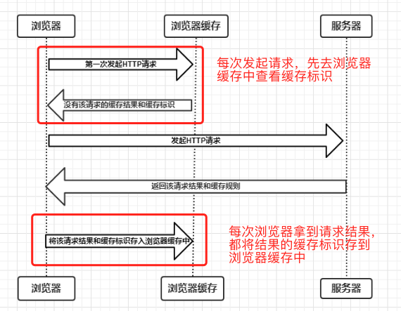
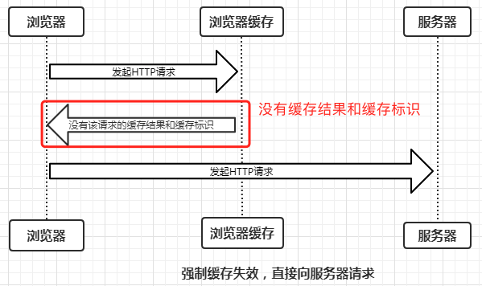
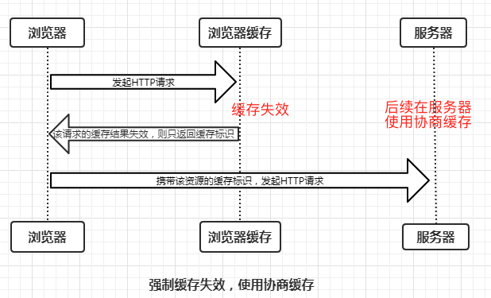
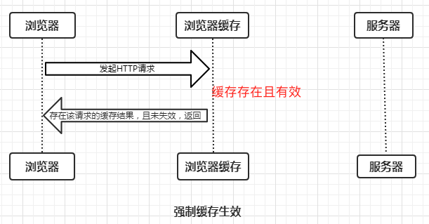
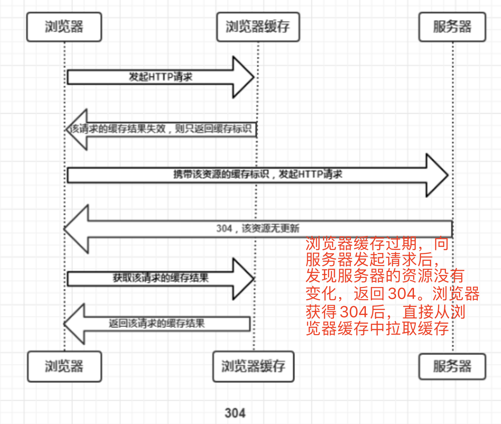
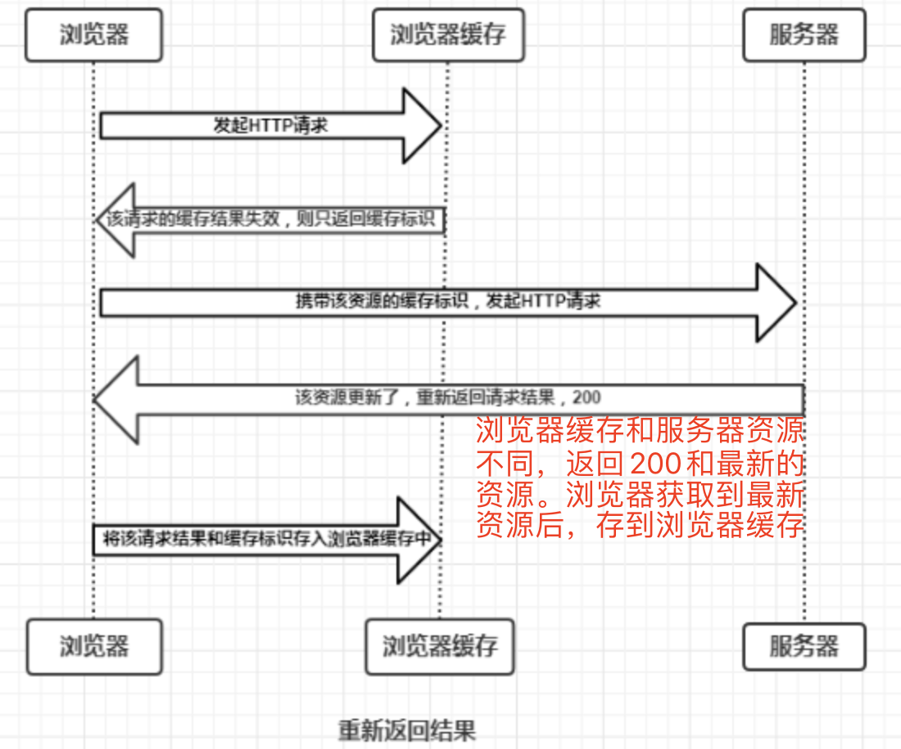
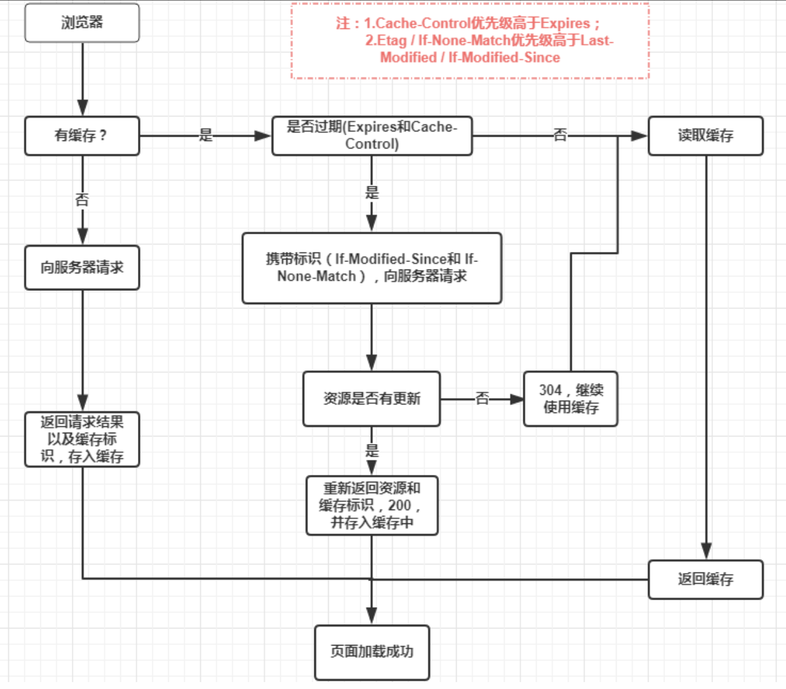
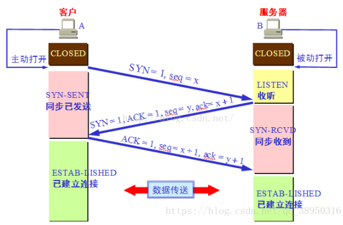
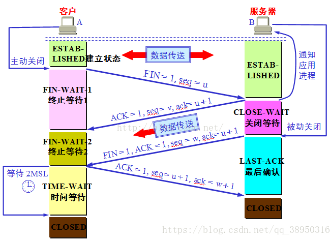
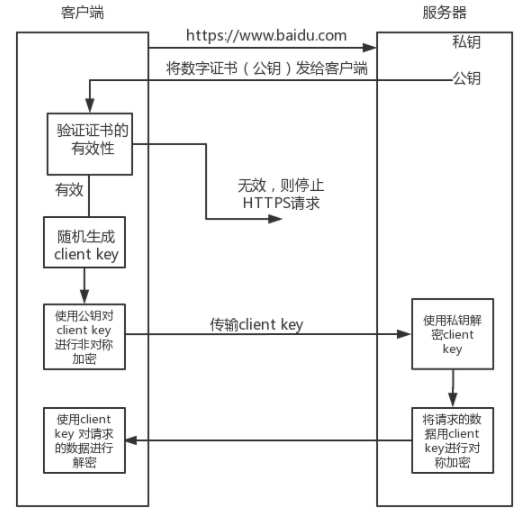

# 计算机网络

[toc]

## 1. UDP 和 TCP 的区别

（1）连接性
TCP 面向连接，UDP 面向非连接
（2）传输可靠性
TCP 可靠，UDP 不可靠
（3）传输速度
TCP 慢（需要握手和挥手），UDP 快
（4）TCP 采用流传输、UDP 采用包传输。（如果丢数据，则 UDP 是以包为单位，TCP 以字节流为单位）
（5）TCP 传输数据段时要给段标号，而 UDP 不需要（TCP 有超时重传机制）

## 2. 浏览器缓存机制

浏览器每次发起请求和收到响应时都会去**查看浏览器缓存**



浏览器根据是否需要重新向服务器发起 Http 请求将缓存分为**强缓存**和**协商缓存**。

### 2.1 强缓存

强缓存是**浏览器根据浏览器缓存中的缓存规则**来决定是否使用该缓存的过程。强缓存有三种结果：

（1）浏览器缓存中不存在缓存结果和缓存标识，强缓存失效，直接向服务器发起请求（与第一次发起请求一致）：



（2）浏览器缓存中存在缓存结果和缓存标识，但是结果已经失效（过期），强缓存失效，**向服务器发起请求，在服务器使用协商缓存**。



（3）浏览器缓存中存在缓存结果和缓存标识，且没有失效，<font color='red'>强缓存生效</font>，直接返回缓存结果



强缓存的 HTTP 字段：expired、cache-control

- expired
  http1.0 缓存控制字段，其值为一个到期时间（last time）。原理是使用**客户端时间和服务端返回的时间（expired）进行对比**，但是如果客户端和服务端由于某些原因（时区不同、时间不准），就会导致强缓存失效。所以使用 http1.1 引入 cache-control

- cache-control
  http1.1 缓存控制字段，其值为一个时间段（比如 max-age=600，表示在 600s 内使用强缓存）。**其优先级大于 expired。**
  （1）public：所有内容都将被缓存（客户端和代理服务器都可缓存）
  （2）private：所有内容只有客户端可以缓存，Cache-Control 的默认取值
  （3）no-cache：客户端缓存内容，但是是否使用缓存则需要经过协商缓存来验证决定
  （4）no-store：所有内容都不会被缓存，即不使用强制缓存，也不使用协商缓存
  （5）max-age=xxx (xxx is numeric)：缓存内容将在 xxx 秒后失效

浏览器的缓存会存在于硬盘或者内存中。以访问www.baidu.com为例：

**访问https://baidu.com->200->关闭页面->重新打开baidu->200(from disk cache)->刷新->200(from memory cache)**

- 内存缓存(from memory cache)
  内存缓存会把编译解析后的文件直接存到该进程的内存中，占据着进程的一定内存资源，以便下次快速读取。<font color='red'>但是一旦进程关闭（关闭页面），进程的内存就会清空。</font>
- 硬盘缓存(from disk cache)
  硬盘缓存是直接将缓存写到硬盘中，读取缓存需要进行 I/O 操作，然后重新解析缓存内容，速度比内存慢。

在浏览器中，浏览器会在 js 和图片等文件解析执行后直接存入内存缓存中，那么当刷新页面时只需直接从内存缓存中读取(from memory cache)；而**css 文件**则会存入硬盘文件中，所以每次渲染页面都需要从硬盘读取缓存(from disk cache)。

### 2.2 协商缓存

协商缓存是<font color='red'>强缓存失效后，</font>**浏览器携带缓存标识向服务器发起请求，由服务器根据缓存标识来决定是否使用缓存的过程**，协商缓存有两种结果：

（1）协商缓存生效，返回<font color='red'>304</font>，表示浏览器缓存和服务器资源相同，可以继续使用。浏览器获得 304 后，从浏览器缓存中拉取“过期”缓存：



（2）协商缓存失败，返回 200 以及最新资源



协商缓存的 HTTP 字段：Last-Modified/If-Modified-Since、Etag/If-None-Match。其中 Etag 的优先级大于 Last-Modified

- Last-Modified/If-Modified-Since
  Last-Modified 是服务器响应请求时，返回该资源文件在服务器最后被修改的时间。
  If-Modified-Since 是客户端再次发起请求时，其值等于携带上次请求的 Last-Modified。如果当前响应资源 Last-Modified（当前资源最后修改时间）大于请求头中的 If-Modified-Since（上次的资源最后修改时间），则代表资源已更新，否则则是未更新。
- Etag/If-None-Match
  Etag 是服务器响应请求时，返回当前资源文件的一个唯一标识(由服务器生成)
  If-None-Match 是客户端再次发起该请求时，携带上次请求返回的唯一标识。 如果当前响应资源 Etag（当前资源版本号）与请求头中的 If-None-Match（上次的资源的版本号）不同，则代表资源已更新，否则则是未更新。

### 2.3 缓存总结

强缓存优先于协商缓存，若强缓存（Expired 和 Cache-Control）生效则直接使用强缓存；若不生效，则进行协商缓存（Last-Modified / If-Modified-Since 和 Etag / If-None-Match）。
协商缓存由服务器决定是否使用缓存，若协商缓存生效，表示服务器资源相较于浏览器缓存没有变化，返回 304，继续使用浏览器缓存中的缓存内容；若不生效，表示服务器资源相较于浏览器缓存已经发生改变，返回 200 以及最新的资源，浏览器获取到资源后，将资源缓存到浏览器缓存中。



参考：https://www.cnblogs.com/chengxs/p/10396066.html

## 3. TCP 传输详细过程

（1）三次握手



- 第一次握手
建立连接时，<font color='red'>客户端主动</font>发送SYN包（syn=x）到服务器，进入**同步已发送**状态，等待服务器确认。<font color='red'>其中SYN为同步序列编号（Synchronize Sequence Numbers）</font>
- 第二次握手
服务器收到SYN包，确认客户端的SYN（ack=x+1），同时自己发送一个SYN包（syn=y）,即SYN包+ACK包，此时进入**同步收到**状态。
- 第三次握手
客户端收到服务器的SYN+ACK包，向服务器发送确认包ACK（ack=y+1），此包发送完毕后，客户端和服务器进入**ESTABLISHED（TCP连接）状态**，完成三次握手。

（2）发 http 请求，服务器处理请求，返回响应
TCP 连接建立后，浏览器就可以利用 HTTP/HTTPS 协议向服务器发送请求。服务器接收到请求后，会解析请求头，如果头部有**缓存字段**如 if-none-match 与 if-modified-since，就验证缓存是否有效，如果有效，则返回 304，从浏览器缓存中直接返回；如果无效，则返回200以及服务器最新资源给客户端，并存储到浏览器缓存中。

（3）四次挥手



- 第一次挥手
关闭连接时，<font color='red'>客户端主动</font>发送FIN包（seq=u）到服务器，此时客户端进入**终止等待1**状态。
- 第二次挥手
服务器收到连接释放报文（FIN包， seq=u），发出确认报文（ACK包，ack=u+1），并带上自己的序列号（seq=v），此时服务器进入**关闭等待**状态。<font color='red'>tcp服务器通知应用层进程，客户端没有数据要发送了。此时进入半关闭状态。</font>（之所以叫半关闭，是因为此时虽然客户端向服务器不再发送数据，但是服务器如果还有数据发送给客户端，客户端依然要接受）。
客户端收到服务器的确认报文后，客户端就进入**终止等待2**状态，等待服务器发送**连接释放报文**（在这之前还需要接受服务器发送的“最后数据”）。
- 第三次挥手
服务器将“最后数据”发送完毕后，向客户端发送连接释放报文（FIN包，ack=u+1，ack与确认报文相同）。<font color='red'>因为在半关闭状态下，服务器可能向客户端又发送了一些数据，所以序列号不可能为v+1。</font>假设seq=w，此时，服务器进入**最后确认**状态，等待客户端的确认。
- 第四次挥手
客户端收到服务器连接释放报文后，发出确认包（FIN包，ack=w+1，seq=u+1），此时客户端进入**时间等待**状态。注意！！！此时tcp还没有释放，需要经过2MSL（最长报文段寿命）的时间，客户端撤销相应的TCB（传输控制块）之后，进入**CLOSED（TCP关闭）状态**。
服务器收到客户端发送的确认包后，同样撤销响应的TCB之后，立即进入**CLOSED（TCP关闭）状态**。结束TCP连接。<font color='red'>可以看到，服务器结束tcp连接比客户端要早一些</font>。

**常见面试题**：

1. 为什么连接**3**次，关闭却是**4**次
答：连接时，当服务端收到客户端的SYN包（连接请求）时，可以直接“回复”SYN+ACK包，其中SYN包用来同步、ACK包用来应答。但是关闭时，服务端收到FIN包时，很可能数据还没有传完，所以需要先回复一个关闭应答ACK包，告诉客户端：<font color='red'>你的关闭请求报文我收到了！</font>。只有当服务端数据全部传完后，才能发送FIN报文。所以需要4次。

2. 为什么客户端**时间等待状态**需要2MSL才能变为**关闭状态**
答：因为最后一个由客户端传给服务端的ACK包有可能丢失。TCP有超时重传机制，如果服务端没有收到最后的ACK包，就不会关闭，并且将不断重复发送FIN包，所以客户端不能关闭，它必须确保服务端收到了最后的ACK。
确保方法：<font color='red'>客户端会在发送出最后的ACK之后进入时间等待状态，并且设置一个定时器，等待2MSL。如果在该时间内再次受到FIN，那么说明最后的ACK没有顺利传到服务端，那么客户端就会重新发最后的ACK并重新设置2MSL的定时器。。。；如果直到2MSL，客户端都没有受到FIN，说明ACK顺利到达服务端，则结束TCP连接。</font>

3. TCP协议如何来保证传输的可靠性

- 数据包校验
- 超时重发
- 流量控制

## 4. Https请求过程



详细流程如下：

1. 客户端向服务器发起https请求，连接到服务器的443端口
2. 服务器将非对称加密的公钥（证书）传给客户端
3. 客户端接收到证书后，验证其有效性（浏览器内置了验证证书有效性的东西），如果有问题，则https请求无法继续；如果证书有效，则客户端随机生成一个对称加密的client key（客户端秘钥），使用“证书”（其实是证书里的公钥）对其进行非对称加密。
4. 将客户端秘钥通过http请求传递给服务器
5. 服务器对加密后的客户端秘钥进行非对称解密，得到client key，使用客户端秘钥对**数据**进行对称加密
6. 将对称加密的数据传递给客户端，客户端对称解密，得到服务器的数据。

## 5. Cookie、Session、Storage之间的区别

### 5.1 Cookie

<font color='red'>网站为了辨别用户身份，进行session追踪而存储在用户本地终端上的数据（通常经过加密）</font>
Cookie由服务端生成，发送给客户端。Cookie总是保存在客户端，按照在客户端存储的位置，分为**会话Cookie**（内存）和**持久Cookie**（硬盘）。

作用：
Cookie的根本作用是在客户端存储用户访问网站的一些信息，如：

1. 记住密码，下次自动登录
2. 购物车功能
3. 记录用户浏览历史，以便进行商品推荐

缺点：

1. Cookie会被附加在每个http请求中，增加了数据量
2. Http中的Cookie是明文传递的，安全性是问题（除非用https）
3. Cookie有4KB的大小限制

### 5.2 Session

<font color='red'>Session代表服务器与浏览器的一次会话过程。Session是一种服务器端的机制，保存在服务器内存、硬盘或者数据库中，Session对象用来存储特定用户**会话的信息**。</font>

工作原理：
以用户登录来理解其工作原理：

1. 将本地的sessionId、用户名、密码通过Cookie（http）带到服务端
2. 后端检测服务端是否有对应sessionId的session。如果没有，则生成一个新的session；有的话检测对应的session是否有效，如果失效，则清除session，生成新的session；如果有效，则使用当前session。

作用：
Session的根本作用是在服务端存储用户与服务器会话的一些信息，同Cookie。

缺点：sessionId作为**会话Cookie**存在的，如果浏览器关闭，那么sessionId就会消失。重新打开浏览器再请求，就是一个全新的请求，服务器会创建一个新的session，之前的session就没法用了。

### 5.3 Cookie和Session区别

1. 存放位置：Cookie在客户端，Session在服务端
2. 存取方式：Cookie为字符串，Session为对象
3. 有效期：Cookie为特定设置的有效期，Session只要浏览器关闭就会失效
4. 安全性： Cookie对客户端是可见的，所以有可能会被窃取。Session存储在服务端（客户端只存SessionID），所以安全性更好一些。
5. 服务端压力：Cookie存在客户端，所以不占用服务器资源，如果并发量很大的情况下，Cookie是很好的选择；Session保存在服务器，每个用户请求都会产生一个Session，如果并发量过大，就会消耗大量的服务器内存。
6. 跨域支持：Cookie支持跨二级域名访问（如www.baidu.com和job.baidu.com），Session不支持跨域访问。

### 5.4 Storage

H5，新加入了localStorage特性，主要解决Cookie存储空间不足的问题。Cookie一般4K，localStorage一般5M左右。Storage有自己封装好的方法：setItem、getItem、removeItem、clear。

### 5.5 cookie、localStorage、sessionStorage区别

1. cookie会在http请求中携带，在客户端与服务器之间进行传递；而localStorage和sessionStorage仅仅在本地存储，不**主动**发数据到服务器。
2. 存储大小：Cookie为4K，localStorage， sessionStorage可以达到5M。
3. 数据有效期：sessionStorage仅在同源窗口有效；cookie在设定的有效期内有效；localStorage长期有效（除非手清）。
4. cookie使用**document.cookie**获取字符串结果，而对应属性的值需要自己封装方法去获取；storage可以使用**window.localStorage**或者**window.sessionStorage**去获取Storage对象，而如果想获取对应属性的值，可以使用特定封装好的方法。

## 6. 从输入网址到获得页面的过程

1. 域名解析

- 从浏览器缓存中找ip
- 如果没找到，再从Hosts文件查找是否有该域名和对应的ip
- 如果没找到，去路由器缓存找
- 如果没找到，去DNS缓存找
- 如果都没找到，浏览器域名服务器向根域名服务器查找域名对应ip，还没找到，就把请求转发到下一级，直到找到ip

2. 5层协议传输数据

- 应用层发起http请求
- 传输层三次握手建立tcp连接
- 网络层把TCP分割好的数据包传到接收方（需要MAC地址）
- 链路层将数据数据链路上传输（物理设备）

3. 服务器返回响应，浏览器进行处理
HTML字符串被浏览器一句一句解析，生成DOM；css资源生成CSSOM。

4. 绘制网页
根据DOM和CSSOM构造渲染树（render tree），在浏览器上渲染，并执行一些js文件等。

## 7. XSS和CSRF攻击

1. XSS

XSS（跨站脚本攻击），攻击者向Web页面中嵌入恶意script代码，当用户浏览该页时，嵌入其中的恶意代码被执行，从而达到攻击目的。

XSS分三种：

- 基于反射
XSS代码在请求的url中，然后请求到服务器。服务器解析后，XSS代码随着响应内容一起传到客户端并执行。
如：
```js
https://www.baidu.com?jarttoTest=<script>alert(document.cookie)</script>
```
- 基于存储
XSS代码保存到了服务器端（数据库、内存、硬盘），可以被用户完整的取得并执行。
- 基于DOM
XSS代码从客户端获取DOM中的数据并在本地执行。

防御：

1. 输入过滤。对url、查询关键字、表单数据进行输入限定
2. 使用HttpOnly Cookie。将重要的Cookie设置为httponly，这样在js脚本中就不能访问这个cookie了，避免document.cookie获取到cookie

2. CSRF

CSRF（跨站请求伪造），即伪造合法用户发起请求。

情景再现：<font color='red'>小明访问银行网站A，以Get请求完成转账操作后，页面没有关闭；这时黑客以美女诱导的方式引诱小明访问危险网站B，小明访问危险网站B时，转账请求代码就执行了，这个请求会携带着网站A的cookie。大多数情况下，这个请求会失败，因为这个请求需要小明的认证信息，但是如果恰好小明访问银行不久，它的浏览器和服务器的session尚未过期，这个请求就会成功。小明收到短信：发现账户丢钱了...</font>

防御：

1. 利用Referer字段，服务器根据HTTP请求来源地址来判断请求是否合法。
2. 在请求中携带token并验证。CSRF之所以能成功，是因为用户验证信息都在cookie中。可以在http请求中以参数的形式携带一个随机的token，服务器端设置一个拦截器来验证这个token，如果没有token或者token不正确，则认为可能是伪造。
token原理：token在用户登录后产生并放在session中，在每次请求时，把token从session中拿出，与请求中的token对比。token本身的问题在于**难以保证token本身的安全**。
3. 在Http头中自定义属性并验证
不是将token以参数的形式置于http请求中，而是将它放到http头中自定义的属性中。保证了token的安全性。

## 8. 正向/反向代理

正向代理：代理客户端，服务器不知道真正发出请求的是谁
例子：客户端用VPN访问国外被墙了的网站

反向代理：代理服务器，客户端不知道具体是哪台服务器处理了自己发出的请求
例子：客户端访问www.baidu.com，请求通过nginx代理到CDN服务器上，加快了请求的响应速度

## 9. Http2.0相较于Http1.1的升级

1. 二进制分帧

- 帧：http2.0最小的通讯单位，所有帧共享一个8字节的首部
- 消息：Http请求、响应，http2.0消息由多个帧组成
- 流：Tcp连接

http1.1采用文本传输，http2.0采用二进制传输。其中http1.1的首部信息被封装到Headers帧，而Body部分封装到Data帧，**帧都采用二进制编码**。

2. 首部压缩
利用HPACK算法对header进行重新编码
3. 多路复用
浏览器会限制同一时刻下，在同一域名的请求数量。当页面需要请求很多资源时，队头会阻塞，必须处理完已请求的资源，才能处理其他请求。
Http2.0基于二进制分帧层，可以在共享TCP连接的基础上，同时发请求或响应。http消息被分解为帧，交错发出，在目的地重新组成起来。
4. 服务器推送
服务器根据客户端请求，提前返回多个响应，推送额外的资源给客户端。推送过程中需要保证**推送资源遵守同源策略**。

## 10. CDN原理

<font color='red'>关键词：负载均衡、缓存、dns解析</font>

资源上传到cdn之后，当用户访问cdn资源地址后会经历下面步骤：

1. cdn资源地址经过**本地dns解析**，请求cname指向的那台cdn专用的dns服务器
2. dns服务器返回**全局负载均衡**的服务器ip给用户
3. 用户请求**全局负载均衡服务器**，服务器根据用户ip返回用户所在区域的负载均衡服务器ip给用户
4. 用户请求**区域负载均衡服务器**，负载均衡器根据用户ip选择存在目标内容、距离近、负载合适的cdn缓存服务器ip给用户。如果没有对应内容，则去上一级缓存服务器找，直到找到资源所在的源站服务器，并且缓存在cdn缓存服务器中，以便用户下次就近拿缓存。

## 11. Websocket

Websocket最大的特点是，服务器可以主动向客户端推送消息，客户端也可以主动向服务器推送消息，是真正是双向平等对话，常用语聊天场景。<font color='red'>与HTTP2.0的区别在于：http2.0可类比为短信，ws可类比为打电话。</font>

特点包括：

1. 属于http升级版，所以握手阶段采用http，可以发送文本，也可以发送二进制
2. 没有同源限制
3. 协议标识符是ws，可以加密（wss）
