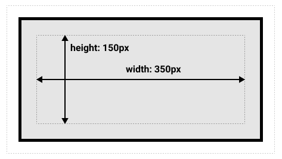
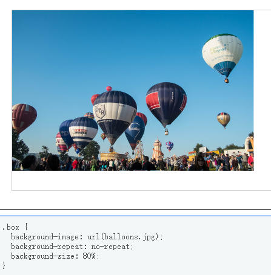
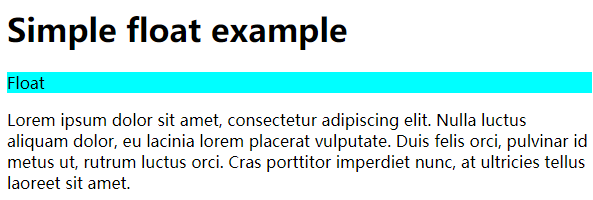

# css学习笔记-MDN

[toc]

## 一、CSS介绍

### 1.1 改变元素的默认样式

在HTML中，标题默认使用大号粗体；无序列表前默认使用实心圆点标记列表项...，这些默认的元素样式都是可以根据自己的喜好进行改变的，通过设置list-style-type来对元素默认的样式进行修改：

```css
/* 列表前标记消失 */
li {
    list-style-type: none;
}
/* 列表前变成竖大拇指的手型 */
li {
    list-style-type: "\1F44D";
}
```

### 1.2 使用类名选择

在html代码中对特定元素使用class属性，在css中对特定class属性前面加 **.** 标记

```html
<ul>
    <li>项目一</li>
    <li class="special">项目二</li>
    <li>项目三</li>
</ul>
```

```css
.special {
    color: orange;
    font-weight: bold;
}
```

有时会遇到li.special的形式，这个对应li标签下class为special的项。

### 1.3 根据元素在文档中的位置选择

1、包含选择符

当仅选择嵌套在\<li>元素内的\<em>时，可以使用**包含选择符**的选择器，它只是单纯的在两个选择器之间加上空格

```css
li em {
    color: red;
}
```

2、相邻选择符

选择在h1之后的p标签（p与h1同级），可以使用**相邻选择符**

```css
h1 + p {
    font-size: 200%;
}
```

### 1.4 根据状态确定样式

一个直观的例子是\<a>-超链接，这个标签有很多状态：未访问过、已访问、被鼠标悬停、正在被点击当中等。可以用css去定位元素的这些状态，进而设定样式

```css
/* 链接没被访问的时候为粉色 */
a:link {
    color: pink
}
/* 链接被访问后变为绿色 */
a:visited {
    color: green
}
/* 在超链接被鼠标悬停的时候，移除下划线 */
a:hover {
  text-decoration: none;
}
```

### 1.5 组合定位

将类名选择、位置选择、状态选择等定位方式组合一起进行定位：

```css
/* 定位到body内h1元素后边的p元素内class为special的元素 */
body h1 + p .special {
    ...
}
```

该CSS样式定位如下：

```html
<body>
    <h1>标题</h1>
    <p>
        <span></span>
        <!-- 定位到这里 -->
        <span class='special'></span>
        <div>...</div>
    </p>
    <p>...</p>
</body>
```

至此，选择器可以有以下几种写法：

```css
/* h1元素 */
h1
/* a元素没被链接前 */
a:link
/* id=onething */
#onething
/* 全局，如*{font-color: res}就是全局范围内文字是红色 */
*
/* class='box'内的p标签 */
.box p
/* class='box'内的p标签内的第一个元素 */
.box p:first-child
/* h1和h2和class='intro'的元素 */
h1, h2, .intro
/* h1后的p标签（同层） */
h1 + p
```

### 1.6 函数

大多数值是简单的关键字或数值，但也有一些值以函数的形式出现。比如calc()用于简单计算：

```css
.box {
    width: calc(90% - 30px)
}
```

### 1.7 @规则

@开头的关键字称为@规则。比如@import用于不同css文件之间的导入；@media用于媒体查询（带有条件的、响应式的css）

```css
/* 不满足媒体查询时，背景颜色为粉色 */
body {
    background-color: pink;
}

/* 当窗口宽度小于600px时，媒体查询生效，背景颜色变为蓝色 */
@media (min-width: 600px) {
    body {
        background-color: blue;
    }
}
```

### 1.8 CSS工作原理（重要）

浏览器接收到一个HTML文件之后到文件显示在浏览器上，中间经过如下步骤：

1. 浏览器载入HTML文件
2. 将HTML文件转化为一个DOM（其中DOM是HTML文件在内存的表现形式）
3. 浏览器拉取HTML相关的大部分资源，包括图片、视频、CSS样式（js会稍后处理）
4. 浏览器拉取到CSS之后进行解析，根据选择器类型（元素、class、id）进行分组，浏览器遍历DOM树，依次找到每个节点对应的样式并将样式应用到节点上（应用的过程称为**渲染树**）
5. 渲染完成后，根据每个元素应该出现在浏览器的位置进行布局
6. 网页展示在屏幕上（展示的过程称为着色）

形象一点的图如下：


浏览器遇到无法解析的CSS代码时，会直接**忽略**。
这样做的好处是，当使用最新的CSS去优化时，即使浏览器遇到不支持的特性无法解析时，也不会报错。这一特点使得，如果想用一个比较新的CSS属性时，可以直接添加，而不用担心添加之后影响原有样式。

```css
/* 可以同时添加两个width */
.box {
    width: 500px;
    width: calc(100% - 50px);
}
```

上述代码在应用到元素上之后，元素的宽会等于下面的width。因为渲染是从前向后的，可以理解为后面的覆盖了前面的样式（类似于js中let a = 1; a = 2;所以最后a的值就变成了2）。

## 二、CSS构建

### 2.1 层叠与继承

- 层叠
CSS规则的顺序很重要。当设置相同规则到一个元素时，写在后面的就是实际使用的规则。

```css
h1 {
    color: red;
}
h1 {
    color: blue;
}
```

最终h1标签的内容会被设置为蓝色

- 优先级

浏览器根据优先级来决定当**多个规则适用于同一元素时**，元素应该用哪个规则。通常
来说，“具体”的规则优先级大于“不具体”的。比如元素选择器优先级低于类选择器。

```css
.main-heading {
    color: red;
}

h1 {
    color: blue;
}
```

```html
<h1 class="main-heading">This is My heading</h1>
```

上述标题文字会显示为红色。因为类选择器优先级大于元素选择器。

- 继承

像颜色这种规则是存在继承关系的：

```css
body {
    color: blue;
}

span {
    color: black;
}
```

```html
<body>
    <p>123</p>
    <p>456<span>789</span></p>
</body>
```

其中body下的p中的文字全都继承了body的颜色样式


CSS为了控制继承，提供了四个特殊的通用属性值（其中revert极少用），**每个属性值都可以接收这些值**

- inherit：设置该属性开启继承
- initial：设置该属性和浏览器默认样式相同，若浏览器没有该属性的默认值且为自然继承，那么会设置为inherit
- unset：重置该属性的值

```css
body {
    color: green;
}
/* 继承于父元素颜色，即p中的绿色（文字） */
.my-class-1 a {
    color: inherit;
}
/* 字体默认颜色（黑色） */
.my-class-2 a {
    color: initial;
}
/* 自然继承时等于inherit */
.my-class-3 a {
    color: unset;
}
```

```html
<body>
    <p>Default <a href="#">link</a> color</p>
    <p class='my-class-1'>12234<a href="#">456</a></p>
    <p class='my-class-2'>12234<a href="#">456</a></p>
    <p class='my-class-3'>12234<a href="#">456</a></p>
</body>
```


同时设置所有属性的继承：使用all

```css
blockquote {
    background-color: red;
    border: 2px solid green;
}
/* 清除所有blockquote上的样式 */
.fix-this {
    all: unset
}
```

```html
<blockquote>
    <p>This blockquote is styled</p>
</blockquote>
<blockquote class="fix-this">
    <p>This blockquote is not styled</p>
</blockquote>
```


选择器的优先级是可以数字化的：

1. **千位**：在style中（内联样式）声明，该位得1分
2. **百位**：选择器中包含id选择器，得1分
3. **十位**：选择器中包含类选择器、属性选择器、伪类，得1分
4. **个位**：选择器包含元素、伪元素，得1分


总体来说，<font color='red'>样式定位越具体，优先级越高！</font>

属性修饰符：**!important**

!important会在当相同的属性应用到同一元素时，如果想强制使用优先级较低的选择器对应设定的值，就可以在属性值后面加上!important，如下例：

```css
/* 0100 */
#a {
    background-color: blue;
}
/* 0010 */
.b {
    background-color: red !important;
}
```

```html
<p class="b" id="a">Some text</p>
```

正常按照优先级，p标签中的内容会被设置为蓝色背景，但是通过使用!important属性修饰符，将忽视优先级，而选择类选择器中的红色。

### 2.2 CSS选择器

选择器的类型包括：

1. 元素选择器
2. 类选择器
3. id选择器
4. 属性选择器（元素属性）
5. 伪类和伪元素（元素状态）
6. 组合选择器

```css
/* 1. 元素选择器 */
p {
    ...
}

/* 2. 类选择器 */
.box {
    ...
}

/* 3. id选择器 */
#box {
    ...
}

/* 4. 属性选择器 */
/* 根据某个元素中的某个属性的存在或者根据某个属性存在值去选择 */

/* 选择带有href属性的a元素 */
a[href] {
    ...
}
/* 选择带有href='www.baidu.com'值的元素 */
a[href="www.baidu.com"]

/* 5. 伪类选择器*/
/* 伪类选择器是根据元素的状态进行选择的（响应式） */
a:hover {
    /* 当鼠标放在a元素上的时候 */
    /* 超链接的状态包括：
    [原始状态 :link]、[鼠标放上去 :hover]、[点击 :active][点击之后 :visited] */
    ...
}
/* 伪元素选择可以对选择元素中的特定部分进行布局 */
p::first-line {
    /* 选中p元素显示的第一个行（不是第一个标签） */
    ...
}

/* 6. 组合选择器 */
/* 选中div的子元素span */
div>span {
    ...
}
/* 需要注意和下面区分 */
/* 选中div下所有的span元素（子孙） */
div span {
    ...
}
/* 选中div（同层）的后面的span元素 */
div + span {
    ...
}
/* 选中div（同层）的后面所有span元素 */
div ~ span {
    ...
}
```

### 2.3 盒模型

1、块级盒子和内联盒子

- 块级盒子：
每个盒子都会换行；width和height会起作用；padding、border、margin会将其他元素从盒子周围“推开”。
- 内联盒子：
每个盒子不会换行；width和height不会起作用；内边距、边框、外边距会产生作用但是不会将其他盒子“推开”。

通过对盒子display属性（block或者inline）的设置，可以控制（或者改变）盒子的**外部**显示类型。

2、外部显示类型和内部显示类型
盒子的外部显示来决定盒子是块级还是内联。而内部显示类型决定盒子的内部元素是如何布局的。如果设置盒子的属性display为flex，该盒子的所有直接子元素就会成为flex元素，会根据弹性盒子规则进行排列。
&emsp;&emsp;如果设置flex:inline-flex，那么内部显示会是flex，而外部会使内联盒子（不换行）。

<font color='red'>3、盒模型</font>

盒模型是CSS很重要的一个概念。一个盒模型由内到外由**内容、内边距、边框、外边距组成**。

需要注意的是<font color='red'>margin 不计入实际大小 —— 当然，它会影响盒子在页面所占空间，但是影响的是盒子外部空间。盒子的范围到边框为止 —— 不会延伸到margin</font>

- 标准盒模型

标准盒模型的宽高只包括元素内容区域。

```css
.box {
    width: 350px,
    height: 150px,
    margin: 25px,
    padding: 25px,
    border: 5px solid black
}
```



- 替代盒模型

宽高计算的时候还需要加上边框和内边距很麻烦，所以可以直接使用替代盒模型，指定的宽高就是盒子的可见宽高（内容+内边距+边框）


默认浏览器会使用标准盒模型。如果想使用替代盒模型，通过设置<font color='red'>box-sizing: border-box</font>（之前被问到过这个面试题）来实现。

如果希望所有元素都使用替代盒模型，通过下面的方法：

```css
html {
    box-sizing: border-box;
}
/* 通过设定全局元素和伪元素来实现 */
*, *::before, *::after {
    box-sizing: inherit;
}
```

4、外边距

外边距可取负数，取负数时会使得盒子本身和其他外部盒子重叠。


调整外边距为负的时候：


**外边距折叠**是理解外边距的一个重要概念。如下面的例子，有两个段落，第一个段落下侧外边距为50px，而第二个段落上侧的外边距为30px，那么实际两个段落之间的外边距就是两个重叠边距中大的那一个。


5、边框

通过设置border属性（包含大小、样式、颜色），可以同时设置border-width、border-style、border-color。

6、内边距

内边距与外边距不同，它不允许设置负数的内边距。内边距用于将内容**推离**边框。

7、display: inline-block

如果一个元素设置为行内块（inline-block）属性，那么会实现：

1. 设置width和height都会生效
2. padding、margin、border会推开其他元素

为了方便理解，先看一下，如果对于内联元素，设置盒子模型属性，会怎么样：


<font color='red'>设置的宽高对于内联元素是不生效的，对于内边距、边框、外边距，它们是生效的，但是它们（内边距和边框）不会改变与其他元素（可以也看成是盒子）的关系。</font>

如果将元素设为块级元素，就是我们熟悉的盒模型：


如果将元素设为行内块元素（inline-block），那么就会出现：盒子整体在整个父元素中像一个内联元素一样（不换行），但是盒子属性缺生效了，它会对周围的元素（盒子）造成推开。


### 2.4 背景与边框

背景可以设置颜色或者图片，颜色比较简单：background-color后边跟个颜色值（#或者rgb）。图片是用background-image，具体用法如下：


如果同时设置了背景颜色和图片，会使图片铺在颜色上面：


#### 一、背景

1、背景平铺
background-repeat控制图像的平铺，可用值包括：

- no-repeat：不重复
- repeat-x：水平重复
- repeat-y：垂直重复
- repeat：两个方向重复

随便的一个图片（默认值就是不重复）：

在水平方向平铺

在两个方向平铺


2、背景调整大小
background-size用来设置图像大小，可用值包括：

- 百分比
- 长度
- cover：使图像充满盒子，短的那一端充满，可能会使得长的那一端跳出盒子外
- contain：使图像大小适应到盒子内，长的那一端充满，可能会使短的那一端留出空隙来

原图太大，在盒子中只能看到一部分

设置百分比后，可以看到图片的全貌了

<font color='red'>设置cover后，图片目的是充满盒子。</font>即短的那一端和盒子的边对齐，从而会使长的一端跳出盒子

<font color='red'>设置contain后，图片目的是尽可能最大的看清楚图片全貌。</font>即长的一端和盒子的边对齐，从而会使短的一端部分漏出来。


3、背景定位
background-position用来定位图像在盒子中的位置。它使用的坐标系的原点在左上交。一般接受两个值，一个水平距离，一个垂直距离。


#### 二、边框

1、边框语法
边框border同时设置了边框宽（border-width）、边框样式（border-style）、边框颜色（border-color）

通常设置一个边框，只需要设置border和border-radius就可以满足所有边框的需要。

### 2.5 处理不同的文字方向

正常接触到的文字都是从左到右排列，而有一些文字是从右到左（如阿拉伯语），还有一些文字是从上到下排列（如日文），这种不同的方向属性称为**书写模式**。在CSS中使用writing-mode属性。

writing-mode有三个取值：

- horizontal-tb：块从上到下排列，文本方向是横向的（默认）。
- vertical-lr：块从左向右排列，文本方向是纵向的。
- vertical-rl：块从右向左排列，文本方向是纵向的。


1、逻辑属性
逻辑属性的相对物理属性而言的，物理属性是属性值依赖于物理因素（比如宽、高）。而逻辑属性是根据块、内联的排列，将对应的长度映射到块、内联的尺寸。下面看一个例子：


设置了盒子的宽度，在书写模式变为列排时，因为尺寸固定（物理属性），导致文字输出到盒子外。
这种情况下可以使用逻辑属性，将对应的尺寸映射到块布局和内联布局上，下面看一下块布局和内联布局在横向和纵向排列时的变化：


逻辑属性是针对**布局设置**，内联尺寸用inline-size，块级尺寸用block-size，这样就可以使得书写模式改变后，盒子也同样“自适应”。


### 2.6 溢出的内容

通过overflow属性控制元素溢出。overflow默认值为visible，这就是为什么平时内容溢出时，是可以看到的原因。overflow值有以下几种：

- visible（默认）
- hidden（将溢出隐藏）
- scroll（始终保持一个滑动条来查看溢出内容）
- auto（当文本溢出时，才显示一个滑动条供溢出内容查看）

### 2.7 值和单元

1、长度、百分比、数字
&emsp;&emsp;长度包括绝对长度和相对长度。常用的绝对长度单位只有<font color='red'>px（像素）</font>，通常像cm（厘米）这样的长度单位是不会在屏幕上直接用的。相对长度是相对于其他一些东西的长度（如父元素的字体大小、视图窗口的大小等）。常用的相对长度单位有<font color='red'>em（父元素的字体大小）、rem（根元素的字体大小）、vw（视图宽）、vh（视图高）</font>
&emsp;&emsp;长度还可以使用百分比表示。百分比总是按照其父元素的宽度进行设置的。
&emsp;&emsp;数字通常设置形如透明度的一些属性（如opacity: 0.6）

2、颜色
颜色可以通过颜色关键字（red）、十六进制rgb（#fefefe）、rgb或rgba函数（rgba(7, 25, 154, 0.8)）、hsl或hsla函数。

前面两种比较常见和经常用，现在简单说一下后两种：
rgb和rgba函数表示通过设置三原色和不透明度（alpha）来表示颜色。而hsl和hsla是通过色调、饱和度、亮度及不透明度来设置颜色的。

<font color='red'>需要注意opacity和alpha的区别，前者是设置元素和元素内所有东西的不透明度；后后者是设置颜色的不透明度</font>

3、位置
位置包括top、left、right、bottom、center。比如background-position属性，它接受两个参数，一个代表横轴位置，另一个代表纵轴位置。默认是指向左上角（left top），**如果只指定一个属性，那么另一个属性默认是center**。

4、函数
rgba()、url()这些都是函数值，还有类似于传统语言的calc()函数，用来将数学运算结果作为长度返回。

```css
.box {
    width: calc(20% + 100px)
}
```

### 2.8 在CSS中调整大小

1、百分比设置边距
在对内边距或外边距使用百分比设定时，值是以**内联尺寸**计算的，也就是说对于书写模式为水平的时候（writing-mode：horizantal-tb），是以<font color='red'>盒子宽来计算的</font>。

2、min尺寸、max尺寸
表示盒子的所能容纳内容的边界值

<font color='red'>3、视口大小</font>
视口是你在浏览器中看到的那一部分页面。在CSS中，视口的高为vh，宽为vw 。

### 2.9 图片、媒体和表单元素

图像（img）元素最常见需要解决的问题，是它在盒子中的位置。当我们给图片的父元素（盒子）设置固定的长宽后，设置图片的宽高为100%的时候可以将图片恰好“挤压”到盒子中，但是往往我们要的不是这种效果，我们想要类似等比例缩放的图片。使用object-fit可以解决这个问题。object-fit包括如下属性：

- fill：默认值，将图像刚好匹配到盒子，可能会出现扭曲
- none：不进行任何处理，保持原图尺寸，可能会出现超出盒子
- cover：保证图片充满，可能会出现裁剪
- contain：保证看到图片整体，可以会出现“白边”
- scale-down：比较none和contain的大小，选择小的那一个

从属性来看，比较像background-image的属性

<font color='red'>form元素</font>

在浏览器中，表单默认不会继承字体样式，如果想统一表单的样式，在CSS中添加如下规则：

```css
button, input, select, textarea {
    font-family: inherit;
    font-size: 100%;
}
```

跨浏览器的form元素对于不同的挂件使用不同的盒模型，所以我们需要统一，以保证form元素的宽高进行统一，使用box-sizing：border-box：

为了保证统一，将所有元素的内外边距均设为0是个好主意，然后在单独进行样式化控制的时候将这些加回来

```css
button, input, select, textarea {
    box-sizing: border-box;
    padding: 0;
    margin: 0;
}
```

对于textarea，设置成当文本超出时，出现滑动按钮比较好：

```css
textarea {
    overflow: auto;
}
```

类似于这种标准化的CSS，有一个被大厂通用的[模板](normalize.css)

### 2.10 样式化表格

表格设计的建议步骤：

1. 使表格标记尽可能简单，使用百分比设置表格的宽度
2. 使用table-layout: fixed创建可以更可控的表格布局
3. 使用border-collapse: collapse使表边框合并，以保证表格看起来更整洁（去除没必要的元素边框）
4. 使用\<thead>、\<tbody>、\<tfoot>使得表格结构划分更加清晰，方便每个部分设置css
5. <font color='red'>使用斑马线来让表格元素更易阅读</font>
6. 使用text-align对齐\<th>和\<td>的文本，使内容更整洁

此节为练习章节，见[练习文件](test4.html)

### 2.11 调试CSS

在解决CSS调试问题时，DevTools会提供很大的帮助。通常在CSS出错时，可以按照如下步骤来做：

1. 检查HTML和CSS代码的语法错误:
   可以使用[HTML语法检查器](https://validator.w3.org/)和[CSS语法检查器](https://jigsaw.w3.org/css-validator/)来检查
2. 确认属性是否被浏览器所支持：
   在如下的截图里，可以看到grid-template-raws（这里故意打错属性名，实际上，即便有这个属性名，浏览器不支持也会这样）不被浏览器所支持，所以样式也就无法显示出来
   
3. 检查是否被高级别的样式覆盖
4. 制作测试用例

前三步没有什么可说的（基本可以解决90%以上的问题），制作测试用例是在前面的方法都用过之后，问题依然存在的情况。制作测试用例步骤如下：

1. 通常需要制作测试用例的CSS代码都是动态的，将html、css、js代码复制到[CodePen](https://codepen.io/)上，检查问题是否依然存在。
2. 在保留问题的情况下，尽可能多的依次删除掉js、html、css。
一个测试用例大概是这样：


### 2.12 组织CSS

大型项目中维护CSS是一个非常有挑战的事情。所以在我们平时编写CSS的时候就尽可能的让其具有可维护性。

```css
/* || GENERAL STYLES */

body { ... }

h1, h2, h3, h4 { ... }

ul { ... }

blockquote { ... }

...

/* || SITEWIDE */

.main-nav { ... }

.logo { ... }

...
```

通常我们写css分块注释很重要，在每块的注释内加上||（也可以是其他标记），来方便在CSS中按块去快速查找（ctrl+F）对应的布局；对于全局化元素，我们尽可能的去给设置一个默认值，比如body、h[1-6]、ul等；避免太固定的选择器，这样会增加代码的复用性（会写大量臃肿代码）；对大的样式表分为几个小的模块化的样式表也是很重要的。

还有一个组织CSS的方法是<font color='red'>通过Sass等预处理工具</font>。

```css
/* Sass */
$base-color: #c6538c;

.alert {
  border: 1px solid $base-color;
}
```

```css
/* CSS */
.alert {
  border: 1px solid #c6538c;
}
```

可以看到Sass可以定义一个变量来替代特定的颜色，如果多处引用了这个颜色，在以后想进行改变，就无需每一处都改了。

## 三、样式化文本

### 3.1 字体

网页安全字体：只有某几个字体可以应用到所有系统，被称为**网页安全字体**

通常设置字体的时候，会给一个**字体栈**，这样可以避免设置单一字体的情况下，有的网页显示不出来。设置方法如下：

```css
/* font-family: [family-name(带引号)]|[generic-name] */
p {
  font-family: "Trebuchet MS", Verdana, sans-serif;
}
```

在这种情况下，浏览器从列表的第一个开始，然后查看在当前机器中，这个字体是否可用。如果可用，就把这个字体应用到选中的元素中。如果不可用，它就移到列表中的下一个字体，然后再检查。<font color='red'>通常字体栈的最后一个字体设置为网页安全字体，可以“兜底”</font>

## 四、样式化盒子

## 五、CSS布局

### 5.1 布局简介

CSS布局会通过以下的属性来改变默认布局方式。display、float、position、表格布局、多行布局。

#### 5.1.1 display

属性包括inline、block、inline-block，以及比较重点讨论的网格布局（grid）和弹性布局（flex）。其中可以通过display属性的设置对特定的元素进行inline和block布局的“切换”。

<font color='red'>1）flexbox（弹性盒）</font>
在父元素设置display:flex之后，（直接）子元素就是弹性布局了，可以在子元素的里面设置flex的数值来平均划分父元素的空间。

<font color='red'>2）grid layout（网格布局）</font>
弹性盒子是基于一维布局的，而网格布局是基于二维布局的（同时设置子元素的行列排布）。网格布局属性全定义在父元素中：

```css
.wrapper {
    display: grid;
    /* 网格列（3列，每列1fr----其中fr类似于flex:1的设置） */
    grid-template-columns: 1fr 1fr 1fr;
    /* 网格行（2行，每行100px） */
    grid-template-rows: 100px 100px;
    /* 网格元素间距 */
    grid-gap: 10px;
}
```

```html
<div class="wrapper">
    <div class="box">One</div>
    <div class="box">Two</div>
    <div class="box">Three</div>
    <div class="box">Four</div>
    <div class="box">Five</div>
    <div class="box">Six</div>
</div>
```


还可以根据对子元素样式进行调试，来设计不同的网格元素

```css
.box1 {
    grid-column: 2 / 4;
    grid-row: 1;
}
.box2 {
    grid-column: 1;
    grid-row: 1 / 3;
}
.box3 {
    grid-column: 3;
    grid-row: 2;
}
```

```html
<div class="wrapper">
    <div class="box1">One</div>
    <div class="box2">Two</div>
    <div class="box3">Three</div>
</div>
```


#### 5.1.2 float

float的属性取值包括：

- left：左浮动
- right：右浮动
- none：没有浮动
- inherit：同父元素

正常的文档流块级元素独占一行：

对块级元素加上浮动之后，可以看到屏幕的左侧被块级元素占据，“下面”的内容围绕着它，并继续向下排列：

```css
.box {
        background-color: aqua;
        float: left;
        width: 80px;
        height: 80px;
        margin-right: 10px;
    }
```


#### 5.1.3 position

定位方式一共有5种：static、relative、absolute、fixed、sticky。

1. static：静态定位，将元素放在文档布局流的默认位置
2. relative：相对定位，将元素在正常文档流中微调
3. absolute：绝对定位，将元素完全从页面的正常布局流中移出，这在复杂布局中很有用。可以将元素在\<html>边缘固定，或者是相对于其祖先元素。
4. fixed：固定定位，与绝对定位很类似，唯一不同的它是相对于浏览器窗口固定。
5. sticky：粘性定位，它的元素类似于static定位，在元素滑出视图之外时候，会类似fixed定位。

具体练习参考[定位练习](test6.html)。

- 静态定位：元素放在文档布局流的默认位置

```html
<h1>Positioning</h1>
<p>I am a basic block level element.</p>
<p>I am a basic block level element.</p>
<p>I am a basic block level element.</p>
```

```css
body {
    width: 50%;
    margin: 0 auto;
}

p {
    background-color: rgb(207, 232, 220);
    border: 2px solid rgb(79, 185, 227);
    padding: 10px;
    margin: 10px;
    border-radius: 5px;
}
```


- 相对定位：通过top、left、right、bottom来**相对正常文档流进行位置微调**。

```css
/* 给第二个段落一个相对定位（相对） */
.relative {
    position: relative;
    top: 30px;
    left: 30px;
}
```


<font color='red'>这里需要特别注意！！！</font>相对定位不是相对于父元素！！！

- 绝对定位：完全移除元素在文档流的布局，然后根据根元素使用top、left、right、bottom进行定位。<font color='blue'>他是依据离自身最近的布局为绝对定位的父元素。</font>

```css
.absolute {
    position: absolute;
    top: 30px;
    left: 30px;
}
```


**需要注意的是：**<font color='red'>top、left、right、buttom都可以为负值，负值时，相当于像反方向移动对应的正值。</font>

- 固定定位：偏移量是根据视图来定位的，也就是随着网页的下拉浏览，固定定位的元素是在视图的某个位置始终不变的。

```css
.fixed {
    position: fixed;
    top: 30px;
    left: 30px;
}
```


在下拉后，固定定位的元素位置相对视图不变：


- 粘性定位：它联合了静态定位了固定定位的特点。在视图没滑动到粘性定位元素之前和元素显示在当前视图中时，元素是遵循正常文档流布局的；当由于下拉滑动，导致元素脱离在视图之外时，粘性元素表现的效果和固定定位一样。

在没有滑动到元素之前（static）：

元素出现在当前视图（static）：

当元素划出视图外（fixed）：


#### 5.1.4 表格布局

表格布局通常是针对不支持flexbox和grid布局的老式浏览器而在最早设计的。它就是将整个页面当作一个表格，对内容进行相应的划分。实际上这种方式灵活度远不如flexbox或grid。

#### 5.1.5 多列布局

通过设置column-width，将内容分列显示。比如：

```css
.contianer {
    colunm-width: 500px;
}
```

当当前窗口大于1000px时，内容分两列显示；大于1500px时，分三列...。

窗口比较小的时候：

窗口大于1000px的时候开始分列：


### 5.2 正常流布局

正常流布局就是最基本的两类布局元素（内联、块级）组合而成。也需要注意对于两个块之间的外边距（margin），是取大的那一个，也就是之前提到过的**间距叠加**。

### 5.3 弹性盒子

控制弹性盒子的属性：

1. flex：设置每个元素占据的空间大小
2. flex-direction：指定主轴方向，默认row
3. flex-wrap：显示flex元素是单行显示还是多行显示（nowrap(默认单行)，wrap多行）

### 5.4 网格布局

### 5.5 浮动

### 5.6 定位

### 5.7 多列布局

### 5.8 响应式设计

### 5.9 媒体查询（入门）

### 5.10 旧式布局

### 5.11 旧式布局的浏览器支持

### 5.12 基本布局理解