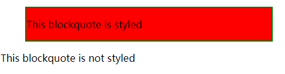

# css学习笔记-MDN

[toc]

## 一、CSS介绍

### 1.1 改变元素的默认样式

在HTML中，标题默认使用大号粗体；无序列表前默认使用实心圆点标记列表项...，这些默认的元素样式都是可以根据自己的喜好进行改变的，通过设置list-style-type来对元素默认的样式进行修改：

```css
/* 列表前标记消失 */
li {
    list-style-type: none;
}
/* 列表前变成竖大拇指的手型 */
li {
    list-style-type: "\1F44D";
}
```

### 1.2 使用类名选择

在html代码中对特定元素使用class属性，在css中对特定class属性前面加 **.** 标记

```html
<ul>
    <li>项目一</li>
    <li class="special">项目二</li>
    <li>项目三</li>
</ul>
```

```css
.special {
    color: orange;
    font-weight: bold;
}
```

有时会遇到li.special的形式，这个对应li标签下class为special的项。

### 1.3 根据元素在文档中的位置选择

1、包含选择符

当仅选择嵌套在\<li>元素内的\<em>时，可以使用**包含选择符**的选择器，它只是单纯的在两个选择器之间加上空格

```css
li em {
    color: red;
}
```

2、相邻选择符

选择在h1之后的p标签（p与h1同级），可以使用**相邻选择符**

```css
h1 + p {
    font-size: 200%;
}
```

### 1.4 根据状态确定样式

一个直观的例子是\<a>-超链接，这个标签有很多状态：未访问过、已访问、被鼠标悬停、正在被点击当中等。可以用css去定位元素的这些状态，进而设定样式

```css
/* 链接没被访问的时候为粉色 */
a:link {
    color: pink
}
/* 链接被访问后变为绿色 */
a:visited {
    color: green
}
/* 在超链接被鼠标悬停的时候，移除下划线 */
a:hover {
  text-decoration: none;
}
```

### 1.5 组合定位

将类名选择、位置选择、状态选择等定位方式组合一起进行定位：

```css
/* 定位到body内h1元素后边的p元素内class为special的元素 */
body h1 + p .special {
    ...
}
```

该CSS样式定位如下：

```html
<body>
    <h1>标题</h1>
    <p>
        <span></span>
        <!-- 定位到这里 -->
        <span class='special'></span>
        <div>...</div>
    </p>
    <p>...</p>
</body>
```

至此，选择器可以有以下几种写法：

```css
/* h1元素 */
h1
/* a元素没被链接前 */
a:link
/* id=onething */
#onething
/* 全局，如*{font-color: res}就是全局范围内文字是红色 */
*
/* class='box'内的p标签 */
.box p
/* class='box'内的p标签内的第一个元素 */
.box p:first-child
/* h1和h2和class='intro'的元素 */
h1, h2, .intro
/* h1后的p标签（同层） */
h1 + p
```

### 1.6 函数

大多数值是简单的关键字或数值，但也有一些值以函数的形式出现。比如calc()用于简单计算：

```css
.box {
    width: calc(90% - 30px)
}
```

### 1.7 @规则

@开头的关键字称为@规则。比如@import用于不同css文件之间的导入；@media用于媒体查询（带有条件的、响应式的css）

```css
/* 不满足媒体查询时，背景颜色为粉色 */
body {
    background-color: pink;
}

/* 当窗口宽度小于600px时，媒体查询生效，背景颜色变为蓝色 */
@media (min-width: 600px) {
    body {
        background-color: blue;
    }
}
```

### 1.8 CSS工作原理（重要）

浏览器接收到一个HTML文件之后到文件显示在浏览器上，中间经过如下步骤：

1. 浏览器载入HTML文件
2. 将HTML文件转化为一个DOM（其中DOM是HTML文件在内存的表现形式）
3. 浏览器拉取HTML相关的大部分资源，包括图片、视频、CSS样式（js会稍后处理）
4. 浏览器拉取到CSS之后进行解析，根据选择器类型（元素、class、id）进行分组，浏览器遍历DOM树，依次找到每个节点对应的样式并将样式应用到节点上（应用的过程称为**渲染树**）
5. 渲染完成后，根据每个元素应该出现在浏览器的位置进行布局
6. 网页展示在屏幕上（展示的过程称为着色）

形象一点的图如下：


浏览器遇到无法解析的CSS代码时，会直接**忽略**。
这样做的好处是，当使用最新的CSS去优化时，即使浏览器遇到不支持的特性无法解析时，也不会报错。这一特点使得，如果想用一个比较新的CSS属性时，可以直接添加，而不用担心添加之后影响原有样式。

```css
/* 可以同时添加两个width */
.box {
    width: 500px;
    width: calc(100% - 50px);
}
```

上述代码在应用到元素上之后，元素的宽会等于下面的width。因为渲染是从前向后的，可以理解为后面的覆盖了前面的样式（类似于js中let a = 1; a = 2;所以最后a的值就变成了2）。

## 二、CSS构建

### 2.1 层叠与继承

- 层叠
CSS规则的顺序很重要。当设置相同规则到一个元素时，写在后面的就是实际使用的规则。

```css
h1 {
    color: red;
}
h1 {
    color: blue;
}
```

最终h1标签的内容会被设置为蓝色

- 优先级

浏览器根据优先级来决定当**多个规则适用于同一元素时**，元素应该用哪个规则。通常
来说，“具体”的规则优先级大于“不具体”的。比如元素选择器优先级低于类选择器。

```css
.main-heading {
    color: red;
}

h1 {
    color: blue;
}
```

```html
<h1 class="main-heading">This is My heading</h1>
```

上述标题文字会显示为红色。因为类选择器优先级大于元素选择器。

- 继承

像颜色这种规则是存在继承关系的：

```css
body {
    color: blue;
}

span {
    color: black;
}
```

```html
<body>
    <p>123</p>
    <p>456<span>789</span></p>
</body>
```

其中body下的p中的文字全都继承了body的颜色样式


CSS为了控制继承，提供了四个特殊的通用属性值（其中revert极少用），**每个属性值都可以接收这些值**

- inherit：设置该属性开启继承
- initial：设置该属性和浏览器默认样式相同，若浏览器没有该属性的默认值且为自然继承，那么会设置为inherit
- unset：重置该属性的值

```css
body {
    color: green;
}
/* 继承于父元素颜色，即p中的绿色（文字） */
.my-class-1 a {
    color: inherit;
}
/* 字体默认颜色（黑色） */
.my-class-2 a {
    color: initial;
}
/* 自然继承时等于inherit */
.my-class-3 a {
    color: unset;
}
```

```html
<body>
    <p>Default <a href="#">link</a> color</p>
    <p class='my-class-1'>12234<a href="#">456</a></p>
    <p class='my-class-2'>12234<a href="#">456</a></p>
    <p class='my-class-3'>12234<a href="#">456</a></p>
</body>
```


同时设置所有属性的继承：使用all

```css
blockquote {
    background-color: red;
    border: 2px solid green;
}
/* 清除所有blockquote上的样式 */
.fix-this {
    all: unset
}
```

```html
<blockquote>
    <p>This blockquote is styled</p>
</blockquote>
<blockquote class="fix-this">
    <p>This blockquote is not styled</p>
</blockquote>
```



### 2.2 CSS选择器

### 2.3 盒模型

### 2.4 背景与边框

### 2.5 处理不同的文字方向

### 2.6 溢出的内容

### 2.7 值和单元

### 2.8 在CSS中调整大小

### 2.9 图片、媒体和表单元素

### 2.10 样式化表格

### 2.11 调试CSS

### 2.12 组织CSS

## 三、样式化文本

### 3.1 字体

网页安全字体：只有某几个字体可以应用到所有系统，被称为**网页安全字体**

通常设置字体的时候，会给一个**字体栈**，这样可以避免设置单一字体的情况下，有的网页显示不出来。设置方法如下：

```css
p {
  font-family: "Trebuchet MS", Verdana, sans-serif;
}
```

在这种情况下，浏览器从列表的第一个开始，然后查看在当前机器中，这个字体是否可用。如果可用，就把这个字体应用到选中的元素中。如果不可用，它就移到列表中的下一个字体，然后再检查。<font color='red'>通常字体栈的最后一个字体设置为网页安全字体，可以“兜底”</font>

## 四、样式化盒子

## 五、CSS布局
