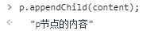
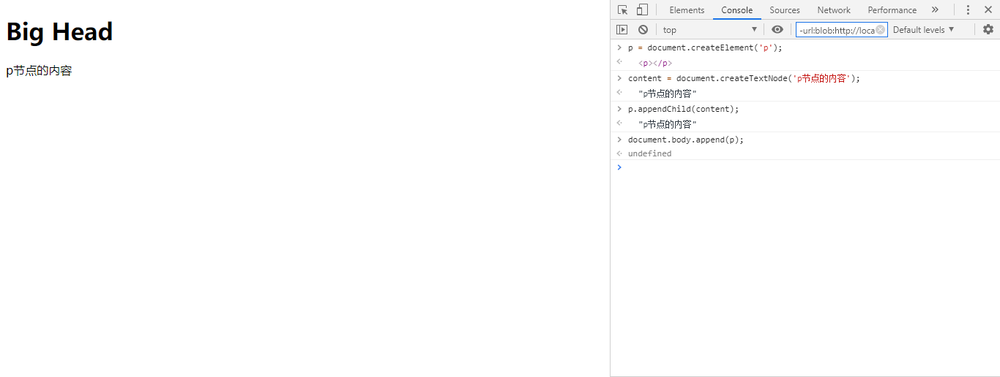

# Dom学习笔记

## 一、js和DOM以及BOM之间的联系

js的实现包括以下三部分：
1、核心（ESMAScript）：描述了js的基本语法。
2、文档对象模型（DOM）：处理网页内容的方法和接口。
3、浏览器对象模型（BOM）：与浏览器交互的方法和接口。

## 二、BOM

### 由于BOM内容较少，所以不单起目录进行，直接归到DOM学习中

BOM: Browser Object Model是浏览器对象模型，浏览器对象模型提供了独立与浏览器窗口进行互动的对象结构（全局变量和全局函数）。BOM中**window对象是顶层对象**，代表浏览器窗口，其他对象是该对象的子对象。

### 2.1、BOM对象

- window对象：是js的最顶层对象，其他BOM对象都是widow对象的属性；
- location对象：浏览器当前URL信息；
- navigator对象：浏览器本身信息；
- screen对象：客户端屏幕信息；
- history对象：浏览器访问历史信息；

#### 2.1.1 window对象

BOM的核心对象是window，它表示浏览器的一个实例。在浏览器中，window对象有双重角色，它既是通过js访问浏览器的一个接口，又是ESMAScript规定的Global对象。

1. 全局变量是window对象的属性，全局函数的window对象的方法。

2. window常用的方法包括弹窗（alert、confirm、setTimeout），调用这些方法时默认前面省略了window。

#### 2.1.2 location对象

window.location对象（方法调用时可不写window，下面几个对象同理）用于获取当前页面的地址（URL），并把浏览器重定向到新的页面。比如location.href返回当前页面的url地址；location.port返回url中指定的端口号；location.portocol返回页面所使用的协议（http或https）。

#### 2.1.3 navigator对象

window.navigator对象包含访问者（客户端）浏览器信息。比如navigator.platform返回操作系统类型；navigator.userAgent返回浏览器详细信息（同http请求头中的字段）；navigator.appName返回浏览器名称；navigator.language返回浏览器设置的语言。

#### 2.1.3 screen对象

window.screen对象包含有关用户屏幕的信息。screen.availHeight和screen.availWidth分别返回客户端屏幕的高度和宽度，以像素为单位，减去界面特性（比如Google的窗口任务栏）。

#### 2.1.3 history对象

window.history对象包括了浏览器的历史，history.back()会加载历史列表的前一个URL,即返回上一页；history.forward()加载历史列表的一下个URL,即返回下一页。这两个操作相当于浏览器上点击左箭头和右箭头。

### 2.2、主流浏览器介绍（当作科普）

注意：**BOM是与特定浏览器相关联的，比如同时打开一个网站，用Chrome和IE，在有些方法调用上是有区别的。**

浏览器内核主要指的是浏览器的渲染引擎，2013 年以前，代表有 Trident（IE），Gecko（firefox），Webkit（Safari chrome 等）以及 Presto（opera)。2013 年，谷歌开始研发 blink 引擎，chrome 28 以后开始使用，而 opera 则放弃了自主研发的 Presto 引擎，投入谷歌怀抱，和谷歌一起研发 blink 引擎，国内各种 chrome系的浏览器（360、UC、QQ、2345 等等）也纷纷放弃 webkit，投入 blink 的怀抱。

移动端的浏览器内核主要说的是系统内置浏览器的内核。

目前移动设备浏览器上常用的内核有 Webkit，Blink，Trident，Gecko 等，其中 iPhone 和 iPad 等苹果 iOS 平台主要是 WebKit，Android 4.4 之前的 Android 系统浏览器内核是 WebKit，Android4.4 系统浏览器切换到了Chromium，内核是 Webkit 的分支 Blink，Windows Phone 8 系统浏览器内核是 Trident。

## 三、DOM

DOM：Document Object Model为文档对象模型，是HTML和XML文档的编程接口。一个Web页面是一个文档，这个文档可以在浏览器窗口或作为HTML源码显示出来，这两种情况都是同一份文档。DOM提供了对同一份文档的另一种表现：将文档解析成一个由节点和对象组成的“DOM树”。简言之，**它会将Web页面与脚本或程序语言连接起来。**

Dom的操作的基本练习：[DOM基本练习](./index.html)

1. 文档初始如下：

2. 创建p节点：

3. 创建节点的内容：

4. 将节点内容绑定到p节点之下：

5. 将绑定好内容的节点加入到文档中：

执行上述操作之后，p节点被加入到文档中：

### 3.1、Dom重要的数据类型

- document
当一个成员返回document对象（如ownerDocument属性返回它所属于的document），这个对象就是root document对象本身。

ps: 鼠标放到输出结构#document上，左侧浏览器页面内整个文档对象会被标记选中。
- element
element是document上的一个元素或节点。例如，document.createElement('p')会返回在DOM上创建的节点p，这个节点p就是一个element。

- nodeList
nodeList是一个特定element的集合（它不是一个数组），如从document.getElementByTagName()返回的就是这种类型。nodeList可通过list.item(0)或者list[0]来访问数组中第一个元素。

这个集合是HTML定义的类型，称为HTMLCollection。
- attribute
attribute是特定元素（如某个p标签）的属性。DOM中的属性也是节点（Attr），就像元素一样。

上图中对p标签（因为文档中只有一个p元素，所以不指定具体是哪个）绑定一个key为my_attrib，value为newVal的attribute，可以看到在文档中属性同时被绑定到了p标签下。

- namedNodeMap
namedNodeMap和数组类似，它是特定元素的属性集合，其中属性的顺序不指定。

上图中使用p.attributes返回了p节点的所有属性的集合。

### 3.2、DOM接口

DOM中许多对象实现了多个接口。例如，table对象实现了[HTML Table Element Interface](https://developer.mozilla.org/zh-CN/docs/Web/API/HTMLTableElement)；另一方面table也是HTML元素，所以它也实现了Element接口，所以它具备Element所具有的属性和方法；最后，由于HTML元素对DOM来说也是组成web页面或xml页面节点数上的一个节点，所以table也实现了更基本的Node接口（Element对象继承了[Node接口](https://developer.mozilla.org/zh-CN/docs/Web/API/Node)）。
下面可以看到一个p标签具有Node接口的childNodes属性：

**例子**：table对象引用时，会用到不同接口的属性或方法：

上面的attributes属于Node/Element接口，而下面的summary属于HTMLTableElement接口。

### 3.3、DOM的核心接口

在DOM编程中，用的最多的就是document和window对象，window对象表示浏览器中的内容，而document对象表示文档的根节点。element继承了通用的Node接口，通常也会用到。下面是DOM中常见的API：

- document.getElementById(id)：通过id属性找到element
- document.getElementByTagName(name)：通过元素名称获取一个元素的集合（HTMLCollection）
- document.createElement(name)：创建HTML元素
- parentNode.appendChild(node)：将node添加到parentNode子节点列表的末尾处
- element.innerHTML：获取元素的内容（如
内容
，p.innerHTML获取的就是"内容"）。
- element.style.left：特定元素样式中的left属性（如p.style.color = 'red'是设置p标签的文字颜色为红色）
- element.setAttribute(name, value)：设置元素的属性
- element.getAttribute(name)：获取元素的属性
- element.addEventListener()：将指定的监听器注册到element上
- window.content：返回window下的content元素引用
- window.onload：在文档装载完成后会触发load事件。通常会window.onload = funcRef来表示当window的load事件触发后，funcRef触发
- window.dump()：输出信息到浏览器上
- window.scrollTo()：滚动到文档中的某个坐标

### 3.4、DOM API练习

[测试页](test_dom.html)

练习中需要补充的知识点操作截图：

