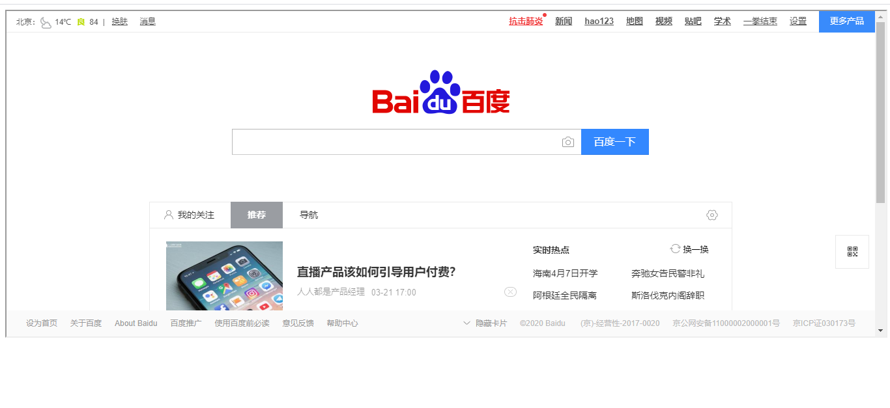
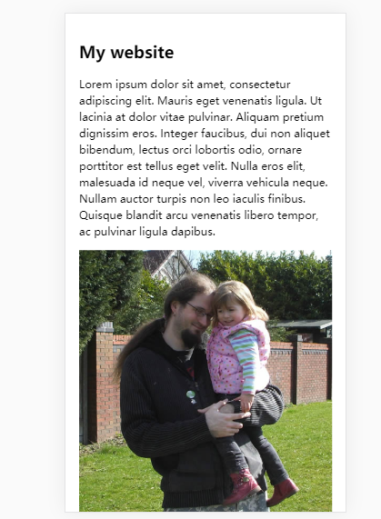

# html学习笔记-MDN

[toc]

## 一、HTML介绍

### 1.1 HTML入门

1、块级元素和内联元素

- 块级元素：在浏览器中以块的形式展现，相对于其前面的内容它会出现在新的一行，其后的内容也会换行。块级元素可以被嵌套进块级元素中，但是不能被嵌套到内联元素中。如p、table、footer等。完整列表参考：[块级元素](https://developer.mozilla.org/zh-CN/docs/Web/HTML/Block-level_elements)。
- 内联元素：内联元素通常出现在块级元素中，它不会导致文本换行。如a、em、b、input等。完整列表参考：[内联元素](https://developer.mozilla.org/zh-CN/docs/Web/HTML/Inline_elements)。

2、空元素

类似于img这种，只有一个标签的元素称为空元素：

```html

```

3、实体引用-在HTML中使用特殊字符
比如想将引号、尖括号等符号作为文本，需要借助实体引用，如：
<等价于\&lt;>等价于\&gt;等。

```html
<!-- 错误写法 -->
<pictu>HTML中用<p>来定义段落元素</p>
<!-- 正确写法 -->
<p>HTML中用&lt;p&gt;来定义段落元素</p>
```

### 1.2 \<head>

1、\<meta>
许多\<meta>元素包含了name和content属性。通常description用于在搜索引擎中使用。keywords和description通常可以使搜索引擎优化（SEO），指定了这样类型的元数据，有助于别人搜索到你的网站。
以海尔集团官网的html文档为例：


2、网站标签页的图标
网站通常都会在标签上有一个16*16像素的网站图标，现在很多网站都使用64\*64像素的图标（具体原因没研究），写法如下：

```html
<head>
    ...
    <link rel="shortcut icon" href="./pic/favicon.ico" type="image/x-icon" />
    ...
</head>
```

3、HTML中使用CSS和JS
在HTML中使用CSS和JS的方法是引入\<link>和\<script>标签：

- \<link>位于head中，包含两个属性，rel="stylesheet"表示这是文档的样式表，href包含了样式表的路径

```html
<link rel="stylesheet" href="css-file.css">
```

- \<script>可以放在head中，但是更好的选择是将它放到文档结束之前的位置（\</body>之前），这样可以确保在加载js之前浏览器已经解析了HTML内容，而不至于当加载脚本出现错误时，导致浏览器报错。

```html
<script src="js-file.js"></script>
```

4、文档语言

```html
<!-- 文档设置为英语 -->
<html lang="en-us">
<!-- 为文档的分段设置语言：例如下面把文档中日语部分设置为日语 -->
<p>Japanese example: <span lang="jp">ご飯が熱い。</span>.</p>
```

### 1.3 HTML文字处理

\<b>和\<strong>的区别
虽然两个标签的结果一样，但是目的不同。

- \<b>:字体样式为粗体（bold）
- \<strong>:代表内容非常重要

&emsp;&emsp;也就说\<b>是基于样式的，而\<strong>是基于文档内容的。类似于基于文档内容的还有\<em>，它代表强调内容（emphasis），在输出上表现为斜体。
<font color='red'>&emsp;&emsp;像\<font>、\<iframe>、\<u>这类没有语义的表象标签，它们出现在CSS不完全支持粗体、斜体、下划线的时期，但是现在这些元素应该被废弃！
&emsp;&emsp;因为语义对HTML的可访问性、SEO等都非常重要！</font>

### 1.4 超链接

1、超链接可以链接到文档外部，也可以链接到文档内的特定部分（**文档片段**）。

```html
<!-- 链接到外部 -->
<p>Link to external <a href="../../external.html">document</a>.</p>
```

```html
<!-- 链接到内部元素 -->
<h2 id="title">h2 title</h2>
<p>Link to internal <a href="#title">element</a>.</p>
```

2、尽量使用**相对链接**
因为使用绝对链接会使浏览器首先去DNS上查找服务器的真实位置，然后再转到该服务器下查找被请求的文件，这就无形当中增加浏览器的工作，而使用相对链接就直接在同一服务器上查找被请求的文件。

3、在下载链接使用download属性
当链接到要下载的资源而不是浏览器中打开时，使用download属性可以提供一个默认的保存文件名：

```html
<a href="https://download.mozilla.org/?product=firefox-latest-ssl&os=win64&lang=en-US"
   download="firefox-latest-64bit-installer.exe">
  Download Latest Firefox for Windows (64-bit) (English, US)
</a>
```

4、电子邮件链接

```html
<a href="mailto:nowhere@gamil.com">Send email to nowhere</a>
```

如下：


### 1.5 高级文字排版

以下元素均为**内容标签**

1、描述列表
使用\<dl>，代表描述列表-description list；每一项用\<dt>，代表描述元素-description term；每一项的具体描述用\<dd>，代表具体描述-description description。

```html
<dl>
    <dt>培根</dt>
        <dd>整个世界的粘合剂。</dd>
    <dt>鸡蛋</dt>
        <dd>一块蛋糕的粘合剂。</dd>
    <dt>咖啡</dt>
        <dd>一种浅棕色的饮料。</dd>
        <dd>可以在清晨带来活力。</dd>
</dl>
```

2、引用
规则如下：
1）块元素用\<blockquote>，其中使用site属性表明引用地址
2）行内引用使用\<q>
3）引用无法显示在浏览器中，想要在浏览器上显示信息，则使用引文元素\<cite>
引文更常用一些，默认字体是斜体：

```html
<p>你好，这段引用自：
    <a href="https://www.baidu.com"><cite>孔子</cite></a>
</p>
```

3、缩略语
使用\<abbr>来代表缩略语，会在缩略语标记下划虚线，鼠标放到缩略语上会显示相应全称（前提是自己设置）

```html
<p>我们使用 <abbr title="超文本标记语言（Hypertext Markup Language）">HTML</abbr> 来组织网页文档。</p>
```


4、联系方式
\<address>，默认为斜体

```html
<address>
  <p>张三、Tom</p>
</address>
```


5、上标和下标

\<sup>和\<sub>分别标记上表和下标：

```html
<p>水的化学方程式是 H<sub>2</sub>O。</p>
<p>x<sup>2</sup> = 5</p>
```


### 1.6 文档和网站结构

1、典型的HTML包括以下部分：

- 页眉：\<header>
- 导航栏：\<nav>
- 主内容：\<main>
- 侧边栏：\<aside>---通常嵌套在\<mian>中
- 页脚：\<footer>

这些元素都有自己对应的语义。除了5大布局元素外，还包括\<article>表示一篇文章，\<section>表示内容分块。

没有语义值的包括\<div>和\<span>，其中前者是块级元素，后者是内联元素，他们都没有具体含义。

2、换行和水平分割线
换行用\<br>，水平线用\<hr>

### 1.7 HTML调试

HTML代码很**宽松**，并且现代浏览器基本都可以对HTML代码进行自动修复语法错误（不见得和本身想达到的效果相同）。检查HTML代码语法错误可以使用W3C的[标记验证服务](https://validator.w3.org/)，输入HTML代码，会返回相应的语法错误：


## 二、多媒体与嵌入内容

### 2.1 HTML中的图片

1、图片宽高的问题
指定图片宽高会在DOM渲染时为要显示的图片预留下一定的空间，从而使得页面加载的更快速。
&emsp;&emsp;指定宽高的时候不应该使用width和height来改变原图大小。因为如果设定比原图大，就会使得图片变得模糊；设定比原图小，就会下载大于你需要的图片，从而浪费带宽；没有保持原图的宽高比例，又会使图片变得扭曲。<font color='red'>所以，在将图片放到网站前，先在PS等软件内编辑好图片尺寸大小。</font>

2、为图片搭配说明文字
用一个段落为一张图片搭配说明文字的方式的可以的，但是这种情况下会使得HTML没有语义性（在图片很多的情况下，你会搞不清楚p标签里的说明文字到底是哪张图片的说明）

```html
<div class="figure">
  
  <p>曼彻斯特大学博物馆展出的一只霸王龙的化石</p>
</div>
```

通过引入figure和figcaption来将一张图片和一段文字进行“绑定”，可以理解为下述为一个图文元素。

```html
<figure>
  
  <figcaption>曼彻斯特大学博物馆展出的一只霸王龙的化石</figcaption>
</figure>
```

3、CSS背景图片 VS HTML图片元素
以下两种方式都可以在HTML中**显示**一张图片

```html
<p>
    
</p>
```

```css
p {
    background-image: url("images/dinosaur.jpg");
}
```

两种方式的显示是一样的，唯一不同是HTML元素的方式是会在DOM中创建节点，它代表了内容的意义；而CSS的方式不会再DOM中创建节点，纯粹是为了装饰文档。

### 2.2 视频和音频

**一、**\<video>
1、简单的例子：

```html
<video src='rabbit320.webm' controls>
    <p>你的浏览器不支持H5视频</p>
</video>
```

属性包括类似于img的src，除此之外还有可以控制视频播放器（包括声音大小、进度等）的controls字段。\<video>标签内的内容（\<p>你的浏览器不支持H5视频\</p>）叫作**后备内容**，当浏览器不支持H5的video标签时，会显示这段话。

2、多格式支持
像MP3、MP4、WebM这些术语都叫**容器格式**。为什么叫容器格式呢？这是因为这些格式是一种音频+一种视频结合而成的格式，如：

- WebM 容器通常包括了 Ogg Vorbis 音频和 VP8/VP9 视频。
- MP4 容器通常包括 AAC 以及 MP3 音频和 H.264 视频。

不同浏览器包含了不同的**Codecs**（编解码器），Codecs用于将音视频转化为二进制数字。因为专利问题，并不是所有的浏览器都支持类似MP3音频或MP4视频（MP4专利到2027年）等，所以如果想要保证视频在不同浏览器都能播放，就需要准备不同格式来**兼容不同浏览器**。

```html
<video controls>
  <source src="rabbit320.mp4" type="video/mp4">
  <source src="rabbit320.webm" type="video/webm">
  <p>你的浏览器不支持 HTML5 视频。可点击<a href="rabbit320.mp4">此链接</a>观看</p>
</video>
```

将video中的src移除，在video内加上source标签。source标签中的type是可选的，但是强烈建议加上，因为如果不加，浏览器会对尝试加载每一个文件，直到找到能正确播放的，这样会消耗大量的时间和资源。

3、多属性

- width、height：控制视频尺寸
- autoplay：自动播放
- loop：循环播放
- muted：默认关闭声音
- poster：播放前默认显示的图像。通常用于粗略的预览或者广告。
- preload：缓冲大的视频文件（none-不缓冲、auto-页面加载后缓冲、metadata-仅缓冲文件的元数据）

**二、**\<audio>

1、简单的例子：

```html
<audio controls>
  <source src="viper.mp3" type="audio/mp3">
  <source src="viper.ogg" type="audio/ogg">
  <p>你的浏览器不支持 HTML5 音频，可点击<a href="viper.mp3">此链接</a>收听。</p>
</audio>
```

<font color='red'>audio和vedio用法几乎相同</font>，不同之处是\<audio> 标签不支持 width/height 属性以及 poster 属性。

**三、** 字幕
webVTT格式使得在视频或音频上添加字幕成为可能。通过在视频内使用\<track>标签指定特定的音轨文件来实现，其中需要满足：

- 音轨文件后缀名为.vtt
- 以\<track>标签链接.vtt文件，并且放在\<source>之后；使用kind指明类型，如subtitles；使用srclang指明用什么语言编写的字幕文件


```html
<video controls>
    <source src="example.mp4" type="video/mp4">
    <source src="example.webm" type="video/webm">
    <track kind="subtitles" src="subtitles_en.vtt" srclang="en">
</video>
```

### 2.3 从\<object>到\<iframe>---其他嵌入技术

1、\<iframe>
\<iframe>元素允许将外接的Web文档嵌入到当前文档中（类似于webview），适合于第三方内容加到网站中。

```html
<iframe src="https://www.baidu.com" width="100%" height="500">
    <p>不支持iframe</p>
</iframe>
```



主要记住以下属性：

- src：外部资源地址
- width、height：盛放外部资源的容器的宽和高
- 备选内容：iframe中的内容，当浏览器不支持iframe时的显示结果
- sandbox：与**安全性**设置有关

<font color='red'>PS：在主页内容加载完后，再使用js设置src属性以访问外部资源有利于页面更快被使用，有利于主页加载速度（重要的SEO指标！！！）</font>

2、安全隐患

- 单击劫持
黑客将隐藏的iframe嵌入到你的网站文档，或者你的网站嵌入到他们的网页中，来误导用户或窃取敏感数据。

解决安全隐患方法：
1）使用https来解决安全问题：如果都使用https，嵌入方和被嵌入方都无法获取对方网站的私密信息；如果一方不使用，那么另一方就可以获取对方的网站信息。
2）始终使用sandbox属性：通过给嵌入的内容特定权限，来防止嵌入内容对被嵌入页进行损害（包括js代码执行、表单提交等）；<font color='red'>特别需要注意对一个嵌入页，不要不同添加allow-scripts和allow-same-origin到sandbox下</font>。因为在这种情况下，嵌入内容的内容可以绕过**站点执行脚本的同源安全策略**，并使用JavaScript完全关闭沙盒（设置好的权限容器）。
3）设置**内容安全策略**：在HTTP头设置<font color='red'>X-Frame-Options: DENY</font>防止别的网站嵌入自己网站的内容。（这块见图解HTTP额6.8.1）


3、\<embed>和\<object>元素
这两种元素不同于\<iframe>，它们是用来嵌入类似于java小程序、pdf、flash等内容。但是随着技术发展，这些内容通常以其他方式去访问，而不是web，所以它们的使用也越来越少。

### 2.4 在页面中添加矢量图

简介：SVG是用于描述矢量图像的XML语言。svg用于标记图形，而不是内容，例如：

```html
<svg version="1.1"
     baseProfile="full"
     width="300" height="200"
     xmlns="http://www.w3.org/2000/svg">
    <rect width="100%" hright="100%" fill="black" />
    <circle cx="150" cy="100" r="90" fill="red" />
</svg>
```


<font color='red'>将SVG添加到页面的方式：</font>

1、img引入

```html

```

**特点：** 无法使用css、js操作svg图像

2、html代码中引入

```html
<svg width="300" height="200">
    <rect width="100%" height="100%" fill="green" />
</svg>
```

**特点：** 将svg内联可以减少http请求，减少加载时间；可以用css、js去对图像进行操作；额外的svg代码会增加html文件大小；浏览器无法像缓存图片那样缓存svg。

3、使用iframe引入

```html
<iframe src="triangle.svg" width="500" height="500" sandbox>
    
</iframe>
```

**特点：** 除非svg和当前网页同源，否则不能在页面上使用js去操作svg。

<font color='red'>矢量图详细内容看MDN官网的[教程](https://developer.mozilla.org/zh-CN/docs/Web/SVG/Tutorial)</font>

### 2.5 响应式图片

**响应式图片：** 一种可以在不同屏幕尺寸和分辨率的设备上都能良好工作的图片

理想的情况是**当访问网站时依靠不同的设备来提供不同的分辨率图片和不同尺寸的图片**

1、分辨率切换：不同尺寸
**问题1：** 同样显示一张800像素的图片，在PC端正常显示的时候没有问题；在手机上（手机屏宽度小于800像素，假设为400像素），同样显示800像素的图片，就会出现：**和PC端消耗同样的带宽**,如下图：


明明屏幕变小了，图片也跟着缩小了，但是还要消耗相同的带宽。有什么办法可以当目标设备屏幕宽度比较小的时候渲染小尺寸的图片，来达到**节省（移动设备）带宽**的方法呢？

解决办法：
&emsp;&emsp;先进行<font color='red'>美术设计</font>，将所需图片根据要求制作出不同的尺寸来，然后再借助img中srcset和sizes属性

```html

```

**srcset**定义了浏览器选择的图像集，并规定了每张图片的大小。每个图像之间以逗号划分，以pic-320w.jpg 320w来说，pic-320w.jpg是文件名，接着跟个空格，最后的320w是图像的宽度。

**sizes**定义了一组媒体条件，并且根据条件决定最终选用图片集的哪张图片。每个条件之间以逗号划分，以(max-width: 320px) 280px为例，max-width: 320px是一个媒体条件，代表当前可视窗口的**宽度小于等于320px时**，接着跟个空格，最后的280px是图像将填充的槽的宽度（在这里是280px）。

在指定了srcset和sizes之后，浏览器会：

1. 查看设备宽度
2. 检查媒体条件中那一项为真
3. 查看满足条件对应槽的大小
4. 加载srcset图片集中最接近所选槽大小的图片

<font color='red'>所以如果屏幕宽度为300px，那么选择280px的槽，对应选择pic-320w.jpg；如果屏幕宽度为400，那么选择440px的槽，对应选择pic-480w.jpg；如果屏幕宽度大于480px，比如500px，那么会选择800px的槽，对应选择pic-800w.jpg。</font>
<font color='blue'>设想一下：</font>一张800px的图片大小为128k的话，480px的图片大小仅为63k，一张图片节省了一半。在一个多图片的移动页面，**这将节省大量带宽！**

2、分辨率切换：相同尺寸，不同分辨率
**问题2：** 如果希望提供多分辨率支持，希望每个设备上的图片显示的尺寸相同，可以使用srcset和x语法结合：

```html

```

img会设定一个固定的宽。注意，这个宽只是像素上的固定，不是物理尺寸上的固定，也就说在电脑上可能1000px等于20厘米，在高分辨率的手机上可能等于8厘米，如下图：


在浏览器，一个设备像素等于一个CSS像素，所以会加载img-320w.jpg，而在手机，一个像素等于两个CSS像素或更多，所以会加载img-640w.jpg，**以此来提高视觉效果（不考虑带宽的情况下）**。

3、使用\<picture>
**问题3：** 在屏幕较窄的时候，图片由于跟着屏幕缩小导致细节看不到：
图一：在浏览器全屏下图片的大小可以让我们看到人物细节

图二：在手机屏幕下图片的大小跟着缩小使得人物细节丢失

图三：使用基于不同尺寸的分辨率切换后，手机屏幕下可以看到和浏览器中相同图片细节的<font color='red'>“裁剪图片”</font>


**解决方法：** \<picture>使浏览器在不同资源间做出选择，就像\<video>和\<audio>一样，包含了一些\<source>：

```html
<picture>
    <source media="(max-width: 799px)" srcset="pic-crop-480w.jpg">
    <source media="(min-width: 800px)" srcset="pic-800w.jpg">
    
</picture>
```

其中\<source>是当满足不同媒体条件时所呈现的资源；\<picture>中的\是当浏览器不支持picture时的备选方案。

通过使用\<picture>我们可以达到上面第三张图的情况。

## 三、HTML表格

### 3.1 元素介绍

- \<table>：表格元素
- \<th>：表格标题
- \<tr>：表格行元素
- \<tr>：表格列元素

```html
<table>
      <tr>
        <td>&nbsp;</td>
        <th scope="col">Knocky</th>
        <th scope="col">Flor</th>
        <th scope="col">Ella</th>
        <th scope="col">Juan</th>
      </tr>
      <tr>
        <th scope="row">Breed</th>
        <td>Jack Russell</td>
        <td>Poodle</td>
        <td>Streetdog</td>
        <td>Cocker Spaniel</td>
      </tr>
      <tr>
        <th scope="row">Age</th>
        <td>16</td>
        <td>9</td>
        <td>10</td>
        <td>5</td>
      </tr>
      <tr>
        <th scope="row">Owner</th>
        <td>Mother-in-law</td>
        <td>Me</td>
        <td>Me</td>
        <td>Sister-in-law</td>
      </tr>
      <tr>
        <th scope="row">Eating Habits</th>
        <td>Eats everyone's leftovers</td>
        <td>Nibbles at food</td>
        <td>Hearty eater</td>
        <td>Will eat till he explodes</td>
      </tr>
    </table>
```


### 3.2 跨行跨列

- rowspan：跨行
- colspan：跨列

```html
<!-- 先把行定出来，一共7行，所以7个tr；
再逐个tr去分析里面的元素跨行跨列情况 -->
<table>
    <tr>
        <th colspan="2">Animals</th>
    </tr>
    <tr>
        <th colspan="2">Hippopotamus</th>
    </tr>
    <tr>
        <th rowspan="2">Horse</th>
        <td>Mare</td>
    </tr>
    <tr>
        <td>Stallion</td>
    </tr>
    <tr>
        <th colspan="2">Crocodile</th>
    </tr>
    <tr>
        <th rowspan="2">Chicken</th>
        <td>Hen</td>
    </tr>
    <tr>
        <td>Rooster</td>
    </tr>
</table>
```


### 3.3 为表格列提供共同样式

使用colgroup和col可以为特定列添加共同样式（没有rowgroup的概念，rowgroup是scope的取值，浏览器不会因为scope的取值出现视觉变化，它用于屏幕阅读器）

未引入这个概念之前，我们想为每列添加相同的样式，需要每列设置style：

```html
<table>
  <tr>
    <th>Data 1</th>
    <th style="background-color: yellow">Data 2</th>
  </tr>
  <tr>
    <td>Calcutta</td>
    <td style="background-color: yellow">Orange</td>
  </tr>
  <tr>
    <td>Robots</td>
    <td style="background-color: yellow">Jazz</td>
  </tr>
</table>
```

引入colgroup和col之后：

```html
<table>
    <colgroup>
        <col>
        <col style="background-color: yellow">
    </colgroup>
    <tr>
        <th>Data 1</th>
        <th>Data 2</th>
    </tr>
    <tr>
        <td>Calcutta</td>
        <td>Orange</td>
    </tr>
    <tr>
        <td>Robots</td>
        <td>Jazz</td>
    </tr>
</table>
```

上述两种方法达到的效果是一样的，但是第二种在代码可读性和代码量上远胜于第一种


### 3.4 表格高级特性

高级特性包括：

- \<caption>：给表格添加标题
- \<thead>：结构化标签-表头
- \<tbody>：结构化标签-表体
- \<tfoot>：结构化标签-表尾

结构化标签并不会在视觉上进行样式改变，仅为了使table变得更加结构化、更加可读。

```html
<table>
    <!-- 表格标题 -->
    <caption>How I chose to spend my money</caption>
    <!-- 表头 -->
    <thead>
        <tr>
            <th>Purchase</th>
            <th>Location</th>
            <th>Date</th>
            <th>Evaluation</th>
            <th>Cost (€)</th>
        </tr>
    </thead>
    <!-- 表体 -->
    <tbody>
        <tr>
            <td>Haircut</td>
            <td>Hairdresser</td>
            <td>12/09</td>
            <td>Great idea</td>
            <td>30</td>
        </tr>
        <tr>
            <td>Lasagna</td>
            <td>Restaurant</td>
            <td>12/09</td>
            <td>Regrets</td>
            <td>18</td>
        </tr>
        <tr>
            <td>Shoes</td>
            <td>Shoeshop</td>
            <td>13/09</td>
            <td>Big regrets</td>
            <td>65</td>
        </tr>
        <tr>
            <td>Toothpaste</td>
            <td>Supermarket</td>
            <td>13/09</td>
            <td>Good</td>
            <td>5</td>
        </tr>
    </tbody>
    <!-- 表尾 -->
    <tfoot>
        <tr>
            <td colspan="4">SUM</td>
            <td>118</td>
        </tr>
    </tfoot>
</table>
```


**嵌套表格：** 高级特定中还包括嵌套表格，但是这实际上并不会用到，因为嵌套的表格在视觉效果上让人很难理解

```html
<table id="table1">
  <tr>
    <th>title1</th>
    <th>title2</th>
    <th>title3</th>
  </tr>
  <tr>
    <td>
      <table id="table2">
        <tr>
          <td>cell1</td>
          <td>cell2</td>
          <td>cell3</td>
        </tr>
      </table>
    </td>
    <td>cell2</td>
    <td>cell3</td>
  </tr>
  <tr>
    <td>cell4</td>
    <td>cell5</td>
    <td>cell6</td>
  </tr>
</table>
```


## 四、HTML表单

### 4.1 \<form>

form是表单的容器，类似于div和p。form中有很多属性，其中action和method一般来说需要填上。action定义了表单提交的时候数据发给谁；而method定义发送数据的http方法（get或者post）。

### 4.2 表单内元素

表单内元素有很多种，以\<label>、\<input>、\<textarea>为例实现一个表单：

```html
<form action="/my-handing-form-page" action="post">
    <div>
        <label for="name">Name:</label>
        <input type="text" id="name">
    </div>
    <div>
        <label for="mail">E-mail:</label>
        <input type="email" id="mail">
    </div>
    <div>
        <label for="msg">Message:</label>
        <textarea id="msg"></textarea>
    </div>
</form>
```

1）label
label中定义一个for属性，值为链接到部件的id，通常和输入框等部件链接

2）input
input中最重要的属性是type，它表明这个输入框的类型，如text、password、email等

3）textarea
textarea不同于input（input是空标签），textarea中间的是默认值（本例中没有设置默认值）。

### 4.3 表单提交

表单提交需要使用\<button>元素，其中最重要的属性是type，包含submit-提交、reset-重置、button-按钮三种取值：

- submit：是type的默认值，会发送表单数据到\<form>元素的action属性所定义的网页中
- reset：将表单中的小部件重新设置为它们的默认值
- button：单纯的按钮，点击不会发生任何事情（通常配合js来使用）

按钮的创建还可以使用\<input type="submit">，但是多样性上不如\<button>。

### 4.4 向Web服务器发送表单数据

在向web服务发送表单数据时，需要为每个用户输入数据起名：

```html
<input type='text' id='name' name='user_name'>
```

上述代码在表单提交后，会将用户输入以user_name: '用户输入'的形式发送到后端。

### 4.5 表单高级特性

1、H5中规定了表单组件可以写到表单外边，只要在组件内部指定form属性即可，但是目前而言，跨浏览器对这个特性支持不好，所以尽量将组件写到表单内部。

2、\<fieldset>和\<legend>
\<fieldset>元素是一种方便的用于创建具有相同目的的小部件组的方式，出于样式和语义目的。 你可以在\<fieldset>开口标签后加上一个\<legend>元素来给\<fieldset> 标上标签。\<legend>的文本内容描述了\<fieldset>里所含有部件的用途。

```html
<form>
    <fieldset>
        <legend>Fruit juice size</legend>
        <p>
            <input type='radio' name='size' id='size_1' value='small'>
            <label for="size_1">Small</label>
        </p>
        <p>
            <input type='radio' name='size' id='size_2' value='middle'>
            <label for="size_2">Middle</label>
        </p>
        <p>
            <input type='radio' name='size' id='size_3' value='large'>
            <label for="size_3">Large</label>
        </p>
    </fieldset>
</form>
```

这里说一下value的使用：

对于不同的输入类型，value 属性的用法也不同：

- type="button", "reset", "submit" - 定义按钮上的显示的文本
- type="text", "password", "hidden" - 定义输入字段的初始值
- type="checkbox", "radio", "image" - 定义与输入相关联的值

<font color='red'>\<input type="checkbox"> 和 \<input type="radio"> 中**必须设置** value 属性</font>

表单的练习：[点这里](test3.html)

## 五、HTML解决常见问题

### 5.1 基本问题

### 5.2 进阶问题

## 六、未完成

1. 表单的深入
2. svg
3. canvas
