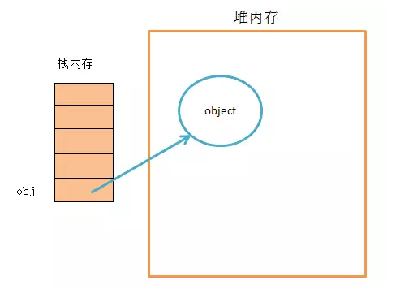

# js知识点

[toc]

## 一、Object对象的浅拷贝与深拷贝方法详解

### 1.1 浅拷贝和深拷贝的区别

浅拷贝：仅仅复制对象的引用，而不是对象本身。拷贝的是值的地址（堆内存地址）。
深拷贝：把复制的对象所引用的全部对象值都复制一遍。拷贝的是值而不是地址。

变量和**引用值**在内存中的存储如下图(以let obj = object为例，其中obj为变量，object为引用值)：

<font color='red'>变量存在于栈内存中，而**引用值**存储在堆内存中。</font>

用一个简单的例子来区别：

```js
// 浅拷贝
let a = {'name': 'qwe', 'sex': 'male', 'age': 18};
let b = a;
a.age = 25;
console.log(b)      // {name: "qwe", sex: "male", age: 25}
```

```js
// 深拷贝
let a = {'name': 'qwe', 'sex': 'male', 'age': 18};
let b = new Object();
for(let key in a){
    b[key] = a[key];
}
a.age = 25;
console.log(b);     // {name: "qwe", sex: "male", age: 18}
```

### 1.2 浅拷贝

1、如果是基本数据类型，变量名和值都存储在栈内存中

```js
let a = 1;
let b = a;
b = 2;
console.log(a)      // 1
```

上述情况虽然b的变化没有使得a变化，但是由于是基本数据类型，所以算不上深拷贝，因为深拷贝本身就是针对引用类型的。

2、如果是引用数据类型（统称为对象-Object）

```js
// 对于单层
let a = {'a': 1, 'b': 2, 'c': 3};
let b = a;
a.a = 10;
console.log(b);     // {a: 10, b: 2, c: 3}

let c = Object.assign({}, a);
a.a = 20;
console.log(c);     // {a: 10, b: 2, c: 3}
```

对于单层来说，等号赋值的方式是浅拷贝而Object.assign()的方式是深拷贝。

```js
// 对于多层
let a = {'a': 1, 'b': 2, 'c': {'d': 4}};
let b = a;
let c = Object.assign({}, a);
a.c.d = 5;
console.log(b);     // {'a': 1, 'b': 2, 'c': {'d': 5}}
console.log(c);     // {'a': 1, 'b': 2, 'c': {'d': 5}}
```

对于多层来说，等号赋值和Object.assign()的方式都是浅拷贝。

<font color='red'>总结：Object.assign()是拷贝的源对象的属性，也就是说它没法拷贝源对象的引用的属性（即只能深拷贝一层），等于号则直接拷贝引用，属于浅拷贝。</font>

### 1.3 深拷贝

对于单层对象来说，Object.assign()属于深拷贝；对于多层对象来说，有以下几种方法实现深拷贝：

1、JSON.parse(JSON.stringify(obj))

```js
// 多层对象的深拷贝
let a = {'a': 1, 'b': 2, 'c': {'d': 4}};
let b = JSON.parse(JSON.stringify(a));
a.c.d = 5;
console.log(b);     // {'a': 1, 'b': 2, 'c': {'d': 4}}
```

这种方法会有一个问题：**它会抛弃对象的constructor，也就是说深拷贝之后，对象的构造函数会变为:f Object() {[native code]}，也就是对象。**这种方法能正确处理的对象只有 Number, String, Boolean, Array, 扁平对象，即那些能够被 json 直接表示的数据结构。RegExp对象是无法通过这种方式深拷贝。

2、递归

```js
function deepClone(p, c){
    let c = c || {};
    for(let i in p){
        if(typeof p[i] === 'object'){
            c[i] = (p[i].constrctor === Array) ? [] : {};
            deepClone(p[i], c[i]);
        }else{
            c[i] = p[i];
        }
    }
    return c;
}
```

单个参数：

```js
function deepcopy(obj){
    //  将对象的特殊情况进行处理
    if(obj === null) return null;
    if(obj instanceof RegExp) return new RegExp(obj);
    if(obj instanceof Date) return new Date(obj);

    if(typeof obj !== object){
        return obj;
    }

    let newObj = new obj.constructor();
    for(let key in obj){
        newObj[key] = deepcopy(obj[key]);
    }
    return newObj;
}
```

<font color='red'>这里没将array和object严格区分，不太严谨。但是在正常的数组
（不含自定义属性-对象定义、不对循环key进行计算）传入时是没有问题的</font>

```js
function deepcopy(obj){
  // 对基本类型进行处理
  if(typeof obj !== 'object'){
      return obj;
  }
  // 将对象的特殊情况进行处理
  if(obj === null) return null;
  if(obj instanceof RegExp) return new RegExp(obj);
  if(obj instanceof Date) return new Date(obj);
  // 区分{}和array
  let newObj = obj.constructor === Array ? [] : {};
  if(obj.constructor === Array){
      for(let i = 0; i < obj.length; i++){
        newObj[i] = deepcopy(obj[i]);
      }
  }else{
      for(let key in obj){
        newObj[key] = deepcopy(obj[key]);
      }
  }
  return newObj;
}
```

3、node下使用库函数（lodash）
_cloneDeep(obj)

## 二、 Promise问题
