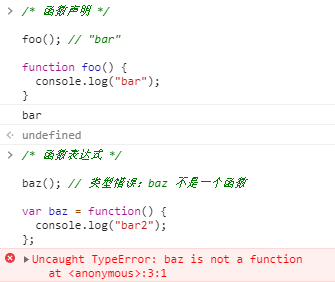

# js学习笔记-MDN

[toc]

## 一、初级

js的标准称为ECMAScript，ES6在2015年被发布，所以也称为ECMAScript 2015。现在最新的标准是ECMAScript 2020，标准链接[点击这里](https://tc39.es/ecma262/)。

该学习分以下章节：**1.介绍、2.语法和数据类型、3.控制流和错误处理、4.循环与迭代、5.函数、6.表达式和运算符、7.数字与日期、8.文本格式化、9.索引集合、10.带键集合、11.处理对象、12.对象模型的细节、13.Promises、14.迭代器与生成器、15.元编程、16.js模块**

### 1.1 介绍

#### 1.1.1 js用途

js的核心部分可通过添加对象来扩展功能，主要可用在客户端和服务端

1. 客户端js
**通常依靠v8等客户端js引擎来运行**。客户端js通过提供对象，控制BOM和DOM。例如，客户端js支持在Web上的鼠标点击、表单提交、页面导航等。
2. 服务端js
**通常依靠nodejs等服务端js引擎来运行**。服务端js通过在提供在服务器上运行的js对象来扩展功能。例如，服务端js支持应用和数据库通信、在服务器上进行文件操作等。

#### 1.1.1 js与java的区别

js是一种基于原型而不是基于类的面向对象语言。而java是基于类的面向对象语言。基于类的语言是构建在类和实例两个概念之上的（例如学生这个类，和小明同学这个实例）；基于原型的的语言只有对象，原型是一个模板，新对象可以从中获取原始的属性和方法，在此基础之上添加自己的属性，**既可以是创建时声明也可以是运行时声明**（这一点java是不支持的，java类中的属性在创建后就不能改变）。

主要区别如下：
|javascript|java|
|-|-|
|基于原型实现面向对象，可以动态添加属性|基于类实现面向对象，不能动态添加属性|
|变量不需要声明类型（动态类型）|变量需要声明类型（静态类型）|
|不能直接自动写入硬盘|可以直接自动写入硬盘|

#### 1.1.2 hello world

```js
function first(str){
    alert('Hello ' + str);
}

first('World!');
```

### 1.2 语法和数据类型

#### 1.2.1 基础

1. js区分大小写、并使用Unicode字符集。每一行js代码末尾要有分号（可以不加，不报错，但是不建议这么做，会出现不可预料的Bug）。
2. 注释和java及c++类似，都是单行//或多行/**/。
3. js声明有三种，包括var、let、const。其中不建议再使用var了，var全部使用let代替来声明变量（var声明会导致作用域问题），而常量用const声明。也可不加声明关键字直接声明，但是在strict模式下会出错。

#### 1.2.2 变量

1、**undefined和null**

1） undefined来判断一个变量是否被赋值

```js
let input;
if(input === undefined){
    console.log(1);
}else{
    console.log(2);
}
```

上面这段程序会输出1，因为input没有被定义

2）布尔值环境中undefined == false


3）数值环境中undefined被转化为NaN


4）null在求值时作为0；在布尔环境中作为false


2、**变量提升**

ES6中引入let后，变量提升就不存在了。变量提升就是在使用var声明变量时，先执行、后声明是不会报错的，它会将变量提升到语句最前面。


3、**函数提升**

对于函数来说，只有函数声明会被提升到顶部，而函数表达式不会：


4、**全局变量**

全部变量是全局对象的属性。网页中，全局对象就是window。可以通过形如window.variable访问全局变量。在window下声明的属性都可以通过全局对象window访问：


5、**常量**

常量使用const关键字定义。常量只读，不可改变（对于数值、字符串和函数等）：

常量对于对象和数组是不受保护的（也就是说可写）：


#### 1.2.3 数据结构和类型

最新的ECMAScript标准定义了8种数据类型

- 七种基本数据类型
1）Boolean（布尔值）
2）null
3）undefined
4）Number（数字）
5）BigInt（任意精度的整数）
6）String（字符串）
7）Symbol（代表）
- 非基本数据类型（引用类型）
8）Object（对象）

<font color='red'>基本数据类型指的是简单的数据段，他们的值以键值对的形式保存在栈中</font>

-**数据类型的转换**
数字转化为字符串：

```js
let x1 = "The answer is " + 1;
// x1输出为"The answer is 1"
let x2 = "37" + 3;
// x2输出为"373"
```

字符串转化为数字：

```js
let y1 = "37" - 7;
// y1输出为30
let y2 = +"1.1";
// y2输出为1.1
let y3 = parseInt("123");
// y3输出为123
let y4 = parseFloat("123.123");
// y4输出为123.123
```

-**字面量**
正则：/ab+c/
字符串中的转义字符：\

### 1.3 控制流和错误处理

#### 1.3.1 if...else

如果需要在条件中赋值，那么就对赋值语句前后加一对括号：

注意：如下代码是错的：

```js
if(1 = 2){
    // statements here
}
```

if括号里面跟的是条件判断，需要用==或者===

<font color='red'>在条件语句中，如下值被视为false:</font>

- false
- undefined
- null
- 0
- NaN
- ""

#### 1.3.2 switch

```js
// 每个case后的break都是可选的
switch(expression){
    case label_1:
        statements_1;
        break;
    case label_2:
        statements_2;
        break;
    ...
    default:
        statements_def;
        break;
}
```

#### 1.3.3 try/catch/throw

throw: 用来抛出一个异常
try...catch: 捕获异常并处理
finally: 无论异常与否都会执行

案例：


#### 1.3.4 Error对象

### 1.4 循环与迭代

### 1.5 函数

#### 1.5.1 this的用法

在箭头函数之前，每一个新函数都重新定义了自己的this值。

```js
function Person(){
    // The Person() constructor defines 'this' as itself.
    this.age = 0;

    setInterval(function growUp(){
    // In nonstrict mode, the growUp() function defines 'this' as the global object, which is different from the 'this' defined by Person() constructor.
    this.age++;
    }, 1000);
}
```

在ES5中，通过把this的值赋给一个变量来修复这个问题：

```js
function Person(){
    // Some choose 'that' instead of 'self'
    let self = this;
    // choose one and be consistent
    self.age = 0;

    setInterval(function growUp(){
        // The callback refers to 'self' variable of which the value is the expected object.
        self.age++;
    }, 1000);
}
```

或者可以使用箭头函数来确定this指向

```js
function Person(){
    this.age = 0;

    setInterval(() => {
        this.age++;
    }, 1000);
}
```

#### 1.5.2 this指向问题

需要记住：**this的指向在函数定义的时候是确定不了的，只有函数执行的时候才能确定this到底指向谁。**<font color='red'>this最终指向调用它的那个对象！</font>

1. 如下图，可以看到test()调用（省略了调用的全局对象window）时，this指向调用对象window。


2. 如下图，调用y函数的对象是b，所以y函数中的this指向b。


3. 如下图，直接调用着是c对象，所以this指向的是c。


4. 如下图，a.c.x被赋给了y，**这时候函数x还没执行**，在下一句y()时才执行，y()相当于window.y()，所以，this指向window。


5. 构造函数中this指向：new关键字会改变this指向，将this指向实例化的对象a。


6. 当this碰到return时：如果返回值是一个对象，那么this指向的就是那个返回的对象；如果返回值不是一个对象，那么this还是指向函数的实例化对象。

<font color='red'>PS：虽然null也是对象，但是它比较特殊，return null时，返回的还是函数的实例。</font>

7. 箭头函数this指向：箭头函数里的this指向与箭头函数上下文的this相同：

下述b函数的上下文没有函数对象，所以默认为window，window对象里没有num属性，所以为undefined。


<font color='red'>总结：
</font>
一、普通函数中this：
1）总是代表它的直接调用者，如a.b.c()，那么c函数中的this指向为b。
2）没有直接调用者，则指向window。
3）严格模式下（use strict），this为undefined
4）当使用call、apply、bind绑定时，this指向绑定对象

二、箭头函数中this：
1）与上下文的函数对象中this指向一致，上下文中没有函数对象，则指向window。
2）call、apply、bind无法改变箭头函数中this指向

#### 1.5.3 几个预定义函数

- eval()
将传入的字符串当作js代码执行
- isNaN()
判断一个值是否是NaN
-parseInt()
解析字符串，返回一个整数


### 1.6 表达式和运算符

### 1.7 数字与日期

### 1.8 文本格式化

### 1.9 索引集合

### 1.10 带键集合

### 1.11 处理对象

js的设计是一个简单的基于对象的范式。一个对象是一系列属性的集合，一个属性包括一个键和一个值。属性的值可以是函数，这个时候属性被称为方法。

#### 1.11.1 对象属性

1、对象元素没赋值时为undefined，而不是null


2、对象的赋值与取值

对象的**赋值**，有两种方法，一种是对象后边跟一个点接一个变量（在此时，这个变量被创建到对象中）；另一种方法是类数组的赋值方法。


用类数组的方式赋值可以接受已经定义好的变量或者字符串（甚至一个空串）。需要注意的是**对象中的键全是字符串**。


如果是点赋值的属性，在访问的时候，直接[对象.键]即可；如果是类数组赋值方式，**取值**的时候可以通过  对象[变量]  的方式或者  对象.变量值  的方式。如果后续改变变量的值，那么  对象[变量]这种访问方式就会被破话，取值会变成undefined：


#### 1.11.2 for...in语句来遍历对象


<font color='red'>注意：for...of无法循环遍历对象，因为对象不是iterable（可迭代）的</font>

#### 1.11.3 列出对象属性的方法

ES5之后，有3种原生方法：

- for...in循环

- Object.keys(o)

- Object.getOwnPropertyNames(o)


#### 1.11.4 创建类的方法

类也是对象，只不过通常类里面有函数：
1）对象初始化器

<font color='red'>2）通过构造函数</font>

通过构造函数创建对象（new），创建的对象是将属性添加到自身实例下的
3）通过Object.create()---es6语法

通过Object.create(proto, [propertiesObject])创建的对象是通过继承原对象实现的，即新对象的属性是在原型（\_\_proto__）之下的：

<font color='red'>4）es6的class</font>


#### 1.11.5 继承

所有js对象继承与至少一个对象，被继承的对象称为**原型**，并且继承的属性可通过构造函数的prototype对象找到。

1）每个实例对象都有一个私有属性（称为__proto__）指向它的构造函数的原型对象（prototype），该原型对象也有也有__proto__。继承时，层层向上直到一个对象的原型对象是null。根据定义null没有原型，并作为**原型链**的最后一个环节。
<font color='red'>注：几乎所有对象都是原型链顶端的<font color='blue'>Object</font>的实例</font>

- 继承属性
当试图访问一个对象的属性时，js会先在当前对象上找，没找到的话会继续像上一层（父对象）寻找。。最后直到找到匹配的属性名或者到达末尾。

上例的原型链：<font color='red'>{a:1, b:2} --> {b:3, c:4} --> Object.prototype --> null</font>
&emsp;属性a、b在对象中已定义，直接取得1和2；而c在父对象定义，取得4；而父对象的b:3，由于对象中已定义，可以认为父对象的属性b被对象所“覆盖”；在原型链上找到最后也没找到d的定义，所以返回undefined。
<br>
- 继承方法
当继承的函数被调用时，this指向的是当前继承的对象，而不是被继承对象（原型）。


<font color='red'>注意：</font>**对象的原型表示用__proto__；函数（function）的原型用prototype表示**

#### 1.11.6 constructor与prototype的关系

先看下面一幅图：


```js
function Person(name){
    this.name = name;
    this.showMe = function(){
        console.log(this.name);
    }
}

Person.prototype.from = function(){
    console.log('来自原型链');
}

let one = new Person('js');
```

实际结果如下：

可以看到经过new实例化后的对象one，它里面的属性__proto__属性包含着Person原型链中的方法。也就是说实例化后的对象可以通过原型链去调用这条链上的任意一个属性或方法（类似于java实例化后的对象调用父类方法）。

要明白原因，必须先要了解new形式创建对象的过程：

```js
let one = new Person('js');
// 等价于
let one = {};
Person.call(one, 'js');
```

1. 首先，js引擎开辟一块内存，创建一个空对象叫作one，并将this指向这个对象。
2. 接着，执行构造函数Person()，对空对象one进行构造（构造函数的属性和方法都赋给one，这也是为什么Person叫作构造函数的原因）
3. 最后，给one添加一个叫__proto__的属性，这个属性指向Person的prototype对象，也就是上面的one.\_\_proto\_\_ == Person.prototype。

最终：


那么constructor又是什么呢？
<!-- TODO -->

### 1.12 对象模型的细节

### 1.13 Promises

### 1.14 迭代器与生成器

### 1.15 元编程

### 1.16 js模块

## 二、中级

## 三、高级