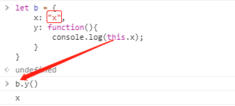
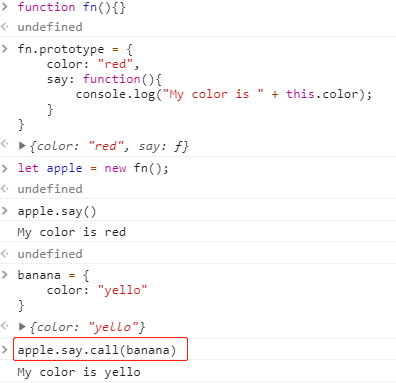

# js学习笔记-MDN

[toc]

## 一、初级

js的标准称为ECMAScript，ES6在2015年被发布，所以也称为ECMAScript 2015。现在最新的标准是ECMAScript 2020，标准链接[点击这里](https://tc39.es/ecma262/)。

该学习分以下章节：**1.介绍、2.语法和数据类型、3.控制流和错误处理、4.循环与迭代、5.函数、6.表达式和运算符、7.数字与日期、8.文本格式化、9.索引集合、10.带键集合、11.处理对象、12.对象模型的细节、13.Promises、14.迭代器与生成器、15.元编程、16.js模块**

### 1.1 介绍

#### 1.1.1 js用途

js的核心部分可通过添加对象来扩展功能，主要可用在客户端和服务端

1. 客户端js
**通常依靠v8等客户端js引擎来运行**。客户端js通过提供对象，控制BOM和DOM。例如，客户端js支持在Web上的鼠标点击、表单提交、页面导航等。
2. 服务端js
**通常依靠nodejs等服务端js引擎来运行**。服务端js通过在提供在服务器上运行的js对象来扩展功能。例如，服务端js支持应用和数据库通信、在服务器上进行文件操作等。

#### 1.1.1 js与java的区别

js是一种基于原型而不是基于类的面向对象语言。而java是基于类的面向对象语言。基于类的语言是构建在类和实例两个概念之上的（例如学生这个类，和小明同学这个实例）；基于原型的的语言只有对象，原型是一个模板，新对象可以从中获取原始的属性和方法，在此基础之上添加自己的属性，**既可以是创建时声明也可以是运行时声明**（这一点java是不支持的，java类中的属性在创建后就不能改变）。

主要区别如下：
|javascript|java|
|-|-|
|基于原型实现面向对象，可以动态添加属性|基于类实现面向对象，不能动态添加属性|
|变量不需要声明类型（动态类型）|变量需要声明类型（静态类型）|
|不能直接自动写入硬盘|可以直接自动写入硬盘|

#### 1.1.2 hello world

```js
function first(str){
    alert('Hello ' + str);
}

first('World!');
```

### 1.2 语法和数据类型

#### 1.2.1 基础

1. js区分大小写、并使用Unicode字符集。每一行js代码末尾要有分号（可以不加，不报错，但是不建议这么做，会出现不可预料的Bug）。
2. 注释和java及c++类似，都是单行//或多行/**/。
3. js声明有三种，包括var、let、const。其中不建议再使用var了，var全部使用let代替来声明变量（var声明会导致作用域问题），而常量用const声明。也可不加声明关键字直接声明，但是在strict模式下会出错。

#### 1.2.2 变量

1、**undefined和null**

1） undefined来判断一个变量是否被赋值

```js
let input;
if(input === undefined){
    console.log(1);
}else{
    console.log(2);
}
```

上面这段程序会输出1，因为input没有被定义

2）布尔值环境中undefined == false


3）数值环境中undefined被转化为NaN


4）null在求值时作为0；在布尔环境中作为false


2、**变量提升**

ES6中引入let后，变量提升就不存在了。变量提升就是在使用var声明变量时，先执行、后声明是不会报错的，它会将变量提升到语句最前面。


3、**函数提升**

对于函数来说，只有函数声明会被提升到顶部，而函数表达式不会：


4、**全局变量**

全部变量是全局对象的属性。网页中，全局对象就是window。可以通过形如window.variable访问全局变量。在window下声明的属性都可以通过全局对象window访问：


5、**常量**

常量使用const关键字定义。常量只读，不可改变（对于数值、字符串和函数等）：

常量对于对象和数组是不受保护的（也就是说可写）：


#### 1.2.3 数据结构和类型

最新的ECMAScript标准定义了8种数据类型

- 七种基本数据类型
1）Boolean（布尔值）
2）null
3）undefined
4）Number（数字）
5）BigInt（任意精度的整数）
6）String（字符串）
7）Symbol（代表）- 一种实例是唯一且不可改变的数据类型
- 非基本数据类型（引用类型）
8）Object（对象）

<font color='red'>基本数据类型指的是简单的数据段，他们的值以键值对的形式保存在栈中</font>

-**数据类型的转换**
数字转化为字符串：

```js
let x1 = "The answer is " + 1;
// x1输出为"The answer is 1"
let x2 = "37" + 3;
// x2输出为"373"
```

字符串转化为数字：

```js
let y1 = "37" - 7;
// y1输出为30
let y2 = +"1.1";
// y2输出为1.1
let y3 = parseInt("123");
// y3输出为123
let y4 = parseFloat("123.123");
// y4输出为123.123
```

-**字面量**
正则：/ab+c/
字符串中的转义字符：\

### 1.3 控制流和错误处理

#### 1.3.1 if...else

如果需要在条件中赋值，那么就对赋值语句前后加一对括号：

注意：如下代码是错的：

```js
if(1 = 2){
    // statements here
}
```

if括号里面跟的是条件判断，需要用==或者===

<font color='red'>在条件语句中，如下值被视为false:</font>

- false
- undefined
- null
- 0
- NaN
- ""

#### 1.3.2 switch

```js
// 每个case后的break都是可选的
switch(expression){
    case label_1:
        statements_1;
        break;
    case label_2:
        statements_2;
        break;
    ...
    default:
        statements_def;
        break;
}
```

#### 1.3.3 try/catch/throw

throw: 用来抛出一个异常
try...catch: 捕获异常并处理
finally: 无论异常与否都会执行

案例：


#### 1.3.4 Error对象

根据抛出的错误类型，可以用'name'和'message'获取错误的详细信息。


#### 1.3.5 Promises

ES6增加了Promise对象，用来对异步流程进行控制
Promise有以下几种状态：

- pending：初始状态，表示正在执行。
- fulfilled：成功完成操作
- rejected：失败，没有完成操作

具体细节到promise章节再详细讲

### 1.4 循环与迭代

js提供了以下方式用来循环：

- for
- do...while
- while
- for...in
- for...of
其中还有labeled、break、continue语句用来辅助控制循环。

#### 1.4.1 for

for语句是最简单的循环控制语句。包括了初始化表达式（let i = 0）、条件表达式（i<nums.length）、运算表达式（i++）。

```js
for(let i = 0; i < nums.length; i++){
    ...
}
```

#### 1.4.2 do...while

do...while语句一直重复直到条件表达式为false：

```js
let i = 3;
do{
    ...
    i--;
}while(i > 0)
```

语句会先执行do内的语句，再去判断while条件。所以do...while至少可以执行一次。

#### 1.4.3 while

while是for循环的一个变种，也和do...while类似，只不过是先判断条件，再去执行语句。

```js
let i = 3;
while(i > 0){
    ...
    i--;
}
```

#### 1.4.4 label、break、continue

label可以标记一个循环，之后用break、continue来指出程序是否停止或继续循环。

```js
markLoop:
    while(true){
        ...
    }
```

上面的markLoop就标记了一个循环。下面举个例子来演示一下label的用法：

```js
let num = 0;
for(let i = 0; i < 10; i++){
    for(let j = 0; j < 10; j++){
        if(i === 5 && j === 5){
            //break默认终止的循环是当前break语句的直接上
            //层循环，所以在i和j等于5之后，j的循环结束，
            // 外层i的循环从6继续
            break;
        }
        num++;
    }
}
// 输出95（0加到99一共100个数，56到60这5个数没加上）
console.log(num);
```

```js
let num = 0;
// label
outPonit:
    for(let i = 0; i < 10; i++){
        for(let j = 0; j < 10; j++){
            if(i === 5 && j === 5){
                // break后加上中断区域，在符合条件时，直接中断
                // 外层循环，直接返回（此时i和j都等于55）
                break outPonit;
            }
            num++;
        }
    }
// 输出为55（0加到54一共55）
console.log(num);
```

```js
let i = 0;
let j = 0;
while(i < 5){
    i++;
    if(i === 3){
        // 当i等于3的时候，终止当前循环，继续下次循环，
        // 所以最后输出的时候少输出一个数。
        continue;
    }
    n += i;
    console.log(n);
}
// 输出1, 3, 7, 12
```

```js
// 检查22 21 12 11这四个数
let i = 2;
checkiandj:
    while(i > 0){
        let j = 2;
        let sum = 0;
        checkj:
            while(j > 0){
                sum = 10*i + j;
                j -= 1;
                // 22
                // 由于查到12的时候，满足条件，直接从外层循环中
                // 跳出，所以就进不到数字为11的循环判断了
                if((sum % 3) == 0){
                    i -= 1;
                    continue checkiandj;
                }

                // 22 11
                // 等同于continue，直接跳出代码块的剩余部分
                // 到下次循环（内层）继续执行
                // if((sum % 3) == 0){
                //     continue checkj;
                // }
                console.log(sum + '不能被三整除');
            }
        i -= 1;
    }
```

#### 1.4.5 for...in

for...in以**任意顺序**遍历一个对象的除Symbol以外的可枚举属性（包括原型链上的，如果不想遍历原型链属性，则加上hasOwnProperty判断）。主要用于遍历对象，<font color='red'>而不太适合遍历数组（因为对于数组来说，遍历顺序很重要）</font>。

```js
let obj = {"1":1, "2":2, "3":3};
function Person(name) {
    this.name = name;
}
Person.prototype = obj;
let person = new Person('xiaoming');
for(let key in person){
    console.log(person[key]);
}
// 输出xiaoming,1,2,3,

// 遍历中去除原型链属性
for(let key in person){
    if(person.hasOwnProperty(key)){
        console.log(person[key]);
    }
}
// 输出为xiaoming
```

#### 1.4.6 for...of

for...of用于可迭代对象（String、Array、Map、Set等）的循环。对象不属于可迭代对象，不能使用for...of循环。

```js
let arr = [1,2,3];
// 因为js中数组也是对象（键为数字的对象），
// 所以也可以通过对象的方式进行赋值
arr.foo = "hello"

for(let item of foo){
    console.log(item);
}
// 输出结果为1,2,3。只会遍历数组元素，数组中自己定义的
// 对象元素不会显示
```

### 1.5 函数

#### 1.5.1 this的用法

this代表**当前执行代码的环境对象**。在非严格模式下，总是指向一个对象，；在严格模式下可以是任何值。

在全局中，this指向globalThis（全局对象）。这个属性在浏览器中代表window，在node中代表global。

```js
function Person(){
    // The Person() constructor defines 'this' as itself.
    this.age = 0;

    setInterval(function growUp(){
    // In nonstrict mode, the growUp() function defines 'this' as the global object, which is different from the 'this' defined by Person() constructor.
    this.age++;
    }, 1000);
}
```

在ES5中，通过把this的值赋给一个变量来修复这个问题：

```js
// 将Person内的this赋值给一个self变量
// 其他地方再用self时，其实就是用的Person内的this
function Person(){
    // Some choose 'that' instead of 'self'
    let self = this;
    // choose one and be consistent
    self.age = 0;

    setInterval(function growUp(){
        // The callback refers to 'self' variable of which the value is the expected object.
        self.age++;
    }, 1000);
}
```

或者可以使用箭头函数来确定this指向

```js
// 箭头函数的this与其父函数（setInterval）的this相同-指向Person
function Person(){
    this.age = 0;

    setInterval(() => {
        this.age++;
    }, 1000);
}
```

#### 1.5.2 this指向问题

需要记住：**this的指向在函数定义的时候是确定不了的，只有函数执行的时候才能确定this到底指向谁。**<font color='red'>this最终指向调用它的那个对象！</font>

1. 如下图，可以看到test()调用（省略了调用的全局对象window）时，this指向调用对象window。


2. 如下图，调用y函数的对象是b，所以y函数中的this指向b。


3. 如下图，直接调用着是c对象，所以this指向的是c。


4. 如下图，a.c.x被赋给了y，**这时候函数x还没执行**，在下一句y()时才执行，y()相当于window.y()，所以，this指向window。


5. 构造函数中this指向：new关键字会改变this指向，将this指向实例化的对象a。


6. 当this碰到return时：如果返回值是一个对象，那么this指向的就是那个返回的对象；如果返回值不是一个对象，那么this还是指向函数的实例化对象。

<font color='red'>PS：虽然null也是对象，但是它比较特殊，return null时，返回的还是函数的实例。</font>

7. 箭头函数this指向：箭头函数里的this指向与箭头函数上下文的this相同：

下述b函数的上下文没有函数对象，所以默认为window，window对象里没有num属性，所以为undefined。


<font color='red'>总结：
</font>
一、普通函数中this：
1）总是代表它的直接调用者，如a.b.c()，那么c函数中的this指向为b。
2）没有直接调用者，则指向window。
3）严格模式下（use strict），this为undefined
4）当使用call、apply、bind绑定时，this指向绑定对象

二、箭头函数中this：
1）与上下文的函数对象（外层函数）中this指向一致，上下文中没有函数对象，则指向window。
2）call、apply、bind无法改变箭头函数中this指向

#### 1.5.3 几个预定义函数

- eval()
将传入的字符串当作js代码执行
- isNaN()
判断一个值是否是NaN
- parseInt()
解析字符串，返回一个整数


#### 1.5.4 闭包（重要）

js允许函数嵌套，内部的函数除了可以访问自己定义的变量和函数，还可以访问外部函数所能访问到的所有变量和函数。<font color='red'>当内部函数以某一种方式被外部函数作用域访问时（常见外部函数return内部函数），一个闭包就产生了</font>

```js
let Func = function(name){
    let getName = function(){
        return name;
    }
    return getName;
}
let myPet = Func('dog');
// myPet是一个函数，即主函数return的getName
sizeof myPet;
// 由于getName可以访问外部函数属性，所以name被返回
myPet();
```

<font color='red'>闭包的使用场景</font>

1、setTimeout传参

```js
// 原生setTimeout的处理函数中不能带有参数
setTimeout(function(param){
    console.log(param);
}, 1000)

// 可以通过闭包实现传承那
function func(param){
    return function(){
        console.log(param);
    }
}
let f = func(1);
setTimeout(f, 1000);
```

2、为节点绑定循环click事件

```html
<p id="info">123</p>
    <p>E-mail: <input type="text" id="email" name="email"></p>
    <p>Name: <input type="text" id="name" name="name"></p>
    <p>Age: <input type="text" id="age" name="age"></p>
```

```js
function showContent(content){
    document.getElementById('info').innerHTML = content;
};

function setContent(){
    var infoArr = [
        {'id':'email','content':'your email address'},
        {'id':'name','content':'your name'},
        {'id':'age','content':'your age'}
    ];
    for (var i = 0; i < infoArr.length; i++) {
        var item = infoArr[i];
        document.getElementById(item.id).onfocus = function(){
            showContent(item.content)
        }
    }
}
setContent();
```

循环中创建了三个闭包，他们的词法环境都是item。在onfocus动作发生之前，只是将函数进行绑定，而并没有执行。但是当onfocus触发时，循环早已结束，执行回调函数时，函数的item.content参数都指向数组中最后一个（'your age'）。
上述的绑定明显不是我们想要得到的结构。所以这里有两种方法解决DOM元素循环绑定事件的问题：

- 使用ES6的let，避免声明提前，作用域只在当前块内

```js
for (var i = 0; i < infoArr.length; i++) {
        let item = infoArr[i];
        document.getElementById(item.id).onfocus = function(){
            showContent(item.content)
        }
}
```

- 将绑定事件放到**函数工厂**中，为函数的每一次回调都创建一个新的环境（每一次循环到会将item.content放到callBack中，但是不执行document... = content）

```js
function callBack(content){
    return function(){
        document.getElementById('info').innerHTML = content;
    }
}
for (var i = 0; i < infoArr.length; i++) {
        var item = infoArr[i];
        document.getElementById(item.id).onfocus = callBack(item.content);
}
```

- 绑定事件放到立即执行函数中

```js
for(let i = 0; i < infoArr.length; i++){
    (
        function(){
            var item = infoArr[i];
            document.getElementById(item.id).onfocus = function(){
                showContent(item.content);
            }
        }
    )();    // 放到立即执行函数上，每次循环得到的item.content值会立刻绑定到事件上
}
```

<font color='red'>这里需要注意一下立即执行函数：</font>声明一个匿名函数，并立即调用的函数，称为**立即执行函数**。

```js
// 写法1
(
    function(){
        ...
    }
)();

// 写法2
(
    function(){

    }()
)
```

#### 1.5.5 arguments对象

函数的传参是会被保存到一个类似数组的arguments对象中，这一点，对于我们来说是透明的。我们可以在函数内使用arguments对象来获取我们传入到函数中的变量。

```js
// 其中separator永远等于第一个参数，它等同于arguments[0]
function myConcat(separator){
    let result = '';
    let i;
    for(i = 1; i < arguments.length; i++){
        result += arguments[i] + separator;
    }
    return result;
}

// 输出："red.green.blue"
myConcat(".", "red", "green", "blue");
```

注意：arguments只是**类数组对象**，它并没有数组的全部方法。此外argumnets与显式参数的关系如下：


#### 1.5.7 函数参数

ES6之后，函数有两个类型的参数：默认参数、剩余参数

1、默认参数

```js
// 使用默认参数，就不需要在函数体中进行undefined判断了
function multiply(a, b = 1){
    return a*b;
}
// 返回5，b已经被赋默认值1
multiply(5);
```

2、剩余参数
剩余参数允许将不确定数量的参数表示为**数组**。

```js
function multiply(multiplier, ...args){
    return args.map(x => multiplier * x);
}

// [2,4,6]
console.log(multiply(2, 1, 2, 3));
```

### 1.6 表达式和运算符

#### 1.6.1 运算符

1. 赋值运算符：x=y、x+=y、x>>=y...
复杂赋值-**解构**

    ```js
    let foo = ["one", "two", "three"]
    let [one, two, three] = foo;
    ```

2. 比较运算符：>=、===、!=、!==...

    ```js
    // 严格相等在相等的基础上加上了类型检查
    3 != '3'    // false，3与'3'操作数相等
    3 !== '3'   // true，3与'3'类型不同
    ```

3. 算数运算符：+、%、++、**（指数）...

    ```js
    // 与java等语言不同，除法返回结果是小数，而非整数
    1 / 2   //0.5
    1.0 / 3.0 === 1.0 / 3.0  // true
    2**3    // 8
    ```

4. 位运算符：&、~、^（异或）、>>（算数右移）、>>>（无符号右移）...

    ```js
    // 9:1001   15:1111
    9 >> 2  // 2    1001带符号（正补0）右移两位变为0010
    // 100...1111（首位符号位）无符号（补0）右移两位变为111...1100
    -15 >>> 2   // 1073741820
    ```

5. 逻辑运算符：&&、||、!
6. 字符串运算符：+、+=

    ```js
    "my " + "string";  // "my string"
    let myString = "hel";
    myString += "lo";   // "hello"
    ```

7. 条件（三元）运算符：condition ? value1 : value2

    ```js
    let status = (age >= 18) ? "adult" : "minor";
    ```

8. 逗号运算符：

    ```js
    var x = [1,2,3,4,5]
    var a = [x, x, x, x, x];

    for (var i = 0, j = 4; j >= 0; i++, j--)
    console.log('a[' + i + '][' + j + ']= ' + a[i][j]);
    // 输出二维矩阵a的斜对角线元素
    // a[0][4] = 5 ... a[4][0] = 1
    ```

9. 一元运算符：delete、typeof、void

    ```js
    // delete删除数组元素
    let colors = ["red", "green", "blue"];
    delete colors[1];
    // 删除数组元素后，对应位置为空，但是数组整体长度不变
    colors  // ["red", empty, "blue"];
    colors.length   // 3
    1 in colors  // false

    // 如果想使对应索引还在colors中，对其赋值undefined即可
    colors[1] = undefined;
    1 in colors   // true
    ```

    ```js
    // typeof返回操作数的类型
    typeof Date;    // function
    typeof Math;    // object
    typeof null;    // object
    typeof undefined;   // undefined
    ```

    ```html
    <!-- void表示运算没有返回值 -->
    <a href="javascript:void(0)">Click</a>
    ```

10. 关系运算符：

关系运算符对操作进行比较，返回相应的布尔类型。

```js
// in操作符判断指定的属性是否存在于所指定的对象
let colors = new Array("red", "green", "blue");
1 in colors   // true   索引1在数组中
3 in colors   // false  索引3不在数组中
'red' in colors    // false  in前的属性应指定为数组的索引（键）

let animal = {type: 'dog', year: 2015};
'type' in animal    // true   type在animal中
'sex' in animal     // false   sex不在animal中
```

```js
// instanceof判断对象是否是所指定的类型
let date = new Date();
date instanceof Date;
// 值得注意的是，如果a对象的构造函数A继承自B构造函数。a instanceof B将判别为true
```

#### 1.6.2 表达式

表达式包括this、new、super、扩展所引领的语句

1、this
this关键字指代当前对象，this在函数章节已详细介绍，这里介绍this改变。
注意：改变this指向有**call、apply、bind**三个函数：

利用call来改变this指向：


三者区别：
call：function.call(this, arg1, arg2)   return函数的立即调用
apply：function.apply(this, [arg1, arg2])   return函数的立即调用
bind：function.bind(this)   return函数的拷贝，以便稍后调用

<font color='blue'>一些需要注意的地方：</font>
首先创建一个Person类，并创建一个实例化对象p1：


1. call方法和apply的唯一区别在于其接受的第二个参数。apply接受的是**参数数组**，而call接受的是**参数列表**；此外bind也只接受**参数列表**
2. bind返回的是函数的拷贝，所以最后比call和apply多一个()

3. 多次bind是无效的，这是因为bind的实现，相当于使用函数在内部包含了一个apply/call。

2、new
new用来创建一个自定义或预置类型的对象实例。

```js
let num = new Number()  // 预置类型
let person = new Person()   // 自定义类型（构造函数）
```

<font color='red'>new创建一个用户定义类型的对象实例会进行如下操作：</font>

```js
function Person(name, sex){
    this.name = name;
    this.sex = sex;
    this.getInfo = function(){
        console.log(this.name + ':' + this.sex);
    }
}
let person1 = new Person('xiaoming', 'male');
```

- 创建一个空的js对象（即{}）

    ```js
        let person1 = {};
    ```

- 设置继承关系：设置新对象的__proto__属性指向构造函数的prototype对象（将空对象继承自构造函数的原型对象）

    ```js
        person1 .__proto__ =  Person.prototype;
    ```

- 绑定this：将新创建的对象作为this的上下文

    ```js
        Person.call(person1)
    ```

- 变量初始化：将要给对象初始化的值赋给对象中对应变量

    ```js
        person1.name = 'xiaoming';
        person1.sex = 'male';
    ```

全部代码：

```js
function objectFactory(){
  var obj = new Object();
  // 取参数中第一个
  var Constructor = [].shift.call(arguments);
  obj.__proto__ = Constructor.prototype;
  //  ret是在构造函数有返回值时，等于其返回值
  // 1. 构造函数返回对象时，实例中只能访问返回的对象
  // 2. 构造函数返回基本类型时，相当于没返回
  var ret = Constructor.apply(obj, arguments);
  return typeof ret === 'object' ? ret || obj : obj;
}
```

下面图文来观察new对象的**步骤**：
通过new的方式创建对象person1：

通过细化操作创建对象person2：

可以看到两种方式创建结果相同：


3、super
super关键字用于调用一个对象的父对象上的函数。
语法：
1）调用 父对象/父类 的构造函数
super([arguments]);
在调用父对象构造函数前，<font color='red'>super必须在使用关键字this之前</font>
2）调用 父对象/父类 的方法
super.functionOnParent([arguments]);

可以看到：


4、扩展语句
扩展语句通常用在函数调用中，等同于apply：

```js
function myFunc(x, y, z){}
let args = [0, 1, 2];
// 相当于在没有改变this指向的前提下，传递了变量数组
myFunc.apply(null, args)
```

上面的写法很不方便，可以用扩展语句来写：

```js
myFunc(...args)
```

值得注意的是...与Object.assign一样，都是**浅拷贝**，只能拷贝属性值，而无法拷贝对象引用：


### 1.7 数字与日期

#### 1.7.1 数字

在js中，数字均为双精度浮点类型。二进制用0b表示；十六进制用0x表示；多0的数用指数表示。

```js
0b101   // 5
0x10    // 16
2e3     // 2000
```

#### 1.7.2 数字对象

JS有很多内置数字对象：

```js
Number.MAX_VALUE    // 最大值
Number.MIN_VALUE    // 最小值
Number.NaN      // 非数字，等于NaN
// **-------整数数字在以下范围内是准确的-------**
Number.MAX_SAFE_INTEGER     // 最大安全数字
Number.MIN_SAFE_INTEGER     // 最小安全数字
// **----------------------------------------**
Number.POSITIVE_INFINITY    // 正无穷，等于Infinity
Number.NEGATIVE_INFINITY   // 负无穷，等于-Infinity

Math.PI     // π
Math.E      // e
```

还有常用的一些内置函数

```js
Number.parseInt()   // 字符串解析成整型
Number.isSafeInteger()    // 判断传递的值是否为安全数

// **----------------Math方法------------**
Math.floor(a)    // 将小数向下取整
Math.ceil(a)     // 将小数向上取整
Math.pow(a, b)  // 返回a的b次方幂  
Math.sqrt(a)     // 返回a的平方根
Math.round(a)   // 对a进行四舍五入
Math.trunc(a)   // 将a的小数点去掉，保留整数部分
```

#### 1.7.3 日期对象

基于日期Date的实例，是呈现时间中的某个时刻。Date对象是基于Unix Time Stamp（1970年1月1往后算毫秒）

Date()构造函数有4种基本形式。

1. 没有参数

    ```js
    // 新创建的now代表对象实例化时刻的时间
    let now = new Date();
    now     // Sat Apr 04 2020 22:24:59 GMT+0800 (中国标准时间)
    ```

2. Unix时间戳

    ```js
    // 新创建一个以时间戳作为参数的时间对象
    let time = new Date(1000000000000)
    time     // Sun Sep 09 2001 09:46:40 GMT+0800 (中国标准时间)
    ```

3. 时间戳字符串（不推荐！！！存在浏览器差异）

    ```js
    // 传入符合标准（能被Date.parse()正确识别）的字符串
    let time = new Date('01 01 2020')
    time    // Wed Jan 01 2020 00:00:00 GMT+0800 (中国标准时间)
    ```

4. 具体日期+时间
具体时间+日期的形式应该为：
<font color='red'>new Date(**year, monthIndex**[, day [, hours [, minutes [, seconds [, milliseconds]]]]])</font>

    ```js
    // 年和月的索引（0-11）是必选参数，其余是可选
    let date = new Date(2020, 0)
    date    // Wed Jan 01 2020 00:00:00 GMT+0800 (中国标准时间)
    ```

日期对象还有一些方法，分为：

- get：getDate()、getDay()...
- set：setDate()、setMonth()...
- to：toJSON()...
- parse：parse()、now()...

### 1.8 文本格式化

#### 1.8.1 字符串字面量

```js
'foo'
// \x之后的被认为是一个16进制数转义序列
'\xA9'      // "©"
// \u之后的被认为是一个unicode转义序列
'\u00A9'    // "©"
```

#### 1.8.2 字符串对象

```js
let s = new String("foo");
s   // String {"foo"}
typeof s    // 'object'
```

在String字面量上可以使用String对象的所有方法。由于String对象在有的时候执行与我们的直觉并不一样(如eval(new String("1+1")))，所以不建议用，直接用字面量就可以了。

#### 1.8.3 字符串方法


#### 1.8.4 模板字符串

1. 字符串多行

    ```js
    // 如果用引号，则必须加上换行符，行末尾还要加上结束符\
    console.log("string line 1\n\
    string line 2")

    // 用反勾号``包裹的字符串直接换行，无需多余操作
    console.log(`string line 1
    string line 2`)
    ```

2. 嵌入表达式

    ```js
    let a = 5;
    let b = 10;
    // 使用引号，则需要通过加号来连接字符串和数字计算值
    console.log
    ("Fifteen is " + (a + b) + " and\nnot " + (2*a+b) + '.')

    // 使用反勾号可以直接将变量和计算放到${}中
    console.log(`Fifteen is ${a+b} and\nnot ${2*a+b}.`)
    ```

### 1.9 索引集合

### 1.10 带键集合

### 1.11 处理对象

js的设计是一个简单的基于对象的范式。一个对象是一系列属性的集合，一个属性包括一个键和一个值。属性的值可以是函数，这个时候属性被称为方法。

#### 1.11.1 对象属性

1、对象元素没赋值时为undefined，而不是null


2、对象的赋值与取值

对象的**赋值**，有两种方法，一种是对象后边跟一个点接一个变量（在此时，这个变量被创建到对象中）；另一种方法是类数组的赋值方法。


用类数组的方式赋值可以接受已经定义好的变量或者字符串（甚至一个空串）。需要注意的是**对象中的键全是字符串**。


如果是点赋值的属性，在访问的时候，直接[对象.键]即可；如果是类数组赋值方式，**取值**的时候可以通过  对象[变量]  的方式或者  对象.变量值  的方式。如果后续改变变量的值，那么  对象[变量]这种访问方式就会被破话，取值会变成undefined：


#### 1.11.2 for...in语句来遍历对象


<font color='red'>注意：for...of无法循环遍历对象，因为对象不是iterable（可迭代）的</font>

#### 1.11.3 列出对象属性的方法

ES5之后，有3种原生方法：

- for...in循环

- Object.keys(o)

- Object.getOwnPropertyNames(o)


#### 1.11.4 创建类的方法

类也是对象，只不过通常类里面有函数：
1）对象初始化器

<font color='red'>2）通过构造函数</font>

通过构造函数创建对象（new），创建的对象是将属性添加到自身实例下的
3）通过Object.create()---es6语法

通过Object.create(proto, [propertiesObject])创建的对象是通过继承原对象实现的，即新对象的属性是在原型（\_\_proto__）之下的：

<font color='red'>4）es6的class</font>


#### 1.11.5 继承

所有js对象继承与至少一个对象，被继承的对象称为**原型**，并且继承的属性可通过构造函数的prototype对象找到。

1）每个实例对象都有一个私有属性（称为__proto__）指向它的构造函数的原型对象（prototype），该原型对象也有也有__proto__。继承时，层层向上直到一个对象的原型对象是null。根据定义null没有原型，并作为**原型链**的最后一个环节。
<font color='red'>注：几乎所有对象都是原型链顶端的<font color='blue'>Object</font>的实例</font>

- 继承属性
当试图访问一个对象的属性时，js会先在当前对象上找，没找到的话会继续像上一层（父对象）寻找。。最后直到找到匹配的属性名或者到达末尾。

上例的原型链：<font color='red'>{a:1, b:2} --> {b:3, c:4} --> Object.prototype --> null</font>
&emsp;属性a、b在对象中已定义，直接取得1和2；而c在父对象定义，取得4；而父对象的b:3，由于对象中已定义，可以认为父对象的属性b被对象所“覆盖”；在原型链上找到最后也没找到d的定义，所以返回undefined。
<br>
- 继承方法
当继承的函数被调用时，this指向的是当前继承的对象，而不是被继承对象（原型）。


<font color='red'>注意：</font>**对象的原型表示用__proto__；函数（function）的原型用prototype表示**

#### 1.11.6 constructor与prototype的关系

先看下面一幅图：


```js
function Person(name){
    this.name = name;
    this.showMe = function(){
        console.log(this.name);
    }
}

Person.prototype.from = function(){
    console.log('来自原型链');
}

let one = new Person('js');
```

实际结果如下：

可以看到经过new实例化后的对象one，它里面的属性__proto__属性包含着Person原型链中的方法。也就是说实例化后的对象可以通过原型链去调用这条链上的任意一个属性或方法（类似于java实例化后的对象调用父类方法）。

要明白原因，必须先要了解new形式创建对象的过程：

```js
let one = new Person('js');
// 等价于
let one = {};
Person.call(one, 'js');
```

1. 首先，js引擎开辟一块内存，创建一个空对象叫作one，并将this指向这个对象。
2. 接着，执行构造函数Person()，对空对象one进行构造（构造函数的属性和方法都赋给one，这也是为什么Person叫作构造函数的原因）
3. 最后，给one添加一个叫__proto__的属性，这个属性指向Person的prototype对象，也就是上面的one.\_\_proto\_\_ == Person.prototype。

最终：


那么constructor又是什么呢？
<!-- TODO -->

### 1.12 对象模型的细节

### 1.13 Promises

### 1.14 迭代器与生成器

### 1.15 元编程

### 1.16 js模块

## 二、中级

### 2.1 客户端 Web API

### 2.2

## 三、高级

### 3.1 继承和原型链

### 3.2 严格模式

### 3.3 JavaScript 类型数组

### 3.4 内存管理

### 3.5 并发模型以及事件循环
