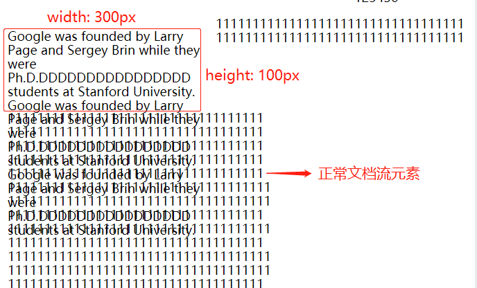

# Responsive Web Design Certification

[toc]

## Character 1: Basic HTML and HTML5

1. input的require字段
required字段用于强制用户输出。如果不输入信息，在form最终的提交会返回提示

    ```html
    <form action="/action">
        <input type="text" required/>
        <button type="submit">Click me</button>
    </form>
    ```

2. 单选框属性问题
radio是单选框（复选框同理-checkbox），一般需要包裹在label中（label用于写文字）。★一对单选按钮需要拥有相同的name；★checked表示选框的默认值；★label中设置for与内层的radio input中的id属性对应上，来保证label和radio input属性对应上（**下面的例子写for是多余了，只有在label没嵌套input时才需要写**）；★value是在提交form后，该单选/复选框的数据。如下例，如果选男，则最后提交表单时，sex='male'。

    ```html
    <label for="male">
        <input id="male" type="radio" name="sex" value="male" checked/>男
    </label>
    <label for="female">
        <input id="female" type="radio" name="sex" value="female"/>女
    </label>

    <!-- 通过for显式联系（没嵌套） -->
    <label for="SSN">Social Security Number:</label>
    <input type="text" name="SocSecNum" id="SSN" />
    <!-- 隐式联系（嵌套） -->
    <label>Date of Birth: <input type="text" name="DofB" /></label>
    ```

## Character 2: Basic CSS

1. CSS字体
字体用font-family：

    ```css
    font-family: Lobster, monospace
    ```

    font-family的值是一个字体列表。浏览器会从前向后选择该字体列表的字体作为最终字体。所以一般将通用字体写到最后，作为保底。通用字体包括：monospace，serif，sans-serif。

2. class选择器和id选择器

    - 一个元素可以同时设置id选择器和class选择器
    - id选择器优先级大于class选择器
    - 一个元素只能有一个id选择器，但是可以拥有多个class选择器，多个class写法为class={class1 class2 ...}

3. 属性选择器
属性选择器会在当前HTML document中**选择属性为指定值的元素**

    ```css
    /* 选择当前document中属性type为checkbox的元素 */
    [type="checkbox"]: {
        ...
    }
    ...
    <input type='radio' />
    /* 被选中 */
    <input type='checkbox' />
    ```

4. CSS自定义变量
可以通过在CSS选择器内部写自定义变量的形式，来为自变量赋CSS值，并实现后续选择器的多处复用。自定义变量一般在变量名前加两个横线特殊标记：

    ```css
    .penguin {
        /* 设置一个自变量（企鹅皮肤），取值为gray */
        --punguin-skin: gray;
    }
    ```

    创建完自定义变量后，可以通过var()去在之后的CSS选择器中使用：

    ```css
    /* 在后续的CSS可复用该自定义变量 */
    /* 这样做的好处是如果需要修改所有地方的样色，*/
    /* 只需要修改一个变量值即可 */
    .penguin-top {
        background: var(--punguin-skin);
    }
    .penguin-bottom {
        background: var(--punguin-skin);
    }
    ...
    ```

    可以为引用自变量的地方加上**备用值**，防止前面的值不能用时（比如变量拼写错误），可以显示备用值：

    ```css
    /* 这里变量拼写错误，无法正常显示 */
    /* 在var()中添加备用值会显示备用值 */
    .penguin-left {
        background: var(--punguinskin, black)
    }
    ```

5. CSS属性继承
CSS中有的属性（比如background）会从根一点一点传下去。其中需要注意下面几种选择器的表示：

    ```css
    /* 代表选择了所有元素 */
    * {
        ...
    }
    /* 代表选择了根元素，通常是html */
    :root {
        --penguin-belly: red;
    }
    /* 没有特殊情况等于:root */
    html {

    }

    body {
        background: var(--penguin-belly, red);
    }
    .penguin {
        /* 重写从body中继承来的background */
        /* 这里隐含语句为background: var(--penguin-belly, red);*/
        /* 直接在此修改根元素变量即可 */
        --penguin-belly: white;
    }
    ```

    上面的语句就相当于在penguin中：

    ```css
    --penguin-belly: white;
    background: var(--penguin-belly, red);
    ```

    并且penguin内层选择器将都不再继承body的background（红色）了，而是继承离他们更近的penguin的background（白色）。

6. 媒体查询
使用@media()函数可以对特定的CSS选择器进行条件设定，比如下面的案例是根据屏幕最大宽设置根样式：

    ```css
    /* 当屏幕小于350px时html显示灰色 */
    /* 当屏幕大于350px时触发媒体查询条件，
       设置html显示为红色
    */
    :root {
        background: gray;
    }

    @media(max-width: 350px){
        :root {
            background: red;
        }
    }
    ```

## Character 3: Applied Visual Design

### 3.1 text-align

取值包括left、center、right、justify。其中前三种很熟悉（左对齐-默认、居中、右对齐），而justify通常用于段落内文字间距调整，使得文字均匀的分布在空间中。

```css
/* 默认左对齐 */
p {
    /* text-align: left; */
}
```


```css
p {
    text-align: justify;
}
```


### 3.2 box-shadow

box-shadow用于设置元素阴影的，有以下几个属性，设置阴影的时候也是按照如下属性顺序对应：

- offset-x：阴影的水平偏移量
- offset-y：阴影的垂直偏移量
- blur-radius：可选，表示阴影模糊半径
- spread-radius：可选，表示阴影扩展半径
- color：阴影颜色

box-shadow可以接受多个阴影，中间用逗号隔开：

```css
/* 属性按顺序对应，两个阴影都没有设置扩展半径 */
box-shadow: 0 10px 20px rgba(0,0,0,0.19),
            0 6px 6px rgba(0,0,0,0.23);
```

### 3.3 opacity&&text-transform&&font-weight

1. opacity
表示不透明度，取值为0到1。

    ```css
    /* 半透明 */
    .class1 {
        opacity: 0.5
    }
    ```

2. text-transform
用于改变文字外观，以"Transform me"为例

    - lowercase：小写   "transform me"
    - uppercase：大写   "TRANSFORM ME"
    - capitalize：首字母大写    "Transform Me"
    - inherit：继承父元素的text-tarnsform
    - initial：使用默认值（none）
    - none：默认值  "Transform me"

3. font-weight
用于设置字体宽度，值是一个数字，没有单位（这一点要和font-size区分开）

    ```css
    /* font-weight没有单位 */
    h1 {
        text-size: 50px;
        text-weight: 500;
    }
    ```

### 3.4 定位

相对定位和绝对定位都是使用top、right、bottom、left来调整位置。相对定位是相对于正常文档流；**绝对定位是相对于最近的定位方式为relative的祖先节点，如果没有，则相对body**。还有就是相对定位不会从文档流中移除，而绝对定位会从文档流中移除。
fixed定位是特殊的absolute，只不过它是**相对于body定位（脱离文档流）**，并且在文档滑动时，fixed定位元素不会划出视图；还有一个sticky，它不脱离文档流，在其位置没有移出窗口时，它的定位方式是static（没有定位，left等不作用），当移出窗口时，它变成fixed定位（left等属性作用）。

### 3.5 浮动

float会使元素移出文档流，并且常常与width一起使用，来确定它的宽度，其包含左浮动和右浮动。
<font color='red'>浮动的元素脱离文档流，所以浮动元素无需关心嵌套关系，与正常文档流元素“占位排列”。</font>比如一个浮动元素设置500px的宽，当前浏览器宽度大于500ox，其后的（或者嵌套的非浮动元素）会围绕着它排列，充满float元素那一行；如果浏览器宽度小于500px，浮动元素超出的会被遮挡，而其后的元素会被挤到下一行显示。

float元素如果不指定高，则会默认为自适应高度，而后的元素会自动向后排列。但是如果指定了高（并且指定了宽），那么后续的元素就会按照该高进行继续往下排列，这样有时会出现内容重叠：


<font color='red'>注意：即便不指定宽度，只指定高度，只要内容过多，也会出现溢出，因为浮动元素后面的正常元素是严格按照浮动元素划定的区域进行继续排列的。</font>


### 3.6 渐变颜色

1. linear-gradient()
使用linear-gradient()函数可以获得渐变颜色，如下例：

    ```css
    div {
        ...
        background: linear-gradient(90deg, red, green, blue);
    }
    ```

    其中第一个参数是颜色渐变角度，遵循顺时针（**颜色移动方向画箭头，与y轴正半轴之间角度**），单位为deg。
    

2. repeating-linear-gradient()
它和linear-gradient()很像，只不过它是通过控制颜色渐变位置，并重复渐变颜色来填充目标元素：

    ```css
    /* 渐变值在40px截断 */
    /* 0到40px从黄变蓝，40px到80px从绿变红 */
    div {
        ...
        background: repeating-linear-gradient(90deg,
            yellow 0px,
            blue 40px,
            green 40px,
            red 80px
        );
    }
    ```

    

    如果上面的不清楚，还可以看一轮内渐变没有截断的情况：

    ```css
    /* 渐变值没有截断 */
    div {
        ...
        background: repeating-linear-gradient(90deg,
            yellow 0px,
            blue 20px,
            green 40px,
            red 60px
        );
    }
    ```

    

### 3.7 transform

transform用于调整元素的大小、位置、旋转等

1. scale()用于调整目标元素的大小：

    ```css
    /* 处理后的元素是原本元素大小的2倍 */
    div{
        transform: scale(2)
    }
    ```

    将其与伪类一起使用会有很好的效果：

    ```css
    /* 鼠标放到div元素上之后会变为原本的1.1倍大小 */
    /* 这个效果会起到提示作用（很有用） */
    div:hover {
        transform: scale(1.1);
    }
    ```

2. skewX()、skewY()用于倾斜元素

    ```css
    /* 高与y轴正方向成24度角倾斜*/
    div {
        transform: skewX(24deg);
    }
    ```

3. rotate()用于旋转元素

    ```css
    /* 逆时针旋转45度 */
    div {
        transform: rotate(-45deg)
    }
    ```

### 3.8 伪类和伪元素

通常带:的是伪类，而带::是伪元素。伪类和伪元素都不存在于DOM树中。

- 伪类：对特定**元素整体**进行操作，比如整个超链接访问后的样式。
包括:hover、:link、:visited、:focus等

```css
/* 链接在未被访问时为红色字体 */
a:link {
    color: red;
}
```

- 伪元素：对**元素特定内容**进行操作，比如元素的第一行。
包括::first-letter、::first-line、::before、::after（就这4个）

```css
/* before将content插入到元素前 */
p::before {
    content: "H"
}
/* after将content插入到元素后 */
p::after {
    content: "d"
}

<p>ello Worl</p>
```


通常可以利用before和after伪元素去画图形，比如下述桃心。<font color='red'>特别需要注意before和after中必要要包含content属性，不然不显示。</font>


### 3.9 动画

动画是靠animation的相关属性去设置的，然后通过@keyframes来对动画进行播放。动画播放通过设置百分比去实现，如果一个10秒的动画，那么0%就是动画开始的帧，而50%是动画播放到5s时候的帧，100%是动画播放结束时候的帧。

#### 3.9.1 简单动画-3秒内背景颜色切换动画

下面实现3秒切换3种背景颜色的动画

```css
#anim {
    animation-name: colorful;
    animation-duration: 3s; /*注意单位*/
}
/* 播放动画设置 */
@keyframes colorful {
    0% {
        background-color: red;
    }
    50% {
        background-color: green;
    }
    100% {
        background-color: blue;
    }
}
```

#### 3.9.2 按钮动画-hover显示动画

上面的简单动画有一个缺点，就是动画在DOM渲染之后只会播放一次，然后元素背景颜色就又回复原状。我们要实现一个鼠标停留在按钮上时，播放动画，并且动画播放完之后不**回退**，使用animation-fill-mode: forwards;来实现

```css
button:hover {
    animation-name: background-color;
    animation-duration: 500ms;
    animation-fill-mode: forwards;
}

@keyframes background-color {
    100% {
        background-color: red;
    }
}
```

#### 3.9.3 动画-元素移动

在@keyframes动画播放设置中，可以在每一时间帧上加位置信息（top...），来实现元素移动：

```css
/* 实现在颜色变化过程中从上向下移动50px */
@keyframes movement {
    0% {
        background-color: red;
        top: 0;
    }
    100% {
        background-color: yellow;
        top: 50px;
    }
}
```

#### 3.9.4 动画计数-循环播放

animation-iteration-count用来控制动画播放次数，赋值infinite可以使得动画永久播放：

```css
#ball {
    ...
    animation-name: bounce;
    animation-duration: 1s;
    animation-iteration-count: infinite;
}
```

<font color="red">这个属性和animation-fill-mode一起记忆，**animation-fill-mode是设置动画播放一次后的状态**，而animation-iteration-count是设置循环次数</font>

#### 3.9.5 动画速率-通过函数控制

animation-timing-function控制动画播放的速率，可以将其看成是汽车从A点到B点。有下列几种选项：

- easy（默认）：开始缓慢，中间加速，最后减速（**猛刹**）
- ease-out：开始缓慢，一直减速（**慢刹**）
- ease-in：自由落体
- linear：全程匀速

更进一步，如果想设置比较准确的运动函数，可以使用贝塞尔曲线-cubic-bezier(x1,y1, x2,y2)，其中p1(x1,y2)，p2(x2,y2)它根据四个点坐标（还包括原点p0(0,0)和结尾点p3(1,1)），在(0,0)到(1,1)之间确定一个函数，通过函数来控制物体运动。

```css
/* p1点为(0.1,0.1)，p2点为(0.2,0.2)
得到的是一根k为1的直线，即匀速运动（linear） */
#ball {
    animation-timing-function: cubic-bezier(0.1,0.1, 0.2,0.2);
}
```

注意，上述坐标点的设置中，虽然区域时在0到1，但是y的值可以大于1，大于1的时候会变成“弹跳运动”，会跳出原始位置之外。

## Character 3: Accessibility

## Character 4: Web Design Principles

响应式CSS设计是根据不同设备（不同的屏幕尺寸、分辨率、处理能力），来灵活显示页面，以适应这种差异。响应式设计包括**媒体查询、边界属性、视口属性**

1. 图片自适应

    ```css
    /*  响应式设计，图片随着屏幕宽度自适应*/
    .responsive-img {
        max-width: 100%;
        height: auto;
    }
    ```

    保证图片宽随着屏幕变化自动伸缩；而高设为auto，可以在宽变化的情况下，不改变原始宽高比，而去自动伸缩高。

2. 低分辨率设备图片显示像素感处理
    在高分辨率制作的图片（高分辨率图），放到低分辨率上，会出现**颗粒感**，遇到这种情况，就只能将图片缩小，以使其在低分辨率设备显示正常。

3. 视口属性
    视口属性是相对长度，它是相对于当前显示窗口的宽高进行自适应的，包括如下属性：

    - vw：视口宽的百分比
    - vh：视口高的百分比
    - vmin：取vw和vh中较小的值
    - vmax：取vw和vh中较大的值

    ```css
    /*宽设定为当前视口宽的80%*/
    .p1 {
        width: 80vw;
    }
    /*宽设定为当前窗口中宽和高较小的一个的75%*/
    .p2 {
        width: 75vmin;
    }
    ```

## Character 5: Flexbox

1. flex缩写
    flex代表flex-grow、flex-shrink、flex-basis的缩写，一般来说只会设置flex一个值，即flex-grow。

    - flex-grow：当父元素空间多出，子元素扩大比例
    - flex-shrink：当父元素空间不够，子元素缩小比例
    -flex-grow：元素的初始大小

    ```css
    /* 盒子扩大属性为1，
    如果父元素空间有剩余，扩大因子为1；
    如果父元素空间不够，不参与缩小；
    初始大小为10px */
    flex: 1 0 10px;
    ```

2. order
    order用来更改弹性盒模型内元素的优先级，默认为0，值越小优先级越高，所以可以选择负值来提升排列在后的元素优先级。

## Character 6: Grid

## Character 7: Responsive Web Design Projects

### 7.1 第一部分

练习见[test1](./第一部分练习/test1.html)

### 7.2 第二部分

练习见[test2](./第一部分练习/test2.html)