# 数据结构和基本算法

[toc]

<font color='red'>数据结构包括以下8大类：</font>
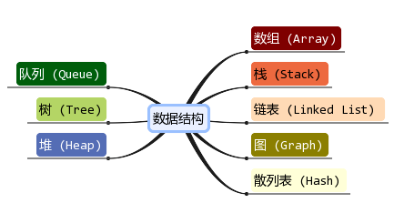

**数据的逻辑结构**：
&emsp;&emsp;逻辑结构指数据元素之间前后关系，与他们在计算机中的存储位置无关。

1. 集合（无关系）
2. 线性结构（一对一）
3. 树形结构（一对多）
4. 图形结构（多对多）

**数据的物理结构**：
&emsp;&emsp;物理结构指数据元素在计算机存储空间的存放形式。

1. 顺序存储：数组
2. 链式存储：链表

<font color='red'>PS：可以认为数据结构全部基于数组和链表进行扩展形成</font>

## 一. js面向对象编程

### 1.1 创建对象的方法

1、new

```js
let obj1 = new Object();
```

2、字面量

```js
let obj2 = {}
```

### 1.2 类的操作

数据结构和算法的基础就是OOP（面向对象）。一个类定义了对象的特征，我们会创建很多类去描述一个数据结构，并在算法中用到他们。

例子：创建一个“书”类，并给其添加打印出属性的方法：
1）创建类：

```js
function Book(title, pages, isbn){
    this.title = title;
    this.pages = pages;
    this.isbn = isbn;
}
```

2）实例化：

```js
let book1 = new Book('js指南', 324, 'KT8512');
```

3）访问对象属性并进行改变：

```js
console.log(book1.title);    // js指南
book1.title = 'js权威指南';
console.log(book1.title);   // js权威指南
```

4）类中有方法，有两种方式去创建方法：

- 使用prototype在原型上创建

```js
Book.prototype.printTitle = function(){
    console.log(this.title);
}

book1.printTitle();     // js权威指南
let book2 = new Book('ts指南', 212, 'MH5487');
book2.printTitle();     // ts指南
```

- 在实例化的对象上创建

```js
book2.printPages = function(){
    console.log(this.pages);
}

book2.printPages();     // 212
let book3 = new Book('node指南', 654, 'NP1549');
book3.printPages();
// Error：book3.printPages is not a function
```

<font color='red'>第一种方法，在原型上创建，printTitle方法进入到Book类的prototype属性中，这个属性和实例化对象的__proto__属性的指向相同，所以，第一种方式可以使后续新实例化的对象中均有printTitle()。
第二种方法，在实例化对象上创建，方法作为实例化对象的一个私有属性，printPages也就成为了book2的私有函数，新实例化的Book中也就不可能有printPages。</font>

## 二. 数组

### 2.1 创建数组

1、new

```js
let arr1 = new Array();
```

2、字面量

```js
let arr2 = [];
```

### 2.2 数组的基本操作

1、创建数组并初始化

```js
let arr = new Array(1, 2, 3);
```

2、length获取数组长度

```js
arr.length;     // 3
```

3、通过下标获取数组成员

```js
arr[0]  // 1
```

4、push pop shift unshift来增加和删除元素

```js
arr.push('4');      // 向数组末尾添加'4', '4'为字符串
arr                 // (4)[1, 2, 3, '4']

arr.pop();          // 删除数组末尾一个元素，'4'被删除
arr                 // (3)[1, 2, 3]

arr.shift();        // 删除数组头部一个元素， 1被删除
arr                 // (2)[2, 3]

arr.unshift({'name': 'aaa'});      // 向数组首部添加一个对象
arr                 // (3)[{...}, 2, 3]
```

5、反转数组

```js
arr.reverse();      // (3)[3, 2, {...}]
```

6、值在数组中（第一次、最后一个）出现的位置

```js
let arr2 = [1, 2, 1, 3, 1, 4]
arr2.indexOf(1)         // 0
arr2.lastIndexOf(1)     // 4
```

7、splice和slice
>splice删除指定索引和数量的元素(可以通过设置deletCount = 0来进行对数组任意位置插入元素的操作)，影响原数组
**语法：splice(pos, ?deletCount, ...item)**

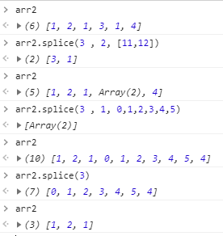

>slice对原数组切片并复制到新数组，不影响数组
**语法：slice(?start, ?end)**

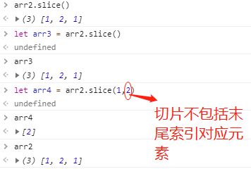

8、concat
>concat用于数组连接，不影响原数组
**语法：concat(...item)**

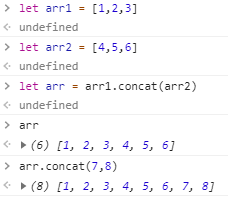

9、toString和join
>toString用于将数组转化为字符串，不影响原数组
**语法：toString()**
join则在toString基础上，可以根据一定的分隔方式来生成字符串，不影响原数组
**语法：join(?separator)**

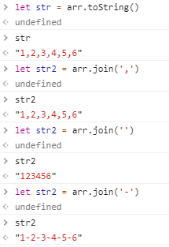

10、sort
>sort用于对数组排序，影响原数组
**语法：sort(?compareFn)**

&emsp;其中比较函数只能有两个参数用于比较，即形如compareFn(firstEl, secondEl)。如果没有指定比较函数，那么会将字符串逐个字符转化为Unicode数值，进行比较，如果是数字也是从高到低逐位比较数字大小。

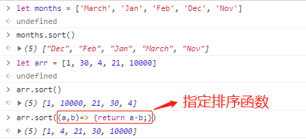

11、fill
>fill用于向数组任意区域填充固定值，不包括终止索引，影响原数组
**语法：sort(value, ?start, ?end)**

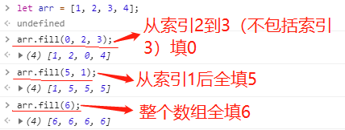

12、includes
>includes判断数组是否包含某个值
**语法：includes(searchElement, fromIndex)**

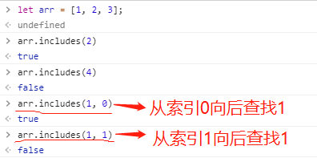

13、forEach some every find findIndex
>forEach对数组的每个元素执行一次提供的函数
**语法：forEach(callbackFn, ?thisArg)**

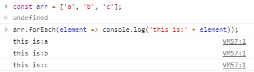

>some测试数组中每一个元素，判断是否至少存在一个以上的元素满足提供的回调函数
**语法：some(callbackFn, ?thisArg)**

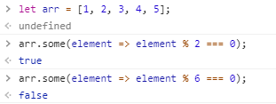

>every测试数组中每一个元素，判断是否全部元素满足提供的回调函数
**语法：every(callbackFn, ?thisArg)**

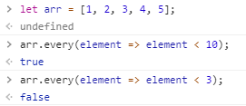

>find返回数组中满足提供的测试函数的第一个元素的值；findIndex返回第一个索引。
**语法：find(callbackFn, ?thisArg)**
&emsp;&emsp;&emsp;**findIndex(callbackFn, ?thisArg)**

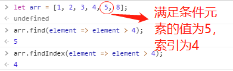

14、filter
>filter根据提供的函数，来筛选出数组中符合条件的元素，不改变原数组
**语法：filter(callbackFn, ?thisArg)**

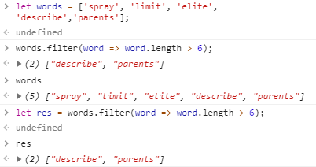

15、map reduce
>map对每个元素都调用提供的函数，根据函数，返回对应结果，不改变原数组
**语法：map(callbackFn, ?thisArg)**

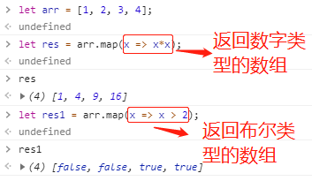

>reduce将数组中的值依次通过给定函数执行，并最后返回一个结果。reduce还有一个initialValue，这个值是累加器（acc，回调函数中第一个参数）的初始值，如果没指定，则默认为数组第一个元素。
**语法：reduce(callbackFn, ?initialValue)**

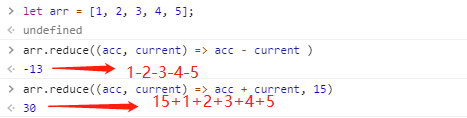

&emsp;&emsp;有时会对数组进行map、filter、reduce的联合操作，只需要从前向后逐步分析即可：
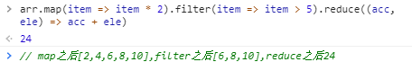

如果想查较全的方法：[点击这个](https://developer.mozilla.org/zh-CN/docs/Web/JavaScript/Reference/Global_Objects/Array)

## 三. 栈

&emsp;&emsp;栈是一种遵循先进后出的有序集合，添加或删除均在栈顶、另一端为栈底。

### 3.1 创建栈及常用方法

js中数组可以模拟栈。创建一个类来代表栈，属性为数组，方法包括：

- push(element(s))：添加一个或几个新元素到栈顶
- pop：移除栈顶元素，同时返回被删除的元素
- peek：返回栈顶元素，不对栈作任何修改
- isEmpty：判断栈是否为空
- clear：移除栈中所有元素
- size：返回栈中的元素个数

## 四. 队列

&emsp;&emsp;队列是一种遵循先进先出的有序集合，从尾部添加元素，从顶部移除元素。

### 4.1 创建队列及常用方法

js中数组可以模拟队列。创建一个类来代表队列，属性为数组，方法包括：

- enqueue(element(s))：添加一个或几个新元素到队尾
- dequeue()：移除队首元素，同时返回被移除的元素
- front()：返回队列中第一个元素（队首），队列不变动
- isEmpty()：判断队列是否为空
- clear：移除队列中所有元素
- size()：返回队列中的元素个数

## 五. 链表

&emsp;&emsp;链表是存储有序元素的集合，但不同于数组，链表中的元素在内存中并不是连续放置的。每个元素由一个存储元素本身的节点和一个指向下一个元素的引用（也称为指针或链接）组成。

链表分为单链表、双链表、循环链表、有序表。
链表的算法实现见代码。

## 六. 集合

&emsp;&emsp;集合是一组无序且不能重复的项组成。ES6中已经引入Set对象，这里我自己实现这个数据结构的常用方法。

集合除了可以添加、删除、查看元素之外，还可以进行如下操作：

1. 并集：对于给定的两个集合，返回一个包含两个集合中所有元素的新集合。

2. 交集：对于给定的两个集合，返回一个包含两个集合中共有元素的新集合。

3. 差集：对于给定的两个集合，返回一个包含所有存在于第一个集合且不存在于第二个集
合的元素的新集合。

4. 子集：验证一个给定集合是否是另一集合的子集。

## 六. 字典和散列表

&emsp;&emsp;在集合中，以[a, b, c....]的形式存储元素，我们感兴趣的是每个值的本身，并把它们当做主要元素。在字典和散列表中，我们使用 [键 , 值] 的形式来存储数据。ES6中已经引入Map对象，这里我自己实现这个数据结构的常用方法。

&emsp;&emsp;HashTable是Dictionary的一种散列表实现方式。散列算法的作用是尽可能快地在数据结构中找到一个值。散列函数的作用是给定一个键值，然后返回值在表中的地址。在散列表上插入、删除和取用数据都非常快，但是对于查找操作来说却效率低下，比如查找最大最小值。得求助于其他数据结构，二叉查找树是一个很好的选择。

## 七. 树

树的优势：

- 二叉树进行查找非常快（链表上查找比较慢）
- 二叉树添加或删除元素非常快（数组添加或删除很慢）
<font color='red'>也就是说树是数组和链表的一种折中结构，它使得在任何操作上花费的时间都较为均衡。</font>

<font color='red'>注意：</font>树的基本操作都是基于**递归**，这一点很重要。

## 八. 图