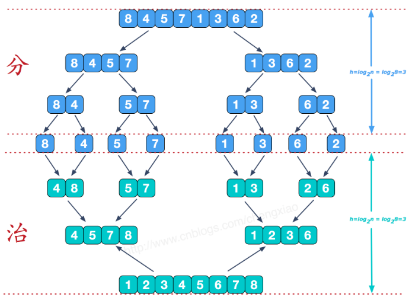

# 第二章、排序

参考[这篇技术论坛](https://www.runoob.com/w3cnote/ten-sorting-algorithm.html)

先给出所有排序算法：


图片名词解释：
n: 数据规模
k:“桶”的个数
In-place: 占用常数内存，不占用额外内存
Out-place: 占用额外内存

## 2.1 冒泡排序

原理：从前往后，依次比较相邻的两个元素（i、j），如果遇到i大于j，则调换他们的位置，然后继续向后比较。一轮比较之后，最大的元素就被挑出来放到数组末尾了，一轮排序就算完成了。接着在除了已经调好位置的最大元素外的剩余数组元素中继续重复步骤...直到最后所有元素从小到大排好。


```js
function bubbleSort(arr){
    let temp;
    for(let i = 0; i < arr.length - 1; i++){
        for(let j = 0; j < arr.length - i - 1; j++){
            if(arr[j] > arr[j+1]){
                temp = arr[j];
                arr[j] = arr[j+1];
                arr[j+1] = temp;
            }
        }
    }
    return arr;
}
```

可以对上述“简单版”进行优化，即每次记录这一轮最后交换的位置，假如初始数组为[7,6,5,2,8,9]，一轮排序后变为[6,5,2,7,8,9]，在第一轮就可以把最大的三个数确定了，即7,8,9（因为7在于8和9比较的过程中指针j没移动），所以第二轮可以直接将待排序数组缩减为[6,5,2]。**优化的算法如下：**

```js
function bubbleSort2(arr){
    let temp;
    let i = arr.length - 1;
    while(i > 0){
        let pos = 0;
        for(let j = 0; j < i; j++){
            if(arr[j] > arr[j+1]){
                pos = j;
                temp = arr[j];
                arr[j] = arr[j+1];
                arr[j+1] = temp;
            }
        }
        i = pos;
    }
    return arr;
}
```

复杂度分析：

- 时间复杂度
因为有两层循环，比较容易看出平均复杂度为O(N**2)；最好的时候是已经排好序，此时一次排序就结束，时间复杂度为O(N)；最坏的情况是完全逆序，此时需要O(N\**2))。
- 空间复杂度
只需要常数级别的变量去作为指针存放索引、去为交换作中间变量，所以为O(1)。

## 2.2 选择排序

原理：全局设置一个记录最小值的变量，每次从待排序数组中挑选一个最小的值，与待排序数组首部交换。其中挑选最小值的做法就是给最小值一个初始值，然后轮流和待排序数组中的元素进行比较，如果有比最小值小的元素，就更换最小值。
<font color='red'>循环次数为arr.length - 1。可以随便代一个例子看看：[2,3,1]，第1次在3和1中挑选，1比2小，与arr[0]=2交换得[1,3,2]；第2次在2中挑选，2比arr[1]=3小，交换得[1,2,3]。一共排序2次，为arr.length-1</font>

```js
function selectionSort(arr) {
    for(let i = 0; i < arr.length - 1; i++){
        let minIndex = i;
        for(let j = i + 1; j < arr.length; j++){
            if(arr[j] < arr[minIndex]){
                minIndex = j;
            }
        }
        if(minIndex !== i){
            let temp = arr[i];
            arr[i] = arr[minIndex];
            arr[minIndex] = temp;
        }
    }
    return arr;
}
```

复杂度分析：

- 时间复杂度
无论什么数据放进去时间复杂度都是O(N**2)
- 空间复杂度
空间复杂度为O(1)

## 2.3 插入排序

原理：从前向后依次扫描每个元素，在序列首部维持一个有序序列。将每个元素依次和有序列表中的元素进行比较，并插入到合适位置，生成新的“有序序列”。

```js
function insertionSort(arr){
    for(let i = 1; i < arr.length; i++){
        let j = i - 1;
        let key = arr[i];
        while(j >= 0 && key < arr[j]){
            arr[j+1] = arr[j];
            j--;
        }
        arr[j+1] = key;
    }
}
```

可以在插入时利用二分查找，快速寻找插入点，算法如下：

```js
function binaryInsertionSort(arr){
    for(let i = 1; i < arr.length; i++){
        let [left, right] = [0, i - 1];
        let key = arr[i];
        while(left <= right){
            let middle = (left +right) >> 1;
            if(arr[middle] > key){
                right = middle - 1;
            }else{
                left = middle + 1;
            }
        }

        for(let j = i - 1; j >= left; j--){
            arr[j+1] = arr[j];
        }
        arr[left] = key;
    }
    return arr;
}
```

复杂度分析：

- 时间复杂度
两层循环，可以轻松得知平均时间复杂度为O(N**2)；在序列已经排好序的情况下，每次省去了寻找插入点的循环操作，所以为O(N)；最坏的情况是序列逆序，此时需要O(N\**2)。
- 空间复杂度
额外的空间是常数级别的（i、j、记录当前插入点的key），所以为O(1)。

## 2.4 希尔排序

原理：也称**递减增量排序**，原理如字面量，先将整个序列分割成若干子序列分别进行直接插入排序，<font color='red'>待整个序列基本有序的时候，再对整体元素进行一次直接插入排序</font>
这个算法在没有理解他的真谛的时候几乎看不懂代码，但是理解它与**插入排序**的关系后，就轻而易举！<font color='red'>希尔排序相当于同时维护了多个插入排序</font>
<font color='blue'>另外还需要注意，该算法是不稳定的，即相同数字在排序后的相对位置可能会发生改变</font>

```js
function shellSort(arr){
    let d = arr.length;
    while(d > 1){
        d = Math.floor(d/2);
        for(let i = 0; i < d; i++){

            // 插入排序
            for(let j = i + d; i < arr.length; i += d){
                let key = arr[j];
                let k = j - d;
                while(k >= 0 && arr[k] > key){
                    arr[k+d] = arr[k];
                    k -= d;
                }
                arr[k+d] = key;
            }
        }
    }
    return arr;
}
```

复杂度分析：

- 时间复杂度
希尔排序的时间复杂度分析是个很困难的数学问题，只需要记住平均复杂度为O(N\^d)---根据增量选择方式而不同。如果使用Hibbard增量（1,3,5,15---通项2k-1），最坏复杂度为O(N^(3/2))。最坏的时间复杂度为O(N\^2)。
- 空间复杂度
空间复杂度为O(1)

## 2.5 归并排序

原理：归并排序是典型的**分治法**的例子。

分治法，即**先分而后治**。**分**利用的是递归的方法将复杂的问题转化为相同类型的子问题；**治**则针对这些子问题的共性统一处理。一个诀窍是先找出**临界条件**，再在临界条件之上将递归初始值具体化（可以在临界的基础+1），然后向下算几次试试。

```js
function mergeSort(arr){
    if(arr.length < 2){
        return arr;
    }
    let middle = Math.floor(arr.length/2);
    let left_arr = arr.slice(0, middle);
    let right_arr = arr.slice(middle);
    return merge(mergeSort(left_arr), mergeSort(right_arr));
}

function merge(left, right){
    let result = [];
    while(left.length && right.length){
        if(left[0] < right[0]){
            result.push(left.shift());
        }else{
            result.push(right.shift());
        }
    }

    while(left.length){
        result.push(left.shift());
    }
    while(right.length){
        result.push(right.shift());
    }
    return result;
}
```

复杂度分析：

- 时间复杂度
归并排序无论怎么样都经历了特定的递归步骤（因为每次数组长度减半，所以递归深度为logN，而合并有一个循环插入新数组的操作，复杂度为N），时间复杂度为O(NlogN)。
- 空间复杂度
借助了一个与原数组等长的数组，所以空间复杂度为O(N)

## 2.6 快速排序

原理：先找出一个pivot（初始值为arr[0]），然后根据pivot，将序列分区，左侧全是小于pivot的元素、右侧全是大于pivot的元素。如果将左侧和右侧看作是一个**具体的数字**，那么此时序列已经排好序。所以接下来只需要将左侧和右侧各自进行递归操作即可。

```js
function partition(arr, left, right){
    let pivot = arr[left];
    while(left < right){
        while(left < right && pivot < arr[right]){
            right--;
        }
        arr[left] = arr[right];
        while(left < right && arr[left] <= pivot){
            left++;
        }
        arr[right] = arr[left];
    }
    arr[left] = pivot;
    return left;
}

function quickSort(arr, left=0, right=arr.length-1){
    if(left < right){
        let pivot = partition(arr, left, right);
        quickSort(arr, left, pivot-1);
        quickSort(arr, pivot+1, right);
    }
    return arr;
}
```

<font color='red'>特别需要注意：在分区的时候，pivot和arr[left]比较的过程中需要判断等于的情况，否则遇到两数相等的情况就会卡住。</font>

<font color='blue'>快速排序是对冒泡排序的改进，如果序列完全逆序，那么操作过程就相当于冒泡排序，也就是说**最坏的情况**就是冒泡排序所需要的复杂度</font>

复杂度分析

- 时间复杂度：
最坏的情况下是O(N**2)，但是这种情况是及其特别的时候。平均复杂度为O(NlogN)，并且比起归并排序来说，这个平均复杂度前边的系数要小很多，所以可以说快速排序是一个相当块的排序算法。
- 空间复杂度：
每次排序所需要的空间是O(1)，真正消耗空间的地方是递归操作，每次递归都会保存一些数据，由于每次序列长度减半，所以：
<font color='green'>最优为O(logN)：第一次都平分数组
最坏为O(N)：退化为冒泡排序，将每一次冒泡排序操作放到递归中</font>

## 2.7 堆排序

原理：先建立一个大根堆，即父节点值大于子节点的二叉树。然后依次去将根与堆的最后一个元素交换，并调整堆使其维持大根堆。重复操作直到堆为空，最后得到的就是递增序列。

```js
function adjustHeap(arr, i, len){
    let temp = arr[i];
    for(let k = 2*i+1; k < len; k = 2*k+1){
        if(k+1<len && arr[k+1] > arr[k]){
            k++;
        }
        if(arr[k] > temp){
            arr[i] = arr[k];
            i = k;
        }else{
            break;
        }
    }
    arr[i] = temp;
}

function swap(arr, i, j){
    let temp = arr[i];
    arr[i] = arr[j];
    arr[j] = temp;
}

function heapSort(arr){
    // 建堆
    for(let i = Math.floor(arr.length/2); i >=0; i--){
        adjustHeap(arr, i, arr.length);
    }
    // 调整
    for(let j = arr.length-1; j > 0; j--){
        swap(arr, 0, j);
        adjustHeap(arr, 0, j);
    }
    return arr;
}
```

堆排序是个**不稳定**算法

复杂度分析

- 时间复杂度：
时间复杂度为O(NlogN)，其中建堆实际复杂度为O(N)，堆调整为O(NlogN)，所以综合起来，复杂度为O(NlogN)。
- 空间复杂度：
空间复杂度为O(1)，因为全程没有借助额外的数组，仅需要几个临时变量。

## 2.8 计数排序

## 2.9 桶排序

## 2.10 基数排序

基数排序 vs 计数排序 vs 桶排序

这三种排序算法都利用了桶的概念，但对桶的使用方法上有明显差异：

基数排序：根据键值的每位数字来分配桶
计数排序：每个桶只存储单一键值
桶排序：每个桶存储一定范围的数值
