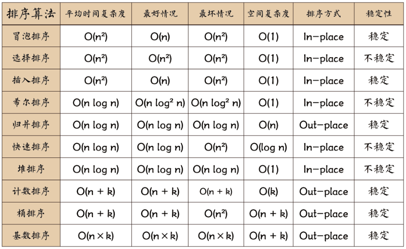

# 第二章、排序

参考[这篇技术论坛](https://www.runoob.com/w3cnote/ten-sorting-algorithm.html)

先给出所有排序算法：


图片名词解释：
n: 数据规模
k:“桶”的个数
In-place: 占用常数内存，不占用额外内存
Out-place: 占用额外内存

## 2.1 冒泡排序

原理：从前往后，依次比较相邻的两个元素（i、j），如果遇到i大于j，则调换他们的位置，然后继续向后比较。一轮比较之后，最大的元素就被挑出来放到数组末尾了，一轮排序就算完成了。接着在除了已经调好位置的最大元素外的剩余数组元素中继续重复步骤...直到最后所有元素从小到大排好。



```js
function bubbleSort(arr){
    let temp;
    for(let i = 0; i < arr.length; i++){
        for(let j = 0; j < arr.length - i - 1; j++){
            if(arr[j] > arr[j+1]){
                temp = arr[j];
                arr[j] = arr[j+1];
                arr[j+1] = temp;
            }
        }
    }
    return arr;
}
```

可以对上述“简单版”进行优化，即每次记录这一轮最后交换的位置，假如初始数组为[7,6,5,2,8,9]，一轮排序后变为[6,5,2,7,8,9]，在第一轮就可以把最大的三个数确定了，即7,8,9（因为7在于8和9比较的过程中指针j没移动），所以第二轮可以直接将待排序数组缩减为[6,5,2]。**优化的算法如下：**

```js
function bubbleSort2(arr){
    let temp;
    let i = arr.length - 1;
    while(i > 0){
        let pos = 0;
        for(let j = 0; j < i; j++){
            if(arr[j] > arr[j+1]){
                pos = j;
                temp = arr[j];
                arr[j] = arr[j+1];
                arr[j+1] = temp;
            }
        }
        i = pos;
    }
    return arr;
}
```

复杂度分析：

- 时间复杂度
因为有两层循环，比较容易看出平均复杂度为O(N**2)；最好的时候是已经排好序，此时一次排序就结束，时间复杂度为O(N)；最坏的情况是完全逆序，此时需要O(N\**2))。
- 空间复杂度
只需要常数级别的变量去作为指针存放索引、去为交换作中间变量，所以为O(1)。

## 2.2 选择排序

原理：全局设置一个记录最小值的变量，每次从待排序数组中挑选一个最小的值，与待排序数组首部交换。其中挑选最小值的做法就是给最小值一个初始值，然后轮流和待排序数组中的元素进行比较，如果有比最小值小的元素，就更换最小值。
<font color='red'>循环次数为arr.length - 1。可以随便代一个例子看看：[2,3,1]，第1次在3和1中挑选，1比2小，与arr[0]=2交换得[1,3,2]；第2次在2中挑选，2比arr[1]=3小，交换得[1,2,3]。一共排序2次，为arr.length-1</font>

```js
function selectionSort(arr) {
    let minIndex = 0;
    let temp;
    for(let i = 0; i < arr.length - 1; i++){
        for(let j = i + 1; j < arr.length; j++){
            if(arr[j] < arr[minIndex]){
                minIndex = j;
            }
        }
        temp = arr[i];
        arr[i] = arr[minIndex];
        arr[minIndex] = temp;
    }
    return arr;
}
```

复杂度分析：

- 时间复杂度
无论什么数据放进去时间复杂度都是O(N**2)
- 空间复杂度
空间复杂度为O(1)

## 2.3 插入排序

原理：从前向后依次扫描每个元素，在序列首部维持一个有序序列。将每个元素依次和有序列表中的元素进行比较，并插入到合适位置，生成新的“有序序列”。

```js
function insertionSort(arr){
    for(let i = 1; i < arr.length; i++){
        let j = i - 1;
        let key = arr[i];
        while(j >= 0 && key < arr[j]){
            arr[j+1] = arr[j];
            j--;
        }
        arr[j+1] = key;
    }
}
```

可以在插入时利用二分查找，快速寻找插入点，算法如下：

```js
function binaryInsertionSort(arr){
    for(let i = 1; i < arr.length; i++){
        let [left, right] = [0, i - 1];
        let key = arr[i];
        while(left <= right){
            let middle = (left +right) >> 1;
            if(arr[middle] > key){
                right = middle - 1;
            }else{
                left = middle + 1;
            }
        }

        for(let j = i - 1; j >= left; j--){
            arr[j+1] = arr[j];
        }
        arr[left] = key;
    }
    return arr;
}
```

复杂度分析：

- 时间复杂度

- 空间复杂度

## 2.4 希尔排序

## 2.5 归并排序

## 2.6 快速排序

## 2.7 堆排序

## 2.8 计数排序

## 2.9 桶排序

## 2.10 基数排序

基数排序 vs 计数排序 vs 桶排序

这三种排序算法都利用了桶的概念，但对桶的使用方法上有明显差异：

基数排序：根据键值的每位数字来分配桶
计数排序：每个桶只存储单一键值
桶排序：每个桶存储一定范围的数值
