# JS 基础

[toc]

## 1. js 事件冒泡、事件捕获和事件委托

https://www.jianshu.com/p/d3e9b653fa95
https://www.jb51.net/article/121063.htm

我的理解：

## 2. 浅拷贝和深拷贝

浅拷贝：值的复制

深拷贝：引用的复制

针对只包含一级属性，没有二级属性的对象，可以使用Object.assign()来实现深拷贝

对于包含二级属性及以上的对象，使用如下方式实现深拷贝：

1. JSON.parse(JSON.stringify())
原理：利用JSON.stringify将js对象序列化，再使用JSON.parse来反序列化（还原）对象。

缺点：

- 如果obj中有时间对象，序列化的结果，时间只能是字符串形式，而不是时间对象
- 如果obj中有正则、Error对象，序列化的结果将只能得到空对象

2. 递归方法

```js
function deepcopy(obj) {
  //  将对象的特殊情况进行处理
  if (obj === null) return null;
  if (obj instanceof RegExp) return new RegExp(obj);
  if (obj instanceof Date) return new Date(obj);

  if (typeof obj !== "object") {
    return obj;
  }

  let newObj = new obj.constructor();
  for (let key in obj) {
    newObj[key] = deepcopy(obj[key]);
  }
  return newObj;
}
```

## 3. 防抖节流

参考：[防抖节流](https://segmentfault.com/a/1190000018428170)

试想一个场景：在一个文章列表下拉过程中，当滑动到一定位置，右下角会出现一个按钮，用来返回顶部（毕竟，如果我们手动返回顶部太慢了！），这个按钮只有在页面滑动到一定位置才出现。所以我们就需要写这么一个监听浏览器滚动事件，返回当前滑动条与顶部距离的函数：

```js
function showBTop() {
  let scrollTop = document.body.scrollTop || document.documentElement.scrollTop;
  console.log("滚动条位置： " + scrollTop);
}
window.onscroll = showBTop;
```

但是当你滑动的时候，window.onscroll 会调用数次（滑动一下调 10 次左右）showTop 函数，这会严重损耗浏览器性能。

基于以上场景，我们需要做一个**防抖**操作：第一次调用会设置一个定时器，随后由于事件触发的调用都会使得定时器清空，直到操作结束后一定时间，才调用函数。

```js
function debounce(fn, delay) {
  let timer = null; //借助闭包
  return function (...args) {
    if (timer) {
      clearTimeout(timer);
    }
    timer = setTimeout(() => fn(...args), delay);
  };
}
function showTop() {
  var scrollTop = document.body.scrollTop || document.documentElement.scrollTop;
  console.log("滚动条位置：" + scrollTop);
}
window.onscroll = debounce(showTop, 1000);
```

上面实现的效果使得：滑动操作调用 debounce 函数，第一次设置一个定时器，随后一直取消当前计时，并且重新计时，直到停止操作 1s 后，定时器时间结束，调用回调函数。

<font color='red'>防抖</font>：对于短时间内连续触发的事件（上面的滚动事件），防抖的含义就是让某个时间期限（如上面的 1000 毫秒）内，事件处理函数只执行一次。

上面的操作还是有一个问题，如果用户一直滑动，不停下来，就会导致回调函数一直执行不了，从而使得按钮没法出现，所以我们需要**节流**操作：它类似于冷却时间，在持续滑动过程中，函数执行一次后，该函数在指定的期间内不再执行。

```js
function throttle(fn, delay) {
  let valid = true;
  return function (...args) {
    if (!valid) {
      return false;
    }
    // 工作时间，执行函数并且在间隔期内把状态位设为无效
    valid = false;
    setTimeout(() => {
      fn(...args);
      valid = true;
    }, delay);
  };
}

function showTop() {
  var scrollTop = document.body.scrollTop || document.documentElement.scrollTop;
  console.log("滚动条位置：" + scrollTop);
}
window.onscroll = throttle(showTop, 1000);
```

其他应用场景：

1. 搜索框 input 事件，例如要支持输入实时搜索可以使用节流方案（间隔一段时间就必须查询相关内容），或者实现输入间隔大于某个值（如 500ms），就当做用户输入完成，然后开始搜索，具体使用哪种方案要看业务需求。
2. 页面 resize 事件，常见于需要做页面适配的时候。需要根据最终呈现的页面情况进行 dom 渲染（这种情形一般是使用防抖，因为只需要判断最后一次的变化情况）。

## 4. 可枚举属性和不可枚举属性（for...in、Object.keys()、Object.getOwnPropertyNames()区别）

**结论：** for...in 循环是遍历对象的每一个可枚举属性,包括原型链上面的可枚举属性；Object.keys()只是遍历自身的可枚举属性,不可以遍历原型链上的可枚举属性；Object.getOwnPropertyNames()则是遍历自身所有属性（不论是否是可枚举的）,不包括原型链上面的。

1. 创建一个对象（具有原型链属性的）

   ```js
   function People() {
     this.name = "Tom";
     this.age = 24;
     this.a = function () {
       console.log("1");
     };
   }
   People.prototype.b = function () {
     console.log("2");
   };
   let p = new People();
   // 使用Object.defineProperty方法添加一个不可枚举属性
   Object.defineProperty(p, "c", { value: "女", enumerable: false });
   ```

2. 通过三种方式分别访问对象属性

- 1.通过 Object.keys()

  ```js
  console.log(Object.keys(p));

  // 输出自身的可枚举属性
  ["name", "age", "a"];
  ```

- 2.通过 for...in

  ```js
  for (let item in p) {
    console.log(item);
  }

  // 输出自身和原型链上可枚举属性
  name;
  age;
  a;
  b; // 原型链上的可枚举属性
  ```

- 3.通过 Object.getOwnPropertyNames()

  ```js
  console.log(Object.getOwnPropertyNames(p))[
    // 输出自身的所有属性（可枚举和不可枚举的）
    ("name", "age", "a", "c")
  ];
  ```

## 5. !!的使用

```js
var a;
if (a !== null && typeof a !== undefined && a !== "") {
  // a有内容时才执行的代码
}

// 用!!等同于上面的写法
if (!!a) {
  // a有内容时才执行的代码
  // 筛选掉null、undefined和空字符串
}
```

## 6. Promise

### 6.1 Promise 基础知识

### 6.2 Promise、async&await、setTimeout 执行顺序

### 6.3 Promise.all 与 Promise.race 的实现

## 7. 闭包

<font color='red'>闭包是可以访问另一个函数作用域的函数。</font>由于 js 作用域链的特性，外层的函数访问不到内部函数的变量，而内部的函数可以访问到外部函数的变量。
&emsp;&emsp;因此，<font color='red'>闭包可以隐藏变量来防止作用域污染，实现封装。</font>它的缺点在于保留了作用域链，会增加内存的开销，需要防止内存泄漏。

## 8. 作用域

### 8.1 js 作用域的理解

1. 全局作用域
   在顶层环境中声明的变量都是全局作用域，他们的属性都是 window 对象下。
2. 函数作用域
   在函数内部定义的变量都是函数作用域，只能在函数内部访问到，也可以通过闭包访问。除此之外，别的地方是无法访问的。
3. 局部作用域
   es6 新增的特性，使用 let 或 const 声明变量。声明的变量只能在声明之后访问到。
4. 作用域链
   如下：

```js
function funcA() {
  let a;
  function funcB() {
    let b;
  }
}
```

当进入 funcA 时，会把 a 压入到作用域 A 中，并且将作用域 A 入栈；当进入 funB 时，则会把变量 b 压入到作用域 B 中，并且将作用域 B 入栈，这时候栈内存中就有作用域 A 和作用域 B，当在 funcB 中查找某个变量时，会先从当前的作用域 B 中查找，如果没有，则依次向栈底查找，**这就是作用域链**。

### 8.2 函数的作用域链

1. 创建函数func时，会创建一个预先包含全局变量对象的<font color='red'>作用域链</font>，保存在内部的[[Scopes]]属性中（可通过func.prototype看到）

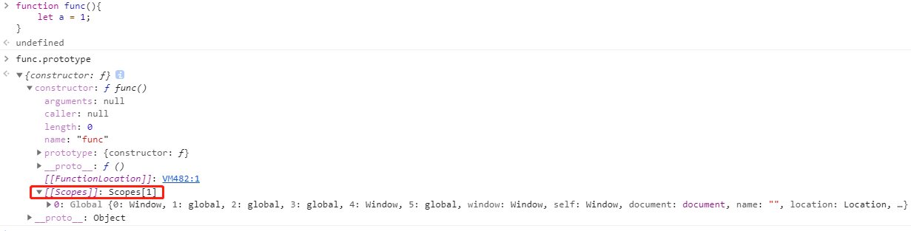

2. 调用函数func时，为此函数创建一个**执行环境**
3. 复制函数的[[Scopes]]属性中的对象构造**执行环境的作用域链**
4. 创建一个**活动对象**，推入执行环境作用域链的前端([0]位置)

此时执行环境的作用域链中包含两个对象：**全局变量对象**，**局部活动对象**。函数中访问一个变量时，就会从作用域链中搜索（[[Scopes]]中从前往后找）具有响应名字的变量；函数执行完毕后，局部活动对象被销毁，内存中仅保存全局作用域。

### 8.3 例子

```js
let func1, func2;
function foo(){
  let x = 10;
  func1 = function(){
    console.log(++x);
  }
  func2 = function(){
    console.log(--x);
  }
}
foo(); // 初始化func1,func2
func1(); // 11
func2(); // 10
```

可以利用这种方法在闭包函数外操作到闭包函数内的变量。<font color='red'>原因：在用一个父作用域的闭包共享了同一个[[Scopes]]属性</font>

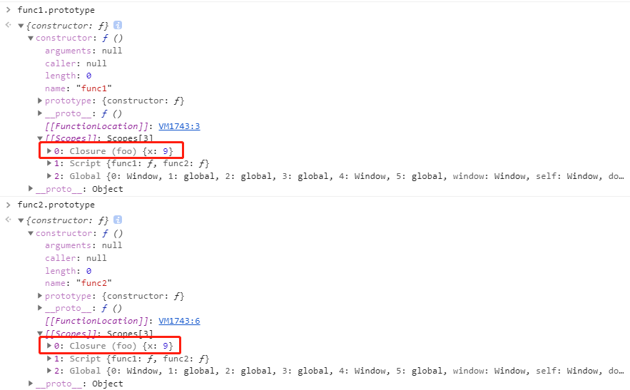

```js
let x = 10;
function foo(){
  console.log(x);
}
foo(); // 10
function func(){
  let x = 20;
  let foo1 = foo;
  foo1();
}
func(); // 10
```

答案是10的原因是因为在复制函数时，<font color='red'>复制后的函数和复制前的函数引用的是同一个[[Scopes]]属性</font>。由于foo的Scopes属性中的x保存的是全局变量的x=10，foo1与其相同，所以foo1在执行时，按照scopes属性查找作用域链时，查到了x=10。

## 9. 0.1 + 0.2 ≠ 0.3

## 10. js垃圾回收

可达性：<font color='red'>以某种方式可访问或可用的值，它们被保存在内存中，则该值可达</font>

js引擎会有一个后台进程**垃圾回收器**，它监视着所有对象，删除那些**不可达**的对象。

### 10.1 例子1

```js
let user = {
  name: 'John'
};
```

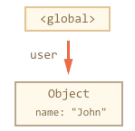
全局对象user引用了对象{name: 'John'}，为简单起见，该对象称为**JOHN**。

```js
user = null;
```

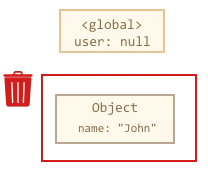
现在**JOHN**变成不可达状态了，没有办法访问它，没有对它的引用。垃圾回收器将丢弃JOHN并释放内存。

如果下面这种情况：

```js
let user = {
  name: 'John'
};
let admin = user;
```

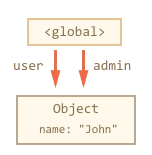

我们做同样的事情：

```js
user = null;
```

由于**JOHN**仍然可以由admin访问，所以它可达，垃圾回收器不会回收

### 10.2 例子2

```js
function marry(man, woman){
  woman.husband = man;
  man.wife = woman;

  return {
    father: man,
    mother: woman
  }
}

let family = marry({
  name: "John"  
},{
  name: 'Ann'
})
```

函数marry通过给两个对象彼此提供引用来“联姻”，并返回一个新对象，产生的内存结构如下：

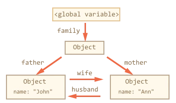

到目前为止，所有对象都是可访问的。我们删除两个引用：

```js
delete family.father;
delete family.mother.husband;
```

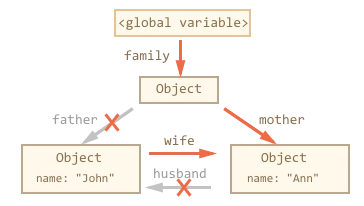

<font color='red'>如果只是删除这两个引用中的一个，是不够的，因为所有对象仍然可达</font>。但是删除了两个引用，就会导致{name: 'John'}不可达，垃圾回收器回收**JOHN**。

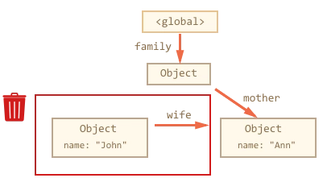

### 10.3 标记-清除算法

基本的垃圾回收算法就叫**标记-清除算法**，定期执行以下垃圾回收步骤：

- 垃圾回收器获取根并**标记**它们
- 然后访问并**标记**所有来自它们的引用
- 然后依次类推（树状递归），直到有未访问的引用为止
- 除标记的对象外（可达），其他对象都被删除

例如：对象结构如下，可以清楚的看到右边有一个不可达的对象，来看看垃圾回收器如何**标记-清除**：

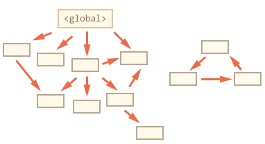

1. 标记根

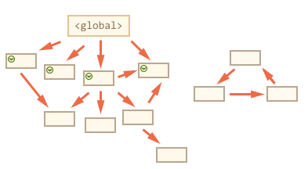

2. 标记根的引用

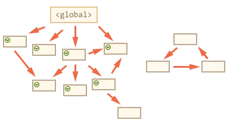

3. 继续“广度优先遍历”，直到遍历到头（没有引用）

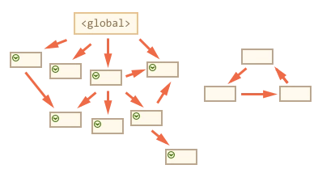

4. 现在垃圾回收进程中不能访问的对象被认为是**垃圾**，将被删除

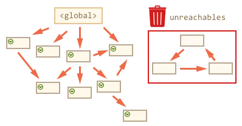

### 10.4 其他算法

1. 标记-压缩
通过数次搜索堆来重新装填活动对象
2. 引用计数（低版本的ie浏览器）
记录每个对象被引用的次数，每次新建、赋值、删除都会更新计数器，计数器为0的时候回收内存。
优点：不需要进行复杂遍历
缺点：循环引用无法回收；闭包中引用DOM对象，会导致内存泄漏