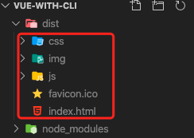
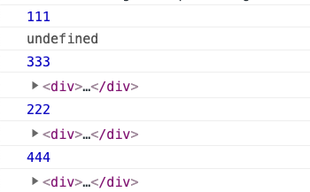

# 高频面试题

[toc]

## 1. v-model 原理

v-model 是默认使用组件的 value prop 和 input 事件

```html
<input v-bind:value="msg" v-on:input="msg=$event.target.value" />
```

## 2. e.target 和 e.currentTarget 区别

其中 target 和 currentTarget 的区别：

**currentTarget 始终是监听事件者，而 target 是事件的真正发出者**

```html
<a @click="onClick($event)">
  记住，我通过换行符隔开，方便测试
  <br />
  <i>0</i>
</a>
```

不管点击 a 本身还是 a 里面的任何子集，currentTarget 获取到的对象都是绑定事件的元素 a；而 target 会随着你点击的区域进行改变。<font color='red'>比如你点击 a 的子集 i，target 就会变成 i 元素，如果点击的是 a，没有点到子集 i，那么 target 就会变成 a 元素。</font>

## 3. vue 中 key 的原理

key 的作用便于 diff 算法的更新，key 的唯一性，能使得算法更快的找到需要更新的 dom。key 最好是一个唯一值，而不是简单使用 index。如果使用 index 可能会出现渲染错位的情况，因为 diff 是同级比对。

详细参考：[为什么在 v-for 中的 key 不推荐使用随机数或者 index 呢？](https://github.com/haizlin/fe-interview/issues/2229)

大致意思是：<font color='red'>因为在插入数据或者删除数据的时候，会导致后面的数据的 key 绑定的 index 变化，进而导致从新渲染，效率会降低。</font>一句话就是：**增删时避免重新渲染**

## 4. vue3 的变化

### 4.1 双向数据绑定用 proxy

### 4.2 插槽换成了函数的方式

## 5. 在 vue 项目中如果 methods 的方法用箭头函数定义结果会怎么样

在严格模式下 this 是 undefined，在非严格模式下指向 window

## 6. \<template><\/template>作用

当做一个不可见的包裹元素，减少不必要的 DOM 元素，整个结构会更清晰

## 7. vue 中的定时器怎么销毁

通过\$once 来监听定时器，在 beforeDestory 钩子中清除；也可以直接调用
beforeDestroy，在里面清除定时器。

```js
const timer = setInterval(() =>{
// 某些定时器操作
}, 500);
// 使用$once
this.$once('hook:beforeDestroy', () => {
clearInterval(timer);
}
```

## 8. vue 优化首屏加载速度

1. 异步路由和异步加载
2. ssr
3. webpack 压缩
4. 关键资源预加载
5. cdn（将不经常变动的资源放到 cdn，使得 vendor.js（存储第三方库资源）体积变小）
6. 静态资源单独域名，去掉 cookie（每次发 heep 请求会变快）

详细见：https://blog.csdn.net/Chris__wang/article/details/90477555

## 9. vue 中能监听到数组变化的方法有哪些，为什么能被监听到

具体哪些方法不需要背（push,pop,shift,unshift 等）。数组的方法在框架内进行了重写，新的方法里增加了监听（ob.dep.notify()）。

## 10. vue 打包最终的文件有哪些

如下图：



其中 js 中包含了 source map，便于找到代码在源文件的位置，方便本地开发调试。

## 11. vue 实现路由懒加载

- vue 的异步组件：resolve=>require(['需要异步加载的组件']，resolve)
- es6 的 import 方法：（）=>import(需要异步加载的组件)
- webpack 的 require.ensure： r => require.ensure([],()=>r( require(需要异步加载的组件))，chunkName)

## 12. vue 首页白屏的原因以及解决方案

出现白屏是因为 SPA 单页面，第一次加载的东西太多了，这种情况可以：使用**路由懒加载**分担一下，刚进到页面先看到哪些，就加载哪些就好了。

1. vue 异步组件
   vue-router 配置路由，使用 vue 的异步组件技术，实现按需加载：

```js
// 非懒加载：
export default new Router({
  routes: [
    {
      path: '/Login',
      name: 'Login',
      component: Login,
    },
    ...
  ]
})
// 懒加载
export default new Router({
  routes: [
    {
      path: '/Login',
      name: 'Login',
      component: resolve => require(['@/components/Login'], resolve)
    },
    ...
  ]
})
```

2. es 的 import()

- require 是<font color='red'>运行时</font>调用，所以 require 可以运用在代码任何地方。require 是<font color='red'>赋值</font>的过程，其实
  require 的结果是对象、数字、字符串等，再把 require 的结果赋值给某个变量。
- import 是<font color='red'>编译时</font>调用，所以必须放在文件开头。import 是<font color='red'>解构</font>的过程，目前所有引擎还没实现 import，在 node 中使用 babel 支持 es6，也仅仅是将 import 转码为 require。

```js
export default new VueRouter({
  routes: [
    {
      path: "/",
      component: () => import("../components/Navigator"),
    },
  ],
});
```

使用路由懒加载 import 的写法，只会在进入到这个路由的时候才走 component，然后再运行 import 编译加载相应的组件。

3. webpack 的 require 和 ensure()

```js
// r就是resolve
const list = (r) =>
  require.ensure([], () => r(require("../components/list/list")), "list");
// 路由也是正常的写法  这种是官方推荐的写的 按模块划分懒加载
const router = new Router({
  routes: [
    {
      path: "/list/blog",
      component: list,
      name: "blog",
    },
  ],
});
```

## 13. nextTick 原理

用法：在下次 DOM 更新循环结束之后执行延迟回调。在修改数据之后立即使用这个方法，获取更新后的 DOM。

简单来说，就是当数据发生变化时，视图不会立即更新，而是等到同一事件循环中所有数据变化完成之后，再统一更新视图。

```js
mounted() {
  console.log(333);
  console.log(this.$refs["hello"]);
  this.$nextTick(() => {
    console.log(444);
    console.log(this.$refs["hello"]);
  });
},
created() {
  console.log(111);
  console.log(this.$refs["hello"]);
  this.$nextTick(() => {
    console.log(222);
    console.log(this.$refs["hello"]);
  });
},
```

打印结果为：



## 14. vue 获取 dom 节点

在组件上使用 ref="ref_value"，在获取的地方使用 this.\$refs.ref_value

## 15. provide 和 inject 的理解

通过在父组件中 provide 一些数据然后再所有子组件中都可以通过 inject 获取使用该参数。主要是为了解决一些循环组件比如 tree, menu, list 等, 传参困难, 并且难以管理的问题, 主要用于组件封装, 常见于一些 ui 组件库。

## 16. $attrs和$listeners

vue 中 inheritAttrs 字段设置了是否禁用继承特性，默认是禁用的，而如果设置为 true，就可以通过\$attrs

$attrs通过v-bind="$attrs"传入内部组件，但是不会传入 props；$listeners通过v-on="$listeners"传入内部组件

## 17. $parent和$children

可以通过这两个属性，父实例获取子实例组成的数组，子实例获取父实例。

## 18. Event Bus

在相互通信的兄弟组件之中，都引入一个新的 vue 实例，然后通过分别调用这个实例的**事件触发**和**监听**来实现通信。

在一个组件中触发事件：

```js
// 其中params为触发事件的参数
Bus.$emit("getTarget", params);
```

在另一个组件中监听这个事件，并接收参数（params）

```js
// 其中后面函数中的参数为前面传进来的
Bus.$on("getTarget", (params) => {
  console.log(params);
});
```

## 19. vue-router 路由模式有几种

**hash 模式（默认）：**
1.url 路径会出现“#”号字符
2.hash 值不包括在 Http 请求中，它是交由前端路由处理，所以改变 hash 值时不会刷新页面，也不会向服务器发送请求
3.hash 值的改变会触发 hashchange 事件

**history 模式：** 1.整个地址重新加载，可以保存历史记录，方便前进后退 2.依赖 H5 API(history.pushState) 和后台配置，没有后台配置的话，页面刷新时会出现 404

## 20. vue 生命周期

生命周期就是 vue 从开始创建到销毁的过程，分为四大步（创建，挂载，更新，销毁），每一步又分为两小步，如 beforeCreate，created。beforeCreate 前，也就是 new Vue 的时候会初始化事件和生命周期；beforeCreate 和 created 之间会挂载 Data，绑定事件；接下来会根据 el 挂载页面元素，如果没有设置 el 则生命周期结束，直到手动挂载；el 挂载结束后，根据 templete/outerHTML(el)渲染页面；在 beforeMount 前虚拟 DOM 已经创建完成；之后在 mounted 前，将 vm.\$el 替换掉页面元素 el;mounted 将虚拟 dom 挂载到真实页面（此时页面已经全部渲染完成）；之后发生数据变化时触发 beforeUpdate 和 updated 进行一些操作；最后主动调用销毁函数或者组件自动销毁时 beforeDestroy，手动撤销监听事件，计时器等；destroyed 时仅存在 Dom 节点，其他所有东西已自动销毁。这就是我所理解的 vue 的一个完整的生命周期。

## 21. 对于数组和对象，vue 不能监听其变化
