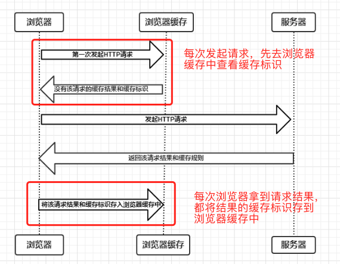
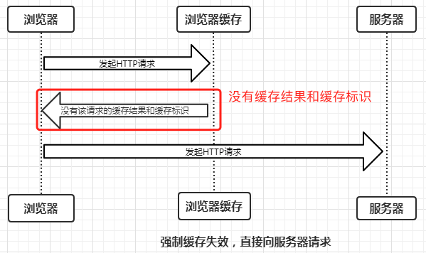
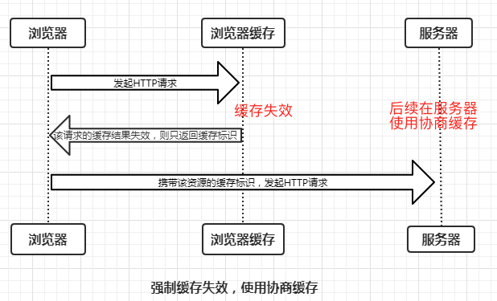
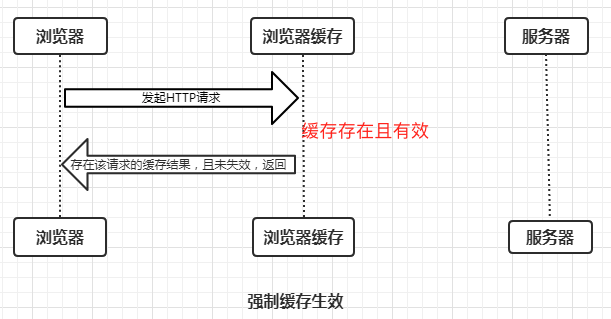
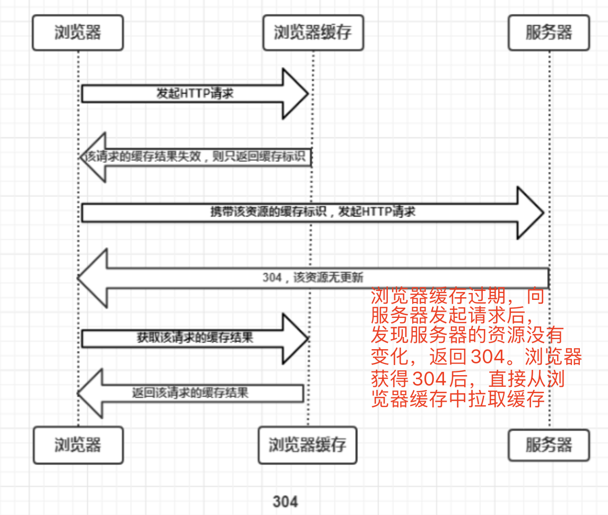
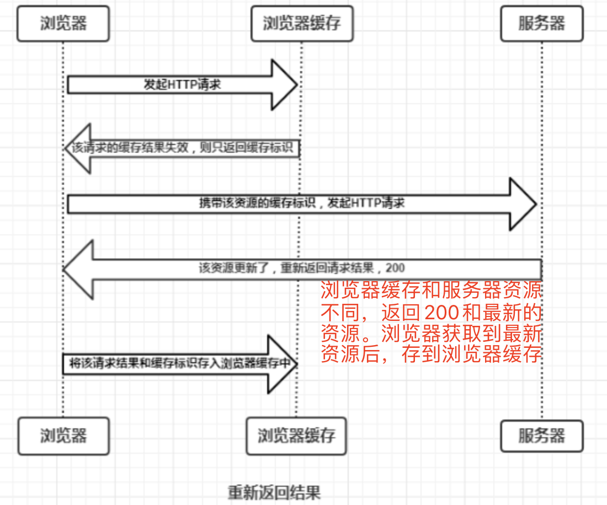
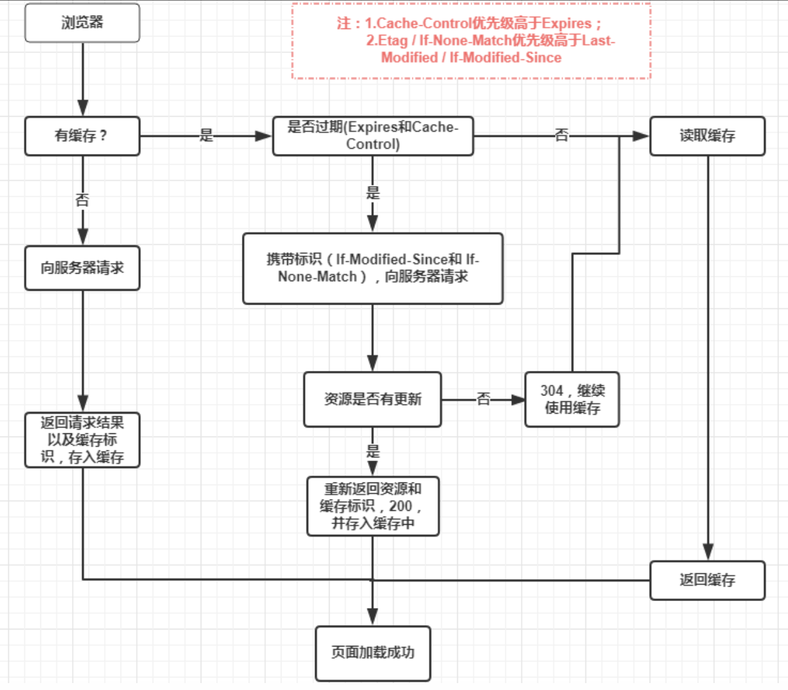

# 计算机网络

[toc]

## 1. UDP 和 TCP 的区别

（1）连接性
TCP 面向连接，UDP 面向非连接
（2）传输可靠性
TCP 可靠，UDP 不可靠
（3）传输速度
TCP 慢（需要握手和挥手），UDP 快
（4）TCP 采用流传输、UDP 采用包传输。（如果丢数据，则 UDP 是以包为单位，TCP 以字节流为单位）
（5）TCP 传输数据段时要给段标号，而 UDP 不需要（TCP 有超时重传机制）

## 2. 浏览器缓存机制

浏览器每次发起请求和收到响应时都会去**查看浏览器缓存**

浏览器根据是否需要重新向服务器发起 Http 请求将缓存分为**强缓存**和**协商缓存**。

### 2.1 强缓存

强缓存是**浏览器根据浏览器缓存中的缓存规则**来决定是否使用该缓存的过程。强缓存有三种结果：

（1）浏览器缓存中不存在缓存结果和缓存标识，强缓存失效，直接向服务器发起请求（与第一次发起请求一致）：

（2）浏览器缓存中存在缓存结果和缓存标识，但是结果已经失效（过期），强缓存失效，**向服务器发起请求，在服务器使用协商缓存**。

（3）浏览器缓存中存在缓存结果和缓存标识，且没有失效，强缓存生效，直接返回缓存结果

强缓存的 HTTP 字段：expired、cache-control

- expired
  http1.0 缓存控制字段，其值为一个到期时间（last time）。原理是使用**客户端时间和服务端返回的时间（expired）进行对比**，但是如果客户端和服务端由于某些原因（时区不同、时间不准），就会导致强缓存失效。所以使用 http1.1 引入 cache-control

- cache-control
  http1.1 缓存控制字段，其值为一个时间段（比如 max-age=600，表示在 600s 内使用强缓存）。**其优先级大于 expired。**
  （1）public：所有内容都将被缓存（客户端和代理服务器都可缓存）
  （2）private：所有内容只有客户端可以缓存，Cache-Control 的默认取值
  （3）no-cache：客户端缓存内容，但是是否使用缓存则需要经过协商缓存来验证决定
  （4）no-store：所有内容都不会被缓存，即不使用强制缓存，也不使用协商缓存
  （5）max-age=xxx (xxx is numeric)：缓存内容将在 xxx 秒后失效

浏览器的缓存会存在于硬盘或者内存中。以访问www.baidu.com为例：

**访问https://baidu.com->200->关闭页面->重新打开baidu->200(from disk cache)->刷新->200(from memory cache)**

- 内存缓存(from memory cache)
  内存缓存会把编译解析后的文件直接存到该进程的内存中，占据着进程的一定内存资源，以便下次快速读取。但是一旦进程关闭（关闭页面），进程的内存就会清空。
- 硬盘缓存(from disk cache)
  硬盘缓存是直接将缓存写到硬盘中，读取缓存需要进行 I/O 操作，然后重新解析缓存内容，速度比内存慢。

在浏览器中，浏览器会在 js 和图片等文件解析执行后直接存入内存缓存中，那么当刷新页面时只需直接从内存缓存中读取(from memory cache)；而**css 文件**则会存入硬盘文件中，所以每次渲染页面都需要从硬盘读取缓存(from disk cache)。

### 2.2 协商缓存

协商缓存是强缓存失效后，**浏览器携带缓存标识向服务器发起请求，由服务器根据缓存标识来决定是否使用缓存的过程**，协商缓存有两种结果：

（1）协商缓存生效，返回304，表示浏览器缓存和服务器资源相同，可以继续使用。浏览器获得 304 后，从浏览器缓存中拉取“过期”缓存：

（2）协商缓存失败，返回 200 以及最新资源

协商缓存的 HTTP 字段：Last-Modified/If-Modified-Since、Etag/If-None-Match。其中 Etag 的优先级大于 Last-Modified

- Last-Modified/If-Modified-Since
  Last-Modified 是服务器响应请求时，返回该资源文件在服务器最后被修改的时间。
  If-Modified-Since 是客户端再次发起请求时，其值等于携带上次请求的 Last-Modified。如果当前响应资源 Last-Modified（当前资源最后修改时间）大于请求头中的 If-Modified-Since（上次的资源最后修改时间），则代表资源已更新，否则则是未更新。
- Etag/If-None-Match
  Etag 是服务器响应请求时，返回当前资源文件的一个唯一标识(由服务器生成)
  If-None-Match 是客户端再次发起该请求时，携带上次请求返回的唯一标识。 如果当前响应资源 Etag（当前资源版本号）与请求头中的 If-None-Match（上次的资源的版本号）不同，则代表资源已更新，否则则是未更新。

### 2.3 缓存总结

强缓存优先于协商缓存，若强缓存（Expired 和 Cache-Control）生效则直接使用强缓存；若不生效，则进行协商缓存（Last-Modified / If-Modified-Since 和 Etag / If-None-Match）。
协商缓存由服务器决定是否使用缓存，若协商缓存生效，表示服务器资源相较于浏览器缓存没有变化，返回 304，继续使用浏览器缓存中的缓存内容；若不生效，表示服务器资源相较于浏览器缓存已经发生改变，返回 200 以及最新的资源，浏览器获取到资源后，将资源缓存到浏览器缓存中。

参考：https://www.cnblogs.com/chengxs/p/10396066.html

## 3. TCP 传输详细过程

（1）三次握手

- 第一次握手

- 第二次握手

- 第三次握手

（2）发 http 请求，服务器处理请求，返回响应
TCP 连接建立后，浏览器就可以利用 HTTP/HTTPS 协议向服务器发送请求。服务器接收到请求后，会解析请求头，如果头部有**缓存字段**如 if-none-match 与 if-modified-since，就验证缓存是否有效，如果有效，则返回 304，从

（3）四次挥手

- 第一次挥手

- 第二次挥手

- 第三次挥手

- 第四次挥手
