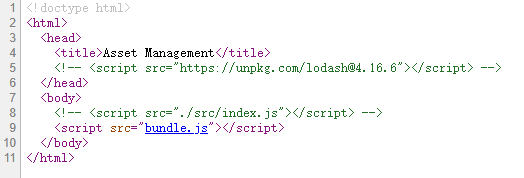
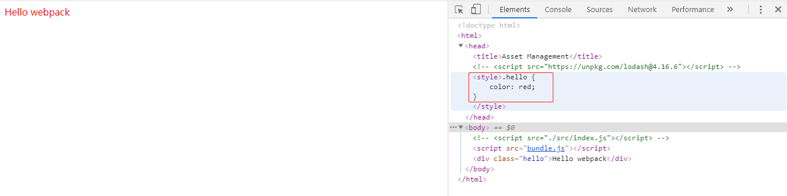
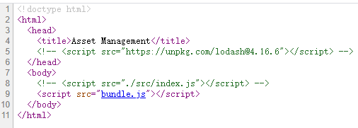
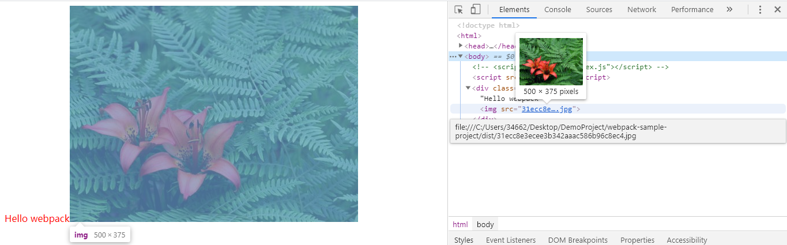

# Webpack官网指南

[toc]

## 一、安装

最新的webpack的版本是4.42.0，可以使用npm在本地项目中安装，也可以在全局进行安装。

```js
// 项目内安装webpack
npm install --save-dev webpack
```

手动创建一个webpack.config.js

## 二、起步

写一个html文件，一个js脚本，js脚本中用到了外部依赖（lodash）

webpack4不需要任何配置就可以使用，但是大多数项目都需要复杂的配置来更好的管理模块，所以仍然需要webpack.config.js来配置。
&emsp;&emsp;不需要配置时，直接使用<font color='red'>npx webpack来生成对应的bundle（npx命令会运行node_modules/.bin中的二进制执行文件）</font>

```js
// 不需要配置文件
npx webpack

// 引入配置文件
npx webpack --config webpack.config.js

// 配置文件名为webpack.config.js时，可以使用省略--config
```

模块：webpack是不会更改import和export以外的部分，如果想使用es6的特性在一些不支持这些特性的浏览器中，需要引入babel等转译器。

## 三、管理资源

webpack可以动态打包所有依赖项，创建相应的**依赖图**。webpack的出色特点之一还有除了可以使用外部js模块，还可以通过loader引入其他类型的文件（如css、scss、图片等）。

### 3.1 加载CSS

为了在js文件中import样式文件（css），需要安装对应的loader（css-loader、style-loader）

```js
npm install --save-dev css-loader style-loader
```

在webpack.config.js中添加相应配置

```js
module.exports = {
    entry: '...',
    output: {
        ...
    },
    module: {
        rules: [
            {
                test: /\.css$/,
                use: [
                    'style-loader',
                    'css-loader'
                ]
            }
        ]
    }
};
```

<font color='red'>这个特别需要注意！！！style-loader一定要写到css-loader之前，否则会在最后打包时出现CssSyntaxError</font>

此时就可以在依赖样式的文件（js）中import样式文件了。<font color='red'>当该模块运行时，含有CSS字符串的\<style>标签会被添加到\<head>中</font>

index.js:

```js
  import _ from 'lodash';
  import './style.css';

  function component() {
    var element = document.createElement('div');

    // lodash 是由当前 script 脚本 import 导入进来的
    element.innerHTML = _.join(['Hello', 'webpack'], ' ');
    element.classList.add('hello');

    return element;
  }

  document.body.appendChild(component());
```

style.css

```css
.hello {
    color: red;
}
```

使用npx webpack打包之后，运行index.html，可以发现js脚本使得样式添加到了\<head>中，这是“动态的添加”，因为你在查看网页源代码时会发现，\<head>中并没有样式文件：




### 3.2 加载图片

使用file-loader可以将图片等资源混合到css中。

```js
npm install --save-dev file-loader
```

```js
module.exports = {
    ...
    modules: {
        rules: [
            // CSS loader
            {...}
            // File loader
            {
                test: /\.(png|jpg|gif|svg)$/
                use: [
                    'file-loader'
                ]
            }
        ]
    }
}
```

现在当在模块中遇到import图片的情况（如import MyImage from './my-image.png'），图像会被处理并添加到output目录，并且图片变量（MyImage）将包含最终处理的Url（一个绝对定位），当使用css-loader或html-loader在遇到./my-image.png时，会将路径替换为输出目录的最终路径。

index.js:

```js
  import _ from 'lodash';
  import './style.css';
  import Pic from './pic.jpg'

  function component() {
    var element = document.createElement('div');

    // lodash 是由当前 script 脚本 import 导入进来的
    element.innerHTML = _.join(['Hello', 'webpack'], ' ');
    element.classList.add('hello');

    // 将图片元素添加到div内，hello之后
    let MyImage = new Image();
    // 上述创建语句等同于document.createElement('img')
    MyImage.src = Pic;
    element.appendChild(MyImage);

    return element;
  }

  document.body.appendChild(component());
```

使用npx webpack打包之后，运行index.html，可以发现js脚本使得图片添加到了对应位置，这是“动态的添加”，因为你在查看网页源代码时会发现，html代码对应位置中并没有图片：




可以看到图片的文件名字也改变了，这意味着webpack在src文件夹中找到了图片并且进行了处理。

### 3.3 加载字体

file-loader可以处理任何文件，而url-loader功能类似于前者，但在文件大小低于限制时（可以自行设置）返回一个base64码。

方法类似于加载图片（区别仅在于一个引入的是图片，另外一个引入的字体文件，然后将loader修改就可以了）

### 3.4 加载数据

要加载的的资源还包括数据，数据的格式包括Json、csv、xml等。需要引入csv-loader或者xml-loader处理对应的数据文件。方法和上面同理。

### 3.5 全局资源

以上这样做的好处（将资源全部打包到dist下），使得页面全都只依赖于这一个目录下的资源，这会使得代码更具备可移植性。<font color='red'>如果一个资源被多个组件共享，那么仍然可以将公共资源存储到一个公共目录，配合别名库（alias）去import它们。</font>

## 四、管理输出

使用一些**插件**可以管理输出：

比如<font color='red'>html-webpack-plugin</font>用来生成一个html文件。想比较与手动创建Html,并且手动去引用入口js，在更换入口名称之后，需要手动去修改bundle.js文件，这个插件可以帮我们自动构建Html文件，并根据entry的配置自动去引入script。
<font color='red'>clean-webpack-plugin</font>可以在每次构建时清理/dist文件夹，以保证构建够的dist内都是模块依赖项。

## 五、开发
