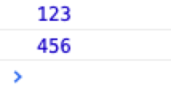

# 知识点记录

[toc]

1. window.onload 和$(document).ready（js原生不提供，jQ的方法）执行顺序
    **$(document).ready 和 window.onload 的区别是\*\*：
   document.ready 方法在 DOM 树加载完成后就会执行，而 window.onload 是在页面资源（比如图片和媒体资源，它们的加载速度远慢于 DOM 的加载速度）加载完成之后才执行。也就是说\$(document).ready 要比 window.onload 先执行。

   ```js
   window.onload = function () {
     console.log(456);
   };
   $(document).ready(function () {
     console.log(123);
   });
   ```

   

2. display 取值 block 与 flex 在缩放问题上的不同
   在重写官网 header 组件的时候遇到的问题。原本的 header 是用的 block，header 内部元素用的是 inline-block，并且是用的左浮动来进行布局。

   这里最外层是 header，内层有一个容器，来放 content。这里的 move 是一个通过监听滑动事件而触发 header 的 position 变为 fixed 的样式（向下滑动时 header 持续置顶）：

   ```css
   .header {
     width: 100%;
     min-height: 80px;
     min-width: 1263px;
     background: #fff;
   }

   .container {
     width: 100%;
     height: 80px;
     line-height: 80px;
     background: #fff;
     text-align: center;

     &.move {
       position: fixed;
       left: 0;
       top: 0;
       z-index: 1000;
       box-shadow: 0 2px 4px 0 rgba(133, 138, 180, 0.14);
     }
   }
   ```

   这里是内容布局：

   ```css
   .content
       display inline-block
       width 1280px
       &:after
           cleatFloat()

       >div, >ul
           float left
   ```

   我在将其改为 flex 布局的时候，当触发 move 样式时，在缩小浏览器窗口时，**这里由于设置了内容居中**。flex 布局会左右同时将内容隐藏，也就是说 header 组件左边最开始的元素会被隐藏到左侧。而元素布局未 block 时则只会隐藏右侧的元素（不管你是从左侧还是右侧缩小屏幕宽度）。

   所以这里为了与原本效果一致，我在 move 中将 display 又从 flex 设置回了 block，而 content 中设置一下 block 水平居中（margin:0 auto），保证在切到 block 时，可以同步居中状态。

3. background 使用 url()问题
   background 中使用 url 函数，并且 img 中没有设置默认的 src，会导致图片出现类似边框的边界（使用 border:none 去不掉，因为不是边框）
